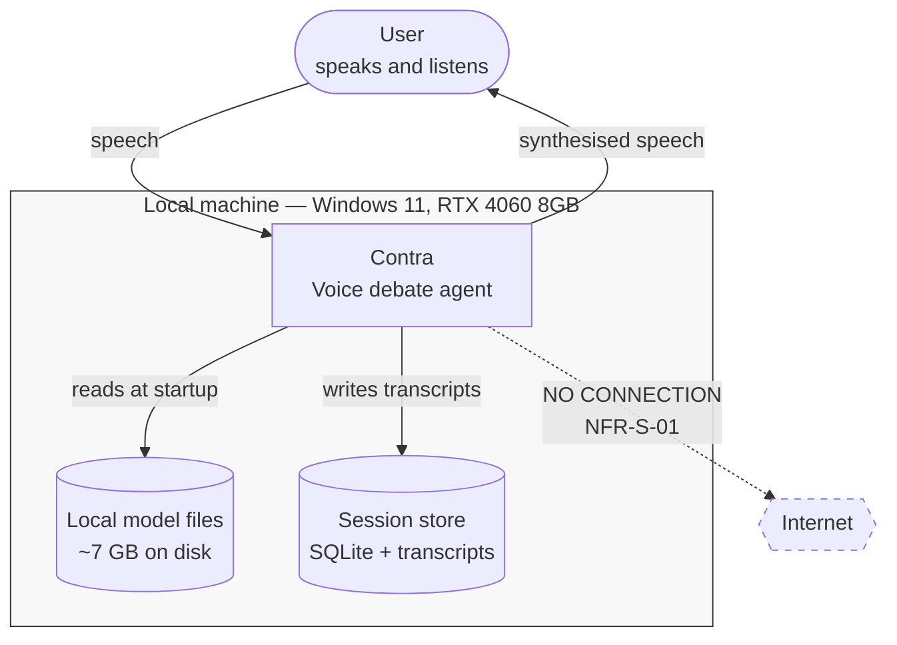
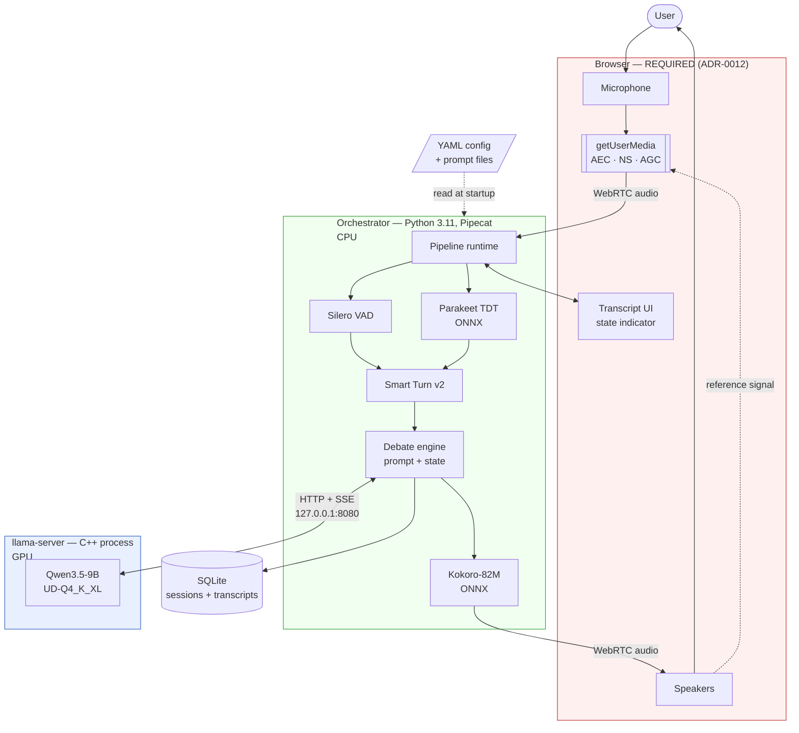
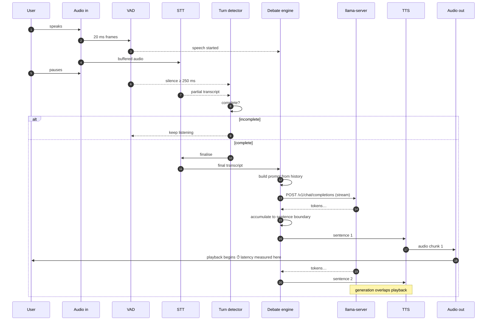
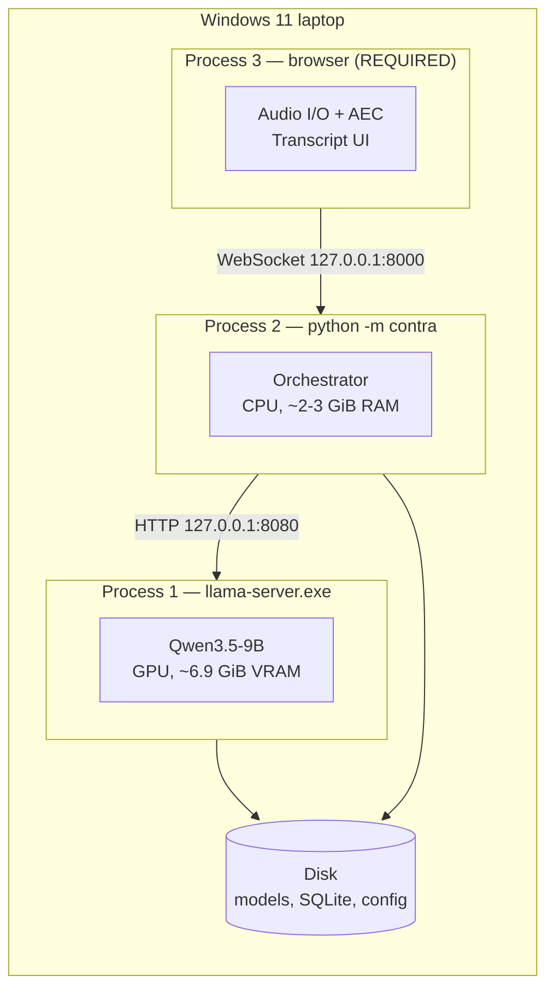

# Architecture Overview

| | |
|---|---|
| **Status** | Draft |
| **Last updated** | 2026-08-30 |
| **Related** | [Component Design](02-component-design.md) · [ADRs](adr/README.md) |

Follows the [C4 model](https://c4model.com/): context, then containers, then
components. Level 3 (components) lives in
[Component Design](02-component-design.md).

---

## 1. Level 1 — System context

One human actor, one system, zero external dependencies at runtime. The dashed
line to the internet is drawn deliberately: **its absence is a feature**, and it
is verified by test (US-501).

---

## 2. Level 2 — Containers

> **Audio loops through the browser in both directions.** This is not
> decoration: the browser's echo canceller can only subtract audio it is itself
> rendering. If Python played TTS output through the system device, the browser
> would have no reference signal and AEC would be inert — the agent would hear
> itself and interrupt itself indefinitely.
> [ADR-0012](adr/0012-browser-webrtc-transport-with-aec.md).

### Containers

| Container | Tech | Runs on | Responsibility |
|---|---|---|---|
| **Browser page** | HTML + WebRTC | Browser | **Audio capture and playback, AEC/NS/AGC**, transcript display |
| **Orchestrator** | Python 3.11 + Pipecat | **CPU** | VAD, turn detection, STT, TTS, debate state |
| **LLM server** | llama.cpp `llama-server` | **GPU** | Token generation, OpenAI-compatible API |
| **Session store** | SQLite | Disk | Transcripts, timings, session metadata |
| **Configuration** | YAML + text | Disk | Tunables and prompts, versioned separately from code |

### The two decisions visible in this diagram

**1. The LLM is a separate process, not a library.** Cost: one localhost HTTP
hop, sub-millisecond, irrelevant beside a 400 ms TTFT. Benefits: the model can
crash and restart without killing the audio pipeline; it can be swapped or
pointed at a cloud endpoint for comparison; and a model reload does not restart
everything. [ADR-0002](adr/0002-llama-cpp-server-as-llm-runtime.md).

**2. Everything except the LLM runs on the CPU.** The colour split above is the
central resource decision. With `-ngl 99` the CPU sits nearly idle during
generation — 16 threads doing nothing. Putting speech models there costs nothing
we are using and protects the LLM's VRAM absolutely.
[ADR-0004](adr/0004-cpu-placement-for-stt-and-tts.md).

---

## 3. Data flow — one turn

**The measurement point (step 15) is what NFR-P-01 governs.** Note that
generation continues *after* it — total generation time is not the user-visible
latency. This is what streaming buys.

---

## 4. Architectural principles

### 4.1 Streaming everywhere

No stage waits for its predecessor to finish. The LLM streams tokens; the debate
engine accumulates to sentence boundaries; TTS synthesises sentence *n* while
the LLM generates *n+1*.

Without this, a 150-token response at 30 tok/s means **5 seconds of silence**
before any audio. With it, the first sentence (~20 tokens, ~0.7 s) starts
playing while the rest generates behind it.

### 4.2 Stages are swappable

Every stage sits behind an interface (NFR-M-01). This is a hedge against real
uncertainty, not architectural decoration: several component choices rest on
third-party benchmarks and some will be wrong. The interface makes discovering
that a one-file change.

### 4.3 The GPU has one tenant

The LLM gets the GPU. Nothing else is allowed on it. Partial offload does not
degrade gracefully — it collapses, because every token then waits on PCIe.
[Resource Budget](08-resource-budget.md).

### 4.4 Spoken history is the source of truth

After a barge-in, the agent has *generated* more than it *spoke*. History
records only what was played (FR-13). Otherwise the agent later references
arguments the user never heard, which reads as gaslighting.
[Data Flow & State](04-data-flow-and-state.md).

### 4.5 Prompts are data

The debate persona is a versioned file, not a string literal (NFR-M-02). It is
the highest-iteration artifact in the project and the one whose changes most
need to be diffable and revertible.

### 4.6 Fail loud, degrade where possible

A dead LLM backend produces a clear message naming the fix (FR-52), never a
traceback. A failed TTS sentence is skipped with a logged warning rather than
killing the session (FR-54).
[Error Handling](../03-engineering/06-error-handling-and-resilience.md).

---

## 5. Deployment

Both services bind to `127.0.0.1` **only** (NFR-S-03). `llama-server` has no
authentication; bound to `0.0.0.0` on a laptop that joins public Wi-Fi it is an
open inference endpoint exposing whatever is in its context.

A supervisor script starts `llama-server`, waits for `/health`, then starts the
orchestrator (FR-51).

---

## 6. Technology summary

| Concern | Choice | ADR |
|---|---|---|
| Pipeline architecture | Cascaded STT→LLM→TTS | [0001](adr/0001-cascaded-pipeline-over-speech-to-speech.md) |
| LLM runtime | llama.cpp `llama-server` | [0002](adr/0002-llama-cpp-server-as-llm-runtime.md) |
| Orchestration | Pipecat | [0003](adr/0003-pipecat-as-orchestration-framework.md) |
| Compute placement | LLM on GPU, all else CPU | [0004](adr/0004-cpu-placement-for-stt-and-tts.md) |
| STT | Parakeet TDT 0.6B v3 (ONNX) | [0005](adr/0005-parakeet-tdt-for-stt.md) |
| TTS | Kokoro-82M (ONNX) | [0006](adr/0006-kokoro-for-tts.md) |
| Turn detection | Silero VAD + Smart Turn v2 | [0007](adr/0007-two-layer-turn-detection.md) |
| Audio transport | **Browser/WebRTC with AEC** | [0012](adr/0012-browser-webrtc-transport-with-aec.md) — supersedes [0008](adr/0008-headphones-first-audio-transport.md) |
| Language | Python 3.11 | [0009](adr/0009-python-as-orchestration-language.md) |
| Persistence | SQLite | [0010](adr/0010-sqlite-for-session-persistence.md) |
| Config | YAML + versioned prompt files | [0011](adr/0011-yaml-configuration-and-versioned-prompts.md) |

---

## 7. What this architecture does not do

Stated so the boundaries are legible:

- **No horizontal scaling.** One user, one machine.
- **No authentication.** Everything is localhost-bound; a local attacker with
  code execution has already won.
- **No plugin system.** Stages are swappable at build time, not runtime.
- **No hot reload of the LLM.** Model changes require restarting `llama-server`.
- **No distributed tracing.** Structured logs with correlation IDs suffice at
  this scale. [Observability Spec](../04-quality/04-observability-spec.md).

---

## 8. Known architectural risks

| ID | Risk | Impact |
|---|---|---|
| [RISK-01](../06-governance/01-risk-register.md) | llama.cpp Qwen3.5 support is recent | Blocking if broken |
| [RISK-02](../06-governance/01-risk-register.md) | LLM throughput below 20 tok/s | NFR-P-01 unreachable → drop to 4B |
| [RISK-03](../06-governance/01-risk-register.md) | Prefix caching ineffective on hybrid architecture | Every turn re-prefills; TTFT balloons |
| [RISK-05](../06-governance/01-risk-register.md) | Turn detection feels wrong | Product feels broken despite passing tests |
| [RISK-06](../06-governance/01-risk-register.md) | CPU speech models miss RTF under GPU load | Queues grow unbounded |
| [RISK-12](../06-governance/01-risk-register.md) | AEC fails during double-talk (speakers) | Agent uninterruptible, or interrupts itself |

Every one is measured in [Phase 0](../07-planning/01-roadmap.md) before
implementation begins.
