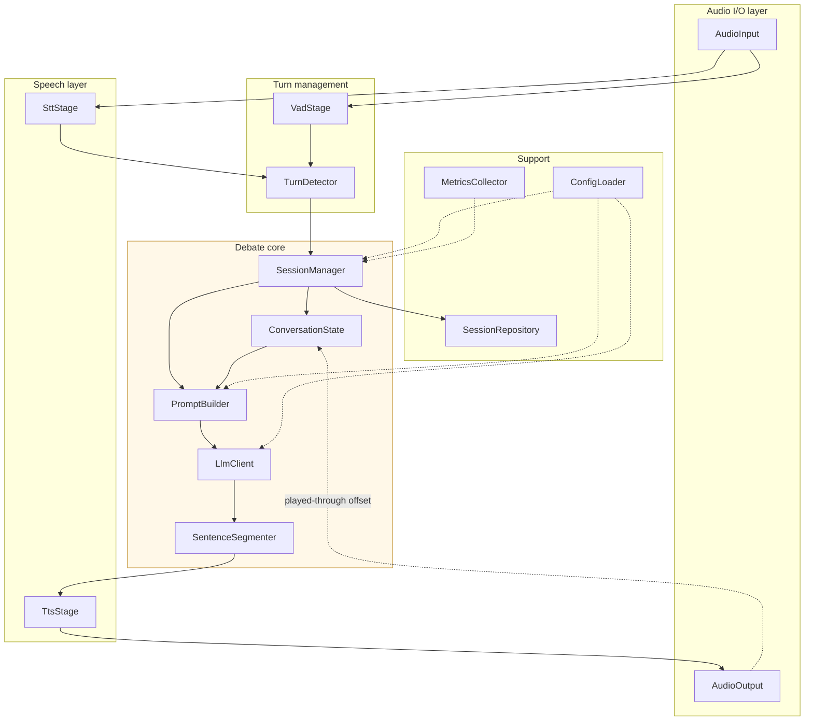

# Component Design (C4 Level 3)

| | |
|---|---|
| **Status** | Draft |
| **Last updated** | 2026-08-30 |
| **Related** | [Architecture Overview](01-architecture-overview.md) · [Internal API Spec](05-internal-api-spec.md) |

Internal structure of the Orchestrator container. Interfaces are given in
Python-ish pseudocode to fix the contracts; they are not final signatures.

---

## 1. Component map



The dotted line from `AudioOutput` back to `ConversationState` is the one to
notice. It carries how much audio was *actually played*, which is what makes
FR-13 possible. Most pipeline diagrams have no such edge, and that is exactly
why most implementations get barge-in history wrong.

---

## 2. Audio I/O

### 2.1 `AudioInput`

Captures microphone audio and publishes fixed-size frames.

```python
class AudioInput(Protocol):
    def start(self) -> None: ...
    def stop(self) -> None: ...
    def frames(self) -> AsyncIterator[AudioFrame]: ...   # 20 ms, 16 kHz mono PCM16
    @property
    def device_info(self) -> DeviceInfo: ...
```

| | |
|---|---|
| **Implementation** | **WebRTC inbound audio track from the browser** ([ADR-0012](adr/0012-browser-webrtc-transport-with-aec.md)) |
| **Frame size** | 20 ms — the granularity Silero VAD expects |
| **Format** | 16 kHz mono PCM16 — what both VAD and STT want; avoids resampling |
| **AEC / NS / AGC** | **Applied in the browser, before audio reaches Python** |

> Echo cancellation happens upstream of this component. `AudioInput` receives
> already-cleaned audio, which is why no AEC appears anywhere in the Python
> pipeline. A native `sounddevice` implementation remains behind the same
> Protocol for benchmarks and headphone-only testing, but is **not** the
> production path — it has no echo canceller.

**Design note.** 16 kHz throughout is deliberate. Capturing at 48 kHz and
resampling adds latency and a failure mode for zero benefit — neither Silero nor
Parakeet uses information above 8 kHz.

### 2.2 `AudioOutput`

Plays synthesised audio and — critically — reports what has actually been heard.

```python
class AudioOutput(Protocol):
    async def enqueue(self, chunk: AudioChunk) -> None: ...
    async def flush(self) -> None: ...
    def clear(self) -> PlaybackPosition: ...   # barge-in: drop queue, report position
    @property
    def is_playing(self) -> bool: ...
```

**`clear()` is the barge-in primitive and the most important method here.** It
must (a) stop immediately, (b) discard queued audio, and (c) **return how far
playback actually got**. Point (c) is what lets `ConversationState` truncate
history to spoken content.

| | |
|---|---|
| **Implementation** | **WebRTC outbound audio track to the browser** |
| **Buffer target** | ≤ 100 ms (NFR-P-14) |
| **Tension** | Small buffer → fast barge-in, higher underrun risk. Large → smooth playback, sluggish stops. |

> **Playback must happen in the browser, not in Python.** The browser's echo
> canceller can only subtract audio it is itself rendering; system-level playback
> would leave it without a reference signal and the agent would hear itself.
> This makes `clear()` a *remote* operation — a control message to the page —
> which costs ~20 ms and is accounted for in the barge-in budget
> ([Latency Budget §10](07-latency-budget.md)).

---

## 3. Turn management

### 3.1 `VadStage`

```python
class VadStage(Protocol):
    def process(self, frame: AudioFrame) -> VadEvent: ...
        # SPEECH_START | SPEECH_CONTINUE | SILENCE | SILENCE_SUSTAINED
```

| | |
|---|---|
| **Implementation** | Silero VAD |
| **Latency** | ~1 ms/frame |
| **Placement** | CPU |

**Responsibility boundary — narrow on purpose.** VAD answers *"is sound
happening"*. It never decides that a turn has ended. `SPEECH_START` during
playback triggers barge-in; `SILENCE_SUSTAINED` merely invites the turn detector
to evaluate. Widening this component's remit is the classic voice-agent mistake.

### 3.2 `TurnDetector`

```python
class TurnDetector(Protocol):
    def evaluate(self, partial: str, silence_ms: int) -> TurnDecision: ...
        # TurnDecision(commit: bool, confidence: float, wait_more_ms: int)
```

| | |
|---|---|
| **Implementation** | Pipecat Smart Turn v2 |
| **Fallbacks** | LiveKit turn-detector → punctuation heuristic |
| **Budget** | ≤ 150 ms (NFR-P-10) |
| **Placement** | CPU |

**Decision policy:**

| Condition | Action |
|---|---|
| Silence < 250 ms | Keep listening — do not even invoke the model |
| Silence ≥ 250 ms, transcript incomplete | Extend to 1,500 ms |
| Silence ≥ 250 ms, transcript complete | Commit |
| Silence ≥ 2,000 ms | Commit regardless — safety valve |

The final row prevents a wedged session if the model persistently reports
"incomplete". It is a backstop, not a design element.

**Tuning bias.** NFR-A-03 (≤5% false cuts) is tighter than NFR-A-04 (≤10% false
holds) because being interrupted mid-thought is far worse than waiting 400 ms.
When these conflict, hold.

---

## 4. Speech layer

### 4.1 `SttStage`

```python
class SttStage(Protocol):
    def feed(self, frame: AudioFrame) -> None: ...
    def partial(self) -> str: ...
    async def finalise(self) -> Transcript: ...   # Transcript(text, confidence, words)
    def reset(self) -> None: ...
```

| | |
|---|---|
| **Implementation** | Parakeet TDT 0.6B v3 via `onnx-asr` |
| **Placement** | CPU |
| **Budget** | ≤ 250 ms to finalise (NFR-P-11) |
| **RTF** | must be < 0.3 (NFR-P-21) |

**Known limitation.** Parakeet TDT is not a streaming model. `partial()` is
implemented by re-transcribing the buffered utterance periodically (every
~500 ms), which is wasteful but adequate for a turn-based interaction. If this
proves too costly, `partial()` may return only what the turn detector needs
rather than display-quality text — [OQ-06](../06-governance/05-open-questions.md).

**Why this component matters beyond accuracy:** Parakeet was chosen largely
because it does not hallucinate into silence. `reset()` must be called between
turns so buffered silence from a previous turn cannot leak.

### 4.2 `TtsStage`

```python
class TtsStage(Protocol):
    async def synthesise(self, text: str) -> AsyncIterator[AudioChunk]: ...
    def cancel(self) -> None: ...
    @property
    def voice(self) -> str: ...
```

| | |
|---|---|
| **Implementation** | Kokoro-82M via `kokoro-onnx` |
| **Placement** | CPU |
| **Budget** | ≤ 150 ms to first byte (NFR-P-13) |
| **RTF** | must be < 0.5 (NFR-P-22) |

**Known caveat.** ONNX Kokoro has higher per-call overhead than PyTorch and is
relatively slower on very short texts (RTF 0.72 vs 0.49). Since we deliberately
stream short sentences, `SentenceSegmenter` must avoid dispatching three-word
fragments — see below.

---

## 5. Debate core

### 5.1 `SessionManager`

The state machine and the only component that coordinates the others.

```python
class SessionManager:
    async def start(self, topic: str, user_position: str) -> Session: ...
    async def handle_user_turn(self, transcript: Transcript) -> None: ...
    async def handle_barge_in(self) -> None: ...
    async def end(self) -> SessionSummary: ...
    @property
    def state(self) -> SessionState: ...   # IDLE|LISTENING|THINKING|SPEAKING|ENDED
```

Owns the state machine in [Data Flow & State](04-data-flow-and-state.md) and
publishes state changes to the UI within 100 ms (NFR-P-05).

### 5.2 `ConversationState`

Holds the debate's memory. **The trickiest component in the system**, because of
FR-13.

```python
class ConversationState:
    def append_user_turn(self, text: str) -> None: ...
    def begin_agent_turn(self) -> TurnHandle: ...
    def record_spoken(self, handle: TurnHandle, text: str) -> None: ...
    def truncate_to_spoken(self, handle: TurnHandle, position: PlaybackPosition) -> None: ...
    def messages(self) -> list[Message]: ...
    def token_estimate(self) -> int: ...
```

**Why `truncate_to_spoken` exists.** During an agent turn there are three
divergent quantities:

| Quantity | Example |
|---|---|
| Tokens *generated* by the LLM | 4 sentences |
| Text *dispatched* to TTS | 3 sentences |
| Audio *actually played* | 1.5 sentences |

On barge-in, history must record the **third**. Recording the first means the
agent later says "as I explained…" about words the user never heard.

The mapping from a `PlaybackPosition` (a byte or sample offset) back to a text
offset requires the TTS layer to emit chunk→text-span metadata. This is the
single most intricate contract in the design and is specified in
[Internal API Spec](05-internal-api-spec.md).

**Context management.** When `token_estimate()` approaches the 16K window, older
turns are summarised rather than dropped — a debate agent that forgets the
user's opening position is broken (FR-27). Policy in
[Data Flow & State](04-data-flow-and-state.md).

### 5.3 `PromptBuilder`

```python
class PromptBuilder:
    def build(self, state: ConversationState, config: DebateConfig) -> list[Message]: ...
```

Assembles the system prompt from versioned files plus session variables (topic,
positions, intensity). **Contains no prompt text** — that lives in
`prompts/` (NFR-M-02). See
[Prompt Engineering Spec](../03-engineering/05-prompt-engineering-spec.md).

### 5.4 `LlmClient`

```python
class LlmClient(Protocol):
    async def stream(self, messages: list[Message], params: SamplingParams
                     ) -> AsyncIterator[Token]: ...
    async def cancel(self) -> None: ...
    async def health(self) -> HealthStatus: ...
```

| | |
|---|---|
| **Implementation** | `openai` SDK against `http://127.0.0.1:8080/v1` |
| **Budget** | ≤ 400 ms TTFT (NFR-P-12) |

**`cancel()` must actually abort server-side generation**, not merely stop
reading the stream. Otherwise an interrupted turn keeps the GPU busy generating
text nobody will hear, delaying the *next* turn — a subtle way for barge-in to
make the system feel slower rather than more responsive.

### 5.5 `SentenceSegmenter`

Converts a token stream into TTS-sized units. Small component, outsized effect
on perceived latency.

```python
class SentenceSegmenter:
    def feed(self, token: str) -> list[str]: ...   # returns any complete units
    def flush(self) -> list[str]: ...
```

**Policy:**

| Rule | Value | Why |
|---|---|---|
| Emit on terminal punctuation | `. ! ?` | Natural prosody boundary |
| Also emit on clause break if buffer > 80 chars | `, ; :` | Avoids long first-sentence latency |
| **Minimum unit** | **~15 chars** | Kokoro ONNX is inefficient on tiny fragments |
| Force-emit at | 200 chars | Safety valve |

> **The first unit is special.** Time-to-first-audio depends almost entirely on
> how quickly unit one is emitted. If the model opens with a long sentence, the
> user waits. The clause-break rule exists to cap that wait, and the minimum-unit
> rule exists to stop it firing on "Well," — which would hit Kokoro's
> short-text penalty for no benefit.

---

## 6. Support components

### 6.1 `ConfigLoader`
Loads and validates YAML into typed objects at startup; fails loudly on invalid
values rather than defaulting silently.
[Configuration Management](../03-engineering/04-configuration-management.md).

### 6.2 `MetricsCollector`
Records per-stage timings for every turn (FR-53). Emits one structured record
per turn with a correlation ID.
[Observability Spec](../04-quality/04-observability-spec.md).

### 6.3 `SessionRepository`
Persists sessions, turns, and timings to SQLite. Writes committed turns
**synchronously** — NFR-REL-03 requires no loss on hard kill.
[Data Model](06-data-model.md).

---

## 7. Dependency rules

```
Audio I/O  ←  Turn management  ←  Debate core  →  Speech layer  →  Audio I/O
                                       ↓
                                  Support
```

1. **Debate core depends on interfaces, never implementations.** It must not
   import `onnx_asr`, `kokoro_onnx`, or `sounddevice`.
2. **Support depends on nothing** in the pipeline. It is a leaf.
3. **No stage imports another stage.** Composition happens in the pipeline
   assembly module only.
4. **Configuration flows down, never up.** No component reads global config
   directly; it is injected.

Rule 1 is what makes NFR-M-01 real rather than aspirational, and it is
enforceable by an import-lint rule —
[Coding Standards](../03-engineering/03-coding-standards.md).

---

## 8. Component sizing

| Component | Est. LOC | Complexity | Risk |
|---|---|---|---|
| `AudioInput` / `AudioOutput` | 200 | Medium | Device enumeration on Windows |
| `VadStage` | 80 | Low | Thin wrapper |
| `TurnDetector` | 150 | **High** | Tuning is empirical, not analytical |
| `SttStage` | 200 | Medium | Non-streaming model, buffer management |
| `TtsStage` | 150 | Medium | Short-text overhead |
| `SessionManager` | 350 | **High** | State machine + interruption paths |
| `ConversationState` | 300 | **High** | FR-13 truncation, context management |
| `PromptBuilder` | 120 | Low | |
| `LlmClient` | 180 | Medium | Cancellation semantics |
| `SentenceSegmenter` | 100 | Medium | Disproportionate latency effect |
| Support | 400 | Low | |
| **Total** | **~2,230** | | |

No file exceeds 400 lines (NFR-M-05). The three **High** components are
`TurnDetector`, `SessionManager`, and `ConversationState` — they get the most
test coverage ([Test Strategy](../04-quality/01-test-strategy.md)) and should be
built first, behind fakes for everything else.
