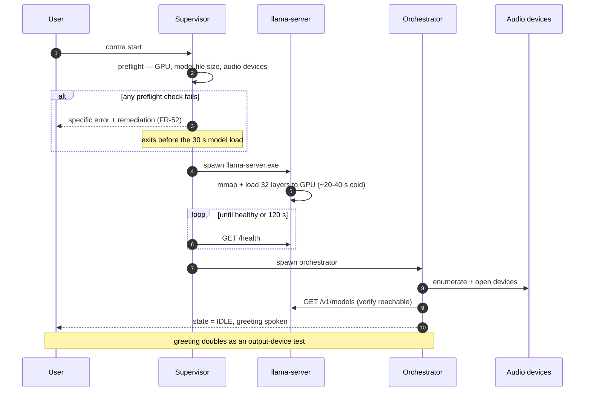
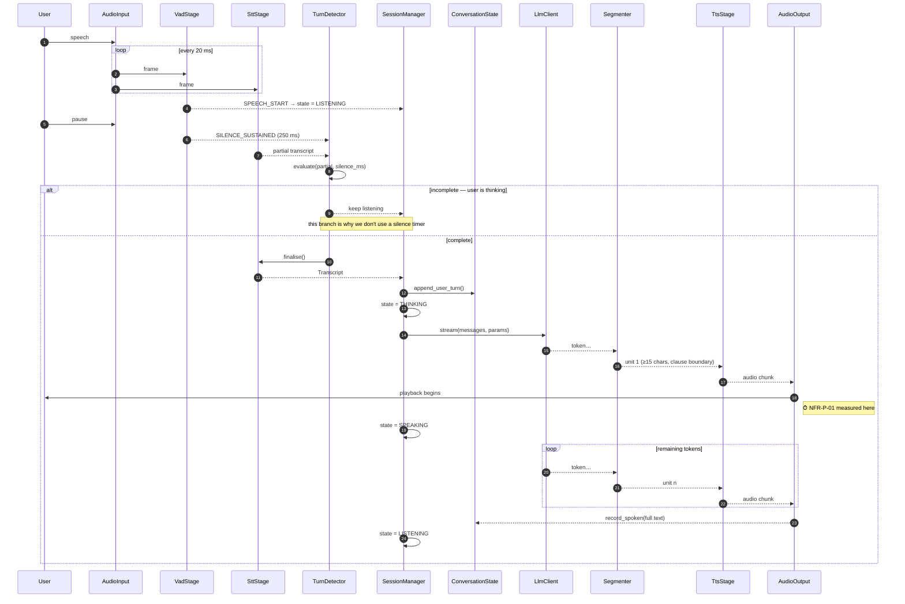
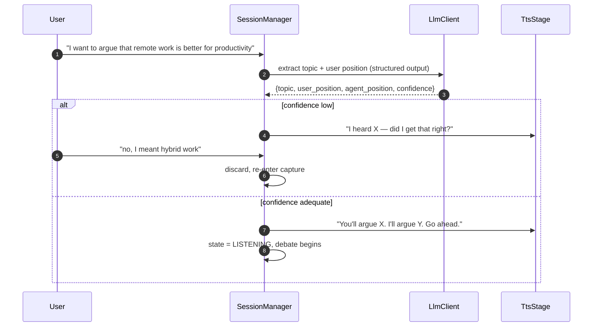
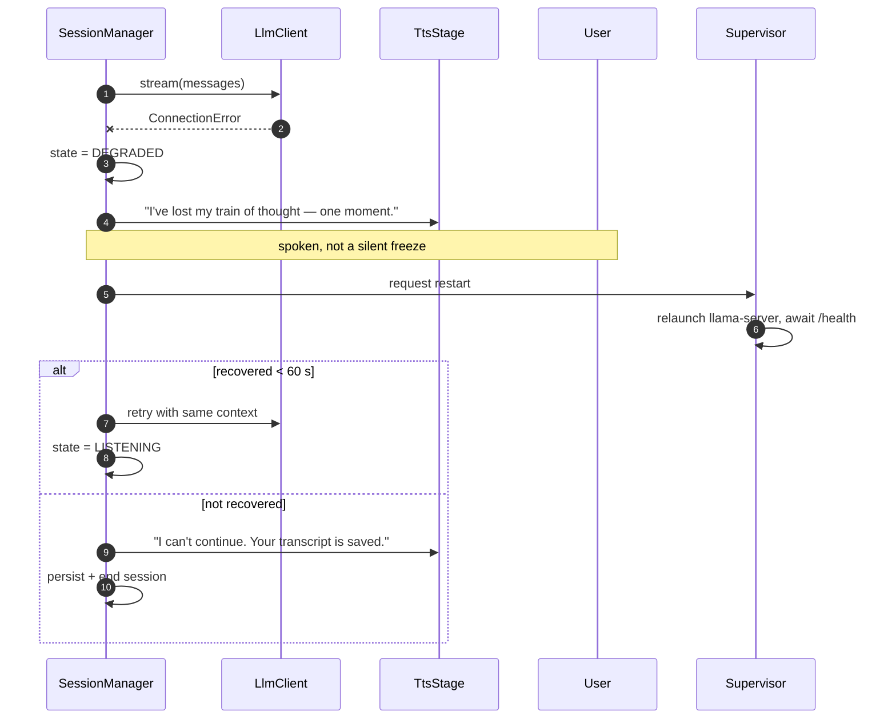
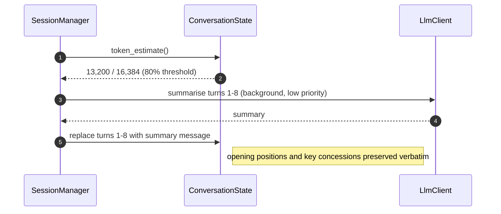
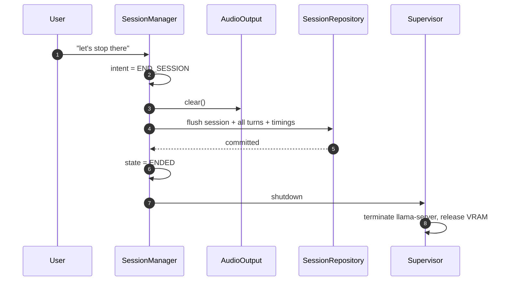

# Sequence Diagrams

| | |
|---|---|
| **Status** | Draft |
| **Last updated** | 2026-08-30 |

The interaction paths that carry real complexity. Happy paths are covered
briefly; the interruption and failure paths get the space, because that is where
implementations actually go wrong.

---

## 1. Startup



**Why preflight precedes model load (step 2).** The model takes 20–40 seconds
from cold disk. Discovering a missing GPU *after* that wait is a bad experience;
every check that can run in milliseconds runs first.

**Why the greeting is spoken (step 10).** It is the only way a user learns that
output is routed to a disconnected HDMI monitor *before* they have argued into
the void for a minute.

---

## 2. The core turn



Note that steps 15–20 **overlap**: generation continues while audio plays. Total
generation time is not user-visible latency.

---

## 3. Barge-in — the critical path

This is the sequence most worth getting right, and the one most often got wrong.

```mermaid
sequenceDiagram
    autonumber
    participant U as User
    participant AI as AudioInput
    participant V as VadStage
    participant SM as SessionManager
    participant AO as AudioOutput
    participant TTS as TtsStage
    participant LC as LlmClient
    participant CS as ConversationState
    participant S as SttStage

    Note over AO,U: agent is speaking; LLM still generating ahead
    U->>AI: begins speaking over agent
    AI->>V: frame
    V-->>SM: SPEECH_START  (~50 ms)
    Note over SM: state SPEAKING + SPEECH_START ⇒ barge-in

    par stop everything
        SM->>AO: clear()
        AO-->>SM: PlaybackPosition (samples played)
    and
        SM->>TTS: cancel()
    and
        SM->>LC: cancel()  → aborts server-side generation
    end

    SM->>CS: truncate_to_spoken(handle, position)
    Note right of CS: history now holds ONLY what was heard (FR-13)
    SM->>S: reset() then feed from barge-in onset
    SM->>SM: state = LISTENING
    Note over SM,U: total stop ≤ 300 ms (NFR-P-03)
```

### Why each parallel branch matters

| Branch | If omitted |
|---|---|
| `AO.clear()` | Agent keeps talking over the user — the visible bug |
| `TTS.cancel()` | Queue refills from in-flight synthesis; audio resumes seconds later |
| `LC.cancel()` | **GPU keeps generating unheard text**, delaying the *next* turn. Barge-in makes the system feel slower. |
| `truncate_to_spoken` | Agent later references arguments the user never heard |

The `LC.cancel()` case is the subtle one. Merely stopping *reading* the SSE
stream is not enough — the server continues generating. The client must abort the
HTTP request so `llama-server` frees the slot.

### Capturing the interrupting speech (step 12)

The user's first word or two arrive *before* barge-in is confirmed. The audio
buffer must be retained across the transition, or the user's opening syllables
are lost and the transcript reads "…ut that ignores the cost". A small rolling
pre-buffer (~300 ms) solves this.

---

## 4. Session start — topic negotiation



**The confirmation is not politeness (FR-02).** A mis-transcribed topic poisons
every subsequent turn and is unrecoverable once the debate starts. Three seconds
of confirmation against forty minutes of wasted session is an easy trade.

---

## 5. Failure — LLM backend dies mid-turn



The spoken acknowledgement matters. In a voice interface, a silent freeze is
indistinguishable from a crash, and users respond by talking — which triggers
barge-in on a pipeline already in trouble.

---

## 6. Failure — TTS fails on one sentence

```mermaid
sequenceDiagram
    participant SEG as Segmenter
    participant TTS as TtsStage
    participant AO as AudioOutput
    participant M as Metrics

    SEG->>TTS: unit n
    TTS--xSEG: SynthesisError
    SEG->>M: log warning (unit n dropped)
    SEG->>TTS: unit n+1
    TTS-->>AO: audio
    Note over SEG,AO: session continues; one sentence lost (FR-54)
```

Deliberately asymmetric with §5. A dead LLM ends the debate; a dropped sentence
is a glitch. Matching the response to the severity is the point of
[Error Handling](../03-engineering/06-error-handling-and-resilience.md).

---

## 7. Context window pressure



**Summarisation, not truncation.** Dropping the oldest turns would discard the
user's opening position — and FR-27 requires the agent to hold the user to what
they said. The summary explicitly preserves stated positions and any conceded
points.

**Timing.** Run at 80% capacity, between turns, never mid-turn. It is an extra
LLM call and would otherwise blow NFR-P-01.

---

## 8. Shutdown



Persistence completes **before** the process exits (NFR-REL-03). Committed turns
are written as they occur, so this flush handles only the tail — a hard kill at
any point loses at most the in-flight turn.

---

## 9. Timing summary

Where the budget goes on a normal turn. Full derivation in
[Latency Budget](07-latency-budget.md).

| Step | Budget | Cumulative |
|---|---|---|
| Silence detection (VAD) | 250 ms | 250 ms |
| Turn detection | 150 ms | 400 ms |
| STT finalise | 250 ms | 650 ms |
| Prompt build | 10 ms | 660 ms |
| LLM TTFT | 400 ms | 1,060 ms |
| First unit segmentation | 30 ms | 1,090 ms |
| TTS first byte | 150 ms | 1,240 ms |
| Output buffer | 100 ms | **1,340 ms** |

Above the 1,200 ms target. §5 of [Latency Budget](07-latency-budget.md) covers
how the 250 ms silence-detection window is partly reclaimed by running STT
finalisation and turn detection concurrently rather than in series.
