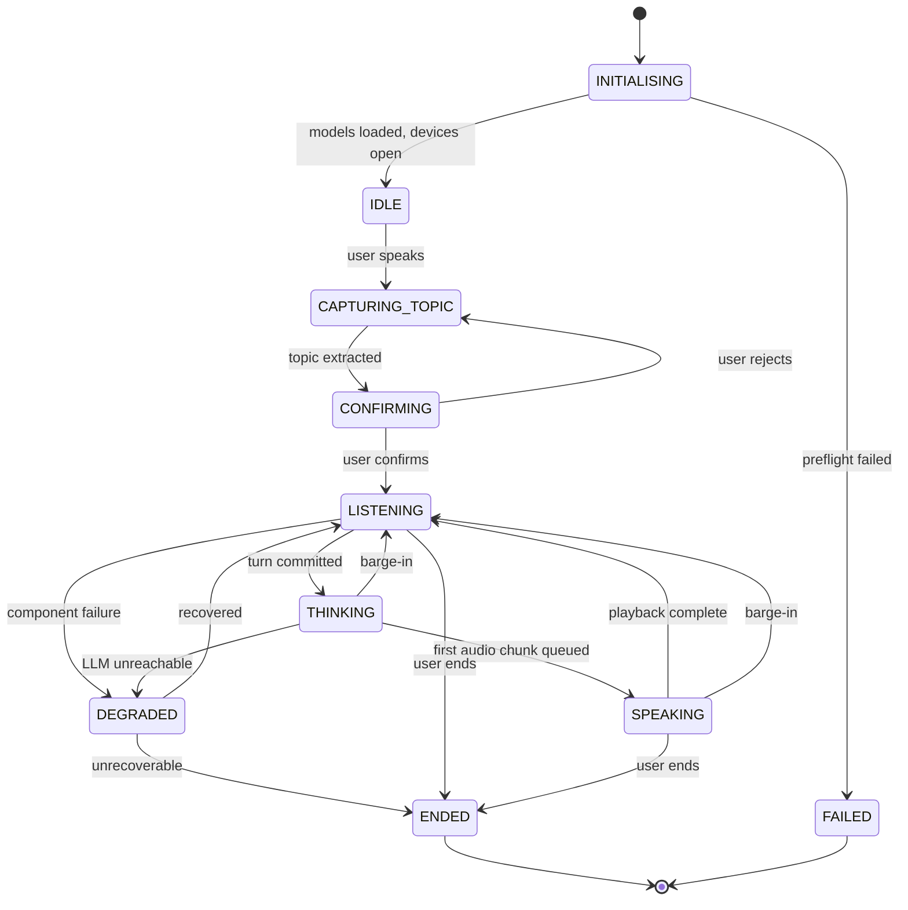
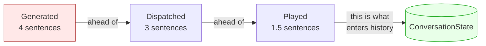
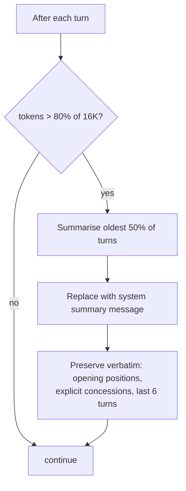
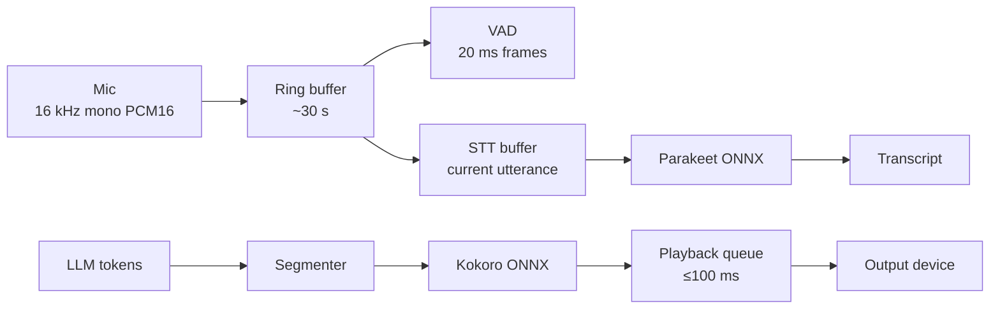
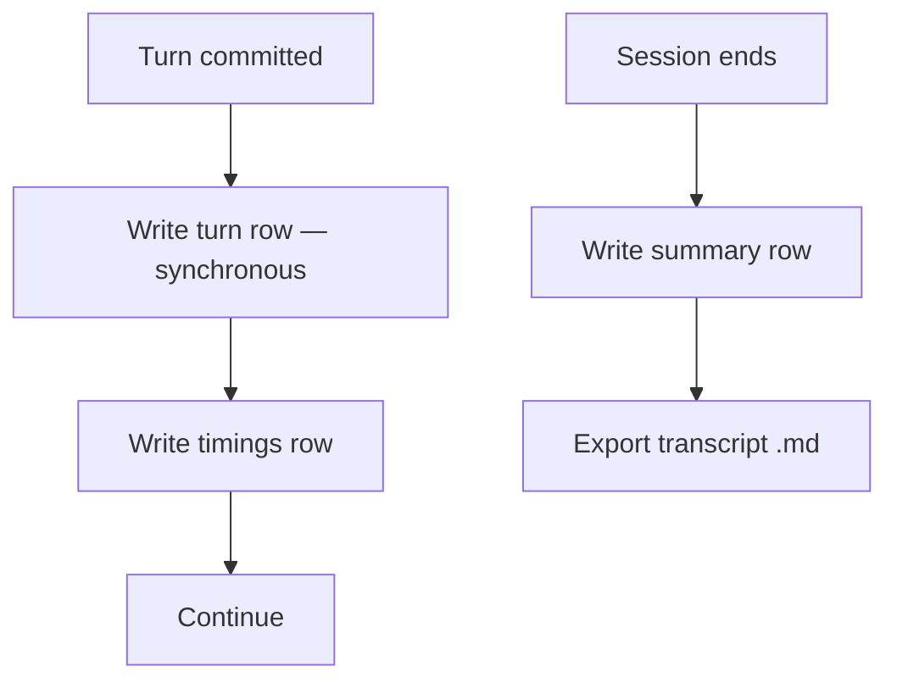
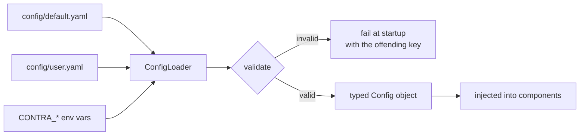

# Data Flow & State

| | |
|---|---|
| **Status** | Draft |
| **Last updated** | 2026-08-30 |

---

## 1. Session state machine



### States

| State | UI label | Mic live? | Meaning |
|---|---|---|---|
| `INITIALISING` | "Starting…" | No | Loading models |
| `IDLE` | "Ready" | Yes | Awaiting a topic |
| `CAPTURING_TOPIC` | "Listening" | Yes | Collecting topic and position |
| `CONFIRMING` | "Speaking" | Yes | Reading back for confirmation |
| `LISTENING` | "Listening" | Yes | Awaiting the user's turn |
| `THINKING` | "Thinking" | **Yes** | Generating; no audio yet |
| `SPEAKING` | "Speaking" | **Yes** | Playing audio |
| `DEGRADED` | "Problem" | Yes | A component failed |
| `ENDED` | "Ended" | No | Session closed |
| `FAILED` | "Failed" | No | Could not start |

> **The microphone stays live in `THINKING` and `SPEAKING`.** This is what makes
> barge-in possible, and it is the source of the self-interruption problem: in
> `SPEAKING` the agent's own audio reaches a live microphone. Since the user uses
> **speakers**, this is handled by browser-side acoustic echo cancellation —
> [ADR-0012](adr/0012-browser-webrtc-transport-with-aec.md).

**`THINKING` exists as a distinct state because of a specific failure.** Without
a visible distinction between "generating" and "crashed", users fill the silence
by talking, which triggers barge-in, which cancels the response they were waiting
for — a self-reinforcing loop that makes a working system feel broken (FR-41).

---

## 2. Conversation history — three divergent quantities

The central subtlety of the whole design.

During an agent turn, three quantities exist and they are **not equal**:

```
LLM generated:   "Productivity gains are contested. Remote workers report
                  higher output, but managers report lower collaboration.
                  The Stanford study found a 13% increase. However that
                  study predates hybrid norms."
                  ─────────────────────── 4 sentences

Dispatched TTS:  "Productivity gains are contested. Remote workers report
                  higher output, but managers report lower collaboration.
                  The Stanford study found a 13% increase."
                  ─────────────────────── 3 sentences

Actually heard:  "Productivity gains are contested. Remote workers report
                  higher out—"
                  ─────────────────────── 1.5 sentences  ← user interrupted
```

**History must record the third.** (FR-13)



### Why the other two are wrong

| If we stored | The agent would |
|---|---|
| Generated | Reference the Stanford study as something it "already explained". The user, who never heard it, experiences this as fabrication or gaslighting. |
| Dispatched | Same failure, one sentence smaller. |

### Mechanism

`AudioOutput.clear()` returns a `PlaybackPosition` (samples played). Mapping that
to a text offset requires TTS chunks to carry their source text span:

```python
@dataclass
class AudioChunk:
    samples: bytes
    text_span: tuple[int, int]   # char offsets into the dispatched text
    duration_ms: float
```

Truncation walks played chunks, takes the largest `text_span[1]`, and cuts the
turn text there — then rounds **back to the last word boundary**, so history
contains "…higher out" rather than a mid-syllable fragment. Contract in
[Internal API Spec](05-internal-api-spec.md).

---

## 3. Message construction

What actually goes to `llama-server` each turn:

```
┌─────────────────────────────────────────┐
│ system:  debate persona (from prompts/)  │  ~600 tokens, stable
│          + topic, positions, intensity   │  ~50 tokens, per-session
├─────────────────────────────────────────┤
│ system:  [summary of turns 1..n]         │  only after compaction
├─────────────────────────────────────────┤
│ user:    turn 1                          │  ┐
│ assistant: turn 1 (as spoken)            │  │ verbatim history
│ user:    turn 2                          │  │
│ assistant: turn 2 (as spoken)            │  ┘
│ …                                        │
├─────────────────────────────────────────┤
│ user:    current turn                    │
└─────────────────────────────────────────┘
```

**The stable prefix matters for latency.** Everything above the current turn is
unchanged between requests, so `llama-server`'s prefix cache should reuse it and
prefill only the new tokens. This is what makes NFR-P-12 (400 ms TTFT)
achievable at all — without it, every turn re-prefills the entire conversation.

> **Unverified and load-bearing.** Prefix caching on a hybrid DeltaNet
> architecture requires recurrent-state checkpointing, not just KV reuse. Whether
> llama.cpp does this efficiently is unknown.
> [OQ-03](../06-governance/05-open-questions.md), benchmark BM-02. If it does
> not, TTFT could be several seconds and the design needs rework.

---

## 4. Context window management

Budget at 16,384 tokens:

| Segment | Tokens |
|---|---|
| System prompt + session vars | ~650 |
| Reserve for response | ~400 |
| Safety margin | ~300 |
| **Available for history** | **~15,000** |

At roughly 150 tokens per exchange (user + agent), that is **~100 exchanges** —
comfortably beyond a 40-minute session. Context pressure is unlikely but must be
handled.

### Compaction policy



**Preservation rules exist because of FR-27.** The agent must hold the user to
what they said. A summary that loses the user's opening position defeats the
purpose, so positions and concessions survive verbatim regardless of age.

Compaction runs **between** turns, never mid-turn — it is an extra LLM call and
would otherwise break NFR-P-01.

---

## 5. Audio data flow



### The pre-buffer

The ring buffer retains ~300 ms of audio *before* VAD confirms speech onset.
Without it, the user's first syllables are lost — barge-in detection takes ~50 ms
and confirmation a little longer, and everything before that would be discarded.
The transcript would read "…ut that ignores the cost" instead of "But that
ignores the cost".

### Playback queue sizing

| Buffer | Barge-in stop | Underrun risk |
|---|---|---|
| 50 ms | Very fast | High — audible glitches |
| **100 ms** | **Fast (NFR-P-03)** | **Acceptable** |
| 300 ms | Sluggish | Very low |

100 ms is the compromise. Under CPU contention it may need raising, which
directly trades against NFR-P-03 — a tension to resolve with measurement, not
argument.

---

## 6. Persistence flow



Committed turns are written **synchronously** as they occur. NFR-REL-03 requires
that a hard kill loses at most the in-flight turn, and buffering turns in memory
for a batch write at session end would violate that on the exact occasion — a
crash — when the transcript matters most.

Schema: [Data Model](06-data-model.md).

---

## 7. Configuration flow



Precedence: env > user > default. Validation happens **once at startup** and
fails loudly — a bad `temperature` should stop the process with a clear message,
not silently coerce to a default and produce mysteriously poor debate quality
three weeks later.
[Configuration Management](../03-engineering/04-configuration-management.md).

---

## 8. State invariants

Assertable in tests; violations indicate real bugs.

| # | Invariant |
|---|---|
| **I-1** | Exactly one state is active at any time |
| **I-2** | In `SPEAKING`, `AudioOutput.is_playing` is true |
| **I-3** | After barge-in, history's last agent turn ≤ what was played |
| **I-4** | `ConversationState.messages()` alternates user/assistant after the system block |
| **I-5** | Every committed turn is persisted before the next begins |
| **I-6** | `token_estimate()` never exceeds context minus response reserve |
| **I-7** | In `LISTENING`, no LLM request is in flight |
| **I-8** | In `IDLE` and `ENDED`, the playback queue is empty |

**I-3 is the one that catches FR-13 regressions**, and it is worth stating as an
executable assertion rather than a hope — it is invisible in normal operation
and only shows up as strange agent behaviour many turns later.
