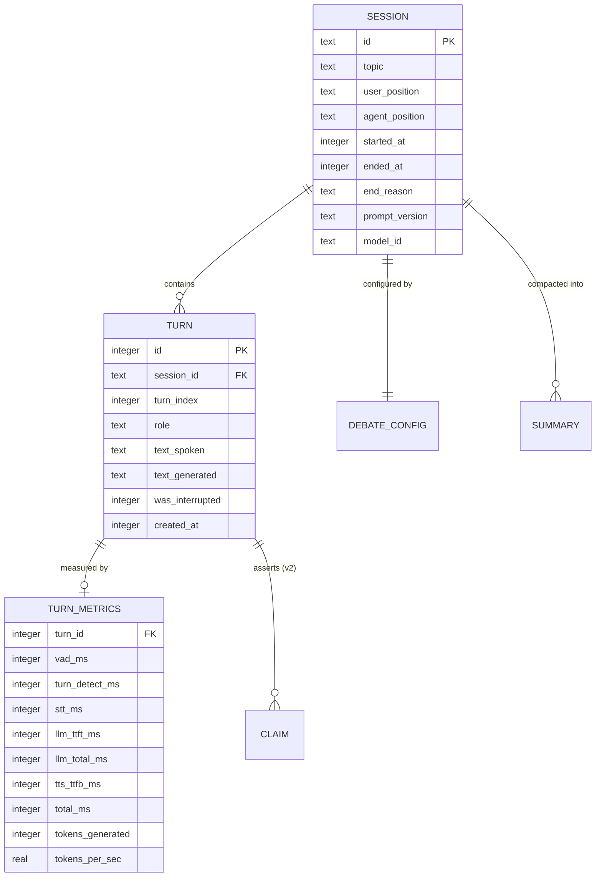

# Data Model

| | |
|---|---|
| **Status** | Draft |
| **Last updated** | 2026-08-30 |
| **Store** | SQLite — [ADR-0010](adr/0010-sqlite-for-session-persistence.md) |

---

## 1. Entity relationships



---

## 2. Schema

### 2.1 `sessions`

```sql
CREATE TABLE sessions (
    id              TEXT PRIMARY KEY,        -- uuid4
    topic           TEXT NOT NULL,
    user_position   TEXT NOT NULL,
    agent_position  TEXT NOT NULL,
    intensity       TEXT NOT NULL DEFAULT 'standard',
    started_at      INTEGER NOT NULL,        -- unix ms
    ended_at        INTEGER,
    end_reason      TEXT,                    -- user|error|timeout|abandoned
    prompt_version  TEXT NOT NULL,           -- e.g. 'debate-v3'
    model_id        TEXT NOT NULL,
    app_version     TEXT NOT NULL
);
CREATE INDEX idx_sessions_started ON sessions(started_at DESC);
```

**`prompt_version` and `model_id` are the important columns here.** The debate
persona will be iterated dozens of times. Without recording which version
produced a session, "did that change make it a better opponent?" is
unanswerable, and every persona change becomes a matter of impression rather
than evidence. These two columns are what make the
[Evaluation Framework](../04-quality/02-evaluation-framework.md) possible.

`ended_at IS NULL` marks a crashed or abandoned session. Not cleaned up
automatically — those rows are diagnostic evidence.

### 2.2 `turns`

```sql
CREATE TABLE turns (
    id              INTEGER PRIMARY KEY AUTOINCREMENT,
    session_id      TEXT NOT NULL REFERENCES sessions(id) ON DELETE CASCADE,
    turn_index      INTEGER NOT NULL,
    role            TEXT NOT NULL CHECK (role IN ('user','agent','system')),
    text_spoken     TEXT NOT NULL,           -- authoritative: what was HEARD
    text_generated  TEXT,                    -- agent only; NULL if not truncated
    was_interrupted INTEGER NOT NULL DEFAULT 0,
    stt_confidence  REAL,                    -- user turns only
    created_at      INTEGER NOT NULL,
    UNIQUE (session_id, turn_index)
);
CREATE INDEX idx_turns_session ON turns(session_id, turn_index);
```

> **`text_spoken` vs `text_generated` is FR-13 made durable.**
>
> - `text_spoken` — what the user actually heard. **This is what feeds the LLM
>   context on subsequent turns.** Always populated.
> - `text_generated` — the full generation, populated only when it differs
>   (i.e. after a barge-in). Kept for analysis, **never sent back to the model**.
>
> Storing both lets us later ask "how often does the user interrupt, and how much
> of the agent's argument goes unheard?" — a genuinely useful signal about
> whether responses are too long (FR-31). Two columns, and the temptation to
> collapse them into one should be resisted; the distinction is the requirement.

`UNIQUE (session_id, turn_index)` makes double-writes a constraint violation
rather than a silent duplicate.

### 2.3 `turn_metrics`

```sql
CREATE TABLE turn_metrics (
    turn_id           INTEGER PRIMARY KEY REFERENCES turns(id) ON DELETE CASCADE,
    vad_ms            INTEGER,
    turn_detect_ms    INTEGER,
    stt_ms            INTEGER,
    prompt_build_ms   INTEGER,
    llm_ttft_ms       INTEGER,
    llm_total_ms      INTEGER,
    tts_ttfb_ms       INTEGER,
    output_buffer_ms  INTEGER,
    total_ms          INTEGER NOT NULL,
    tokens_prompt     INTEGER,
    tokens_generated  INTEGER,
    tokens_per_sec    REAL,
    vram_used_mib     INTEGER
);
```

Separate table because metrics are written on a different cadence (may batch)
and are deletable without losing the transcript.

`vram_used_mib` is sampled per turn to detect the leak in NFR-REL-05 — a slow
climb across a session is exactly the failure that is invisible until minute 45.

**`total_ms` is the NFR-P-01 metric.** The component columns exist so that "it
feels slow" is diagnosable; without stage attribution the cost could be in any
of six places (US-503).

### 2.4 `summaries`

```sql
CREATE TABLE summaries (
    id                INTEGER PRIMARY KEY AUTOINCREMENT,
    session_id        TEXT NOT NULL REFERENCES sessions(id) ON DELETE CASCADE,
    covers_from_turn  INTEGER NOT NULL,
    covers_to_turn    INTEGER NOT NULL,
    summary_text      TEXT NOT NULL,
    created_at        INTEGER NOT NULL
);
```

Written when context compaction runs. Retaining these lets us verify that
compaction preserved the user's opening position and conceded points, rather
than trusting that it did.

### 2.5 `claims` — v2, defined now

```sql
CREATE TABLE claims (
    id            INTEGER PRIMARY KEY AUTOINCREMENT,
    turn_id       INTEGER NOT NULL REFERENCES turns(id) ON DELETE CASCADE,
    claim_text    TEXT NOT NULL,
    claim_type    TEXT,          -- factual|normative|definitional
    confidence    TEXT,          -- asserted|hedged|speculative
    rebutted_by   INTEGER REFERENCES turns(id),
    conceded      INTEGER NOT NULL DEFAULT 0
);
```

Not populated in v1. Defined here because it is the substrate for post-session
review and fabrication auditing ([Responsible AI](../06-governance/04-responsible-ai.md)),
and knowing the target shape prevents v1 choices that make it awkward to reach.

### 2.6 `schema_version`

```sql
CREATE TABLE schema_version (
    version    INTEGER NOT NULL,
    applied_at INTEGER NOT NULL
);
```

Migrations are forward-only numbered SQL scripts. Even a single-user local app
accumulates data worth not destroying.

---

## 3. Transcript export

Alongside the database, each session exports a human-readable Markdown file to
`data/transcripts/{started_at}-{topic-slug}.md`:

```markdown
# Debate — Remote work and productivity
**2026-08-30 21:14** · 23 min · 31 turns · prompt `debate-v3` · Qwen3.5-9B

- **User:** remote work is better for productivity
- **Contra:** remote work is worse for productivity

---

**User:** I think remote work clearly improves productivity because…

**Contra:** Productivity gains are contested. Remote workers report higher
output, but managers report lower collaboration. *(interrupted)*

**User:** But that ignores…
```

The database is authoritative; this is for reading. Interrupted turns are marked
so a reader is not confused by a sentence that stops mid-clause.

---

## 4. Storage estimates

| | |
|---|---|
| Turn row | ~500 bytes |
| Metrics row | ~120 bytes |
| 30-minute session (~40 turns) | ~25 KB |
| 500 sessions | ~12 MB |

Negligible. **No retention policy in v1** — deleting a user's own debate history
without being asked is worse than using 12 MB of disk. A `contra sessions purge`
command satisfies NFR-S-06.

---

## 5. What is deliberately not stored

| Not stored | Why |
|---|---|
| **Raw audio** | NFR-S-04. Large, and the most sensitive artifact in the system. Opt-in dev flag only. |
| Model weights / KV cache | Derived, huge |
| Interim transcripts | Superseded by finals; only noise |
| Full prompts per turn | Reconstructable from `prompt_version` + turns |

> **The raw-audio decision is a privacy stance, not a storage one.** Audio
> carries identity, tone, emotional state, and background context that text does
> not. Retaining transcripts and discarding audio keeps everything useful and
> the least sensitive form of it. When a dev flag enables audio capture, the UI
> must say so unmistakably.

---

## 6. Concurrency

One writer (the orchestrator), occasional readers (UI, analysis scripts).

| Setting | Value |
|---|---|
| `journal_mode` | `WAL` — readers do not block the writer |
| `synchronous` | `NORMAL` — durable enough with WAL |
| `foreign_keys` | `ON` — off by default in SQLite; must be set per connection |
| `busy_timeout` | 5000 ms |

The `foreign_keys` pragma is worth calling out: SQLite silently ignores foreign
key constraints unless it is enabled on **every** connection, which makes the
`ON DELETE CASCADE` clauses above inert if forgotten.
