# Latency Budget

| | |
|---|---|
| **Status** | Draft — **unvalidated**, every figure is estimated or sourced |
| **Last updated** | 2026-08-30 |
| **Governs** | NFR-P-01 … NFR-P-14 |

---

## 1. What we are measuring

**Mouth-to-ear latency**: the acoustic end of the user's final word to the first
sample of agent audio reaching the output device.

This is the only metric matching what a user perceives. Component timings are
diagnostic. In particular, **LLM time-to-first-token is not the latency** —
several hundred milliseconds elapse before the LLM is even invoked, and more
elapse after its first token before any sound is produced.

```
User stops speaking                              First audio heard
        │                                                │
        ├──── VAD ──┬── turn detect ──┬── STT ──┬─ LLM ─┬─ TTS ─┬─ buf ─┤
        │           │                 │         │       │       │       │
        └───────────┴─────────────────┴─────────┴───────┴───────┴───────┘
                            ← this whole span is the metric →
```

---

## 2. Targets

| Metric | Target | Ceiling |
|---|---|---|
| Median | 1,200 ms | 1,500 ms |
| P95 | 2,000 ms | 2,500 ms |
| Barge-in stop | 300 ms | 500 ms |

### Why 1,200 ms and not 800 ms

Published guidance says users notice lag around **800 ms**, and Twilio targets
~1,115 ms median. A shipped-product study measured **1,366 ms mean** across nine
consumer voice assistants.

We deliberately target looser than a customer-service agent for a reason
specific to this product: **debate tolerates, and arguably rewards, a beat of
consideration before a rebuttal.** An instant counterargument reads as glib — as
though the opponent were not listening. A 1.2 s pause reads as thought.

This is not a rationalisation for being slow. It is a genuine difference in what
the interaction wants, and it buys real headroom on constrained hardware.

---

## 3. Serial budget — the naive path

Stages executed strictly in sequence:

| # | Stage | Budget | Cumulative | Confidence |
|---|---|---|---|---|
| 1 | VAD silence confirmation | 250 ms | 250 | **[ASSUMED]** — tunable |
| 2 | Semantic turn detection | 150 ms | 400 | **[SOURCED]** |
| 3 | STT finalisation | 250 ms | 650 | **[SOURCED]** |
| 4 | Prompt assembly | 10 ms | 660 | **[ESTIMATED]** |
| 5 | LLM TTFT (warm prefix) | 400 ms | 1,060 | **[ASSUMED]** — BM-02 |
| 6 | Segment first unit | 30 ms | 1,090 | **[ESTIMATED]** |
| 7 | TTS first byte | 150 ms | 1,240 | **[SOURCED]** |
| 8 | Output buffer | 100 ms | **1,340** | Design choice |

**1,340 ms — over budget by 140 ms.** Three ways to close it follow.

---

## 4. Optimisation 1 — overlap turn detection with STT

Stages 2 and 3 do not depend on each other. The turn detector reads the *partial*
transcript, which STT has already produced; finalisation refines it.

```mermaid
gantt
    dateFormat X
    axisFormat %L ms
    title Serial vs overlapped (stages 2-3)
    section Serial
    Turn detection   :0, 150
    STT finalise     :150, 400
    section Overlapped
    Turn detection   :0, 150
    STT finalise     :0, 250
```



Run concurrently, the pair costs `max(150, 250) = 250 ms` rather than 400 ms.

**Saving: 150 ms → 1,190 ms.**

Requires speculative finalisation: begin finalising as soon as silence is
detected, discard if the turn detector says "keep listening". Wasted CPU on
false starts, but the CPU is idle anyway — this is precisely the free capacity
that [ADR-0004](adr/0004-cpu-placement-for-stt-and-tts.md) identifies.

---

## 5. Optimisation 2 — speculative prefill

The largest single cost is LLM TTFT at 400 ms, of which most is **prefill** of
the new user turn.

Prefill can start before the turn is committed. When silence is first detected,
send the partial transcript to `llama-server` for prefill only (`max_tokens: 0`).
If the turn commits with an unchanged transcript, the KV cache is warm and TTFT
collapses to near-pure decode latency.

| | TTFT |
|---|---|
| Cold prefill | ~400 ms |
| Warm (speculative) | ~120 ms **[ESTIMATED]** |

**Saving: up to 280 ms → ~910 ms.**

**Cost and risk.** Wasted GPU work when the user resumes speaking. More
importantly this is **the optimisation most dependent on prefix caching working
correctly on a hybrid DeltaNet architecture** — which is unverified
([OQ-03](../06-governance/05-open-questions.md), BM-02). Treat it as a Phase 3
optimisation, not a Phase 1 assumption.

---

## 6. Optimisation 3 — tune the silence window

250 ms of VAD silence confirmation is pure waiting.

| Window | Effect |
|---|---|
| 150 ms | −100 ms latency; more false cuts (NFR-A-03 pressure) |
| **250 ms** | Balanced |
| 400 ms | Fewer false cuts; sluggish |

**Not recommended as a primary lever.** NFR-A-03 (≤5% false cuts) is deliberately
tighter than NFR-A-04 (≤10% false holds) because interrupting a user mid-thought
is far worse than a slightly slower reply. Buying 100 ms here by cutting people
off is a bad trade for a *debate* partner specifically.

---

## 7. Optimised budget

| # | Stage | Budget | Cumulative |
|---|---|---|---|
| 0 | **WebRTC transport, round trip** | **40 ms** | 40 |
| 1 | VAD silence | 250 ms | 290 |
| 2+3 | Turn detection ∥ STT finalise | 250 ms | 540 |
| 4 | Prompt assembly | 10 ms | 550 |
| 5 | LLM TTFT (speculative prefill) | 150 ms | 700 |
| 6 | Segment first unit | 30 ms | 730 |
| 7 | TTS first byte | 150 ms | 880 |
| 8 | Output buffer | 100 ms | **980** |

**~980 ms median — 220 ms under target**, with the margin absorbing variance.

> **Stage 0 is new**, added by
> [ADR-0012](adr/0012-browser-webrtc-transport-with-aec.md): audio now travels
> browser → Python and back over WebRTC, costing Opus encode/decode and jitter
> buffering in both directions. Budgeted at 40 ms round trip and verified in
> BM-05 (sub-test AEC-6).

**Without speculative prefill (Phase 1 realistic case): ~1,230 ms — now
marginally *over* the 1,200 ms target.**

This is an honest consequence of the speakers decision and worth stating plainly
rather than absorbing quietly. Two responses, in order:

1. **BM-02 becomes more important, not less.** If prefix caching works,
   speculative prefill recovers ~280 ms and the budget is comfortable.
2. If BM-02 fails, the 1,200 ms target is missed by ~30 ms in Phase 1 and must be
   recovered from §6 (silence window) or by shortening responses. A 2.5%
   overshoot is not a crisis, but it removes all margin.

---

## 8. What happens after the first byte

The budget above ends when audio starts. Generation continues behind it.

```
t=0.94s   first audio plays  ─────────────────────────────────►
t=0.94s   LLM still generating tokens 20…164
t=5.4s    generation completes (164 tokens @ 30 tok/s)
t=40s     playback completes
```

**Playback (40 s) far outruns generation (5.4 s).** Once the first sentence is
out, the pipeline is comfortably ahead and stays ahead — provided TTS keeps RTF
below ~0.5. This is why NFR-P-22 is a correctness constraint: if TTS RTF exceeds
1.0, the gap closes, playback stalls, and the agent stutters mid-argument.

---

## 9. Tail latency (P95)

Medians are the easy part. The P95 sources:

| Source | Impact | Mitigation |
|---|---|---|
| Long first sentence | +200–400 ms | Clause-break segmentation ([Component Design](02-component-design.md)) |
| Prefix cache miss | +300–800 ms | Stable prompt prefix; avoid mid-session prompt edits |
| Context compaction | +2–4 s | Run between turns, never mid-turn |
| CPU contention (STT ∥ TTS ∥ VAD) | +100–300 ms | Thread pool sizing; P-core affinity |
| GPU thermal throttling | Degrades over session | Monitor tok/s drift (NFR-REL-01) |
| Windows scheduler jitter | +50–150 ms | Raise process priority |

**Compaction is the one that will blow P95** — a 2–4 s pause is far outside
budget. Mitigation is scheduling it between turns while the user is speaking,
where it is invisible. If it must run during a turn, the agent should say
something ("Let me think about how we got here") rather than going silent.

---

## 10. Barge-in budget

Separate path, separate target (NFR-P-03).

| Step | Budget | Cumulative |
|---|---|---|
| Mic → Python over WebRTC | 20 ms | 20 |
| VAD speech onset | 50 ms | 70 |
| Barge-in confirmation (avoid false trigger on a cough) | 100 ms | 170 |
| `clear()` command → browser | 20 ms | 190 |
| Drain output buffer | 100 ms | **290** |

**290 ms — inside the 300 ms target, but only just.** The WebRTC round trip
consumed 40 ms of a budget that previously had 30 ms of slack.

> **Mitigation if BM-05 shows this is too tight: run VAD in the browser for
> barge-in detection only.**
>
> An `AudioWorklet` doing energy-based onset detection client-side lets the page
> stop its own playback immediately, removing both transport hops from the path —
> roughly 250 ms total. Server-side Silero VAD continues to drive turn detection,
> where 40 ms is irrelevant.
>
> This splits one component across two runtimes, which is a real complexity cost.
> Worth it only if measurement shows the 290 ms budget failing in practice.

`TTS.cancel()` and `LLM.cancel()` run in parallel and do not add to the
user-perceived stop time — but `LLM.cancel()` must still complete within 100 ms
so the server slot frees before the next turn ([Internal API Spec §A.4](05-internal-api-spec.md)).

---

## 11. Where the risk actually is

Ranked by damage if the estimate is wrong:

| # | Assumption | If wrong | Detected by |
|---|---|---|---|
| 1 | LLM ≥ 25 tok/s | Generation cannot outrun playback; agent stutters | BM-01 |
| 2 | Prefix caching works on hybrid arch | TTFT balloons to seconds; §5 impossible | BM-02 |
| 3 | STT RTF < 0.3 on CPU under GPU load | Transcription falls behind, unbounded | BM-03 |
| 4 | TTS RTF < 0.5 on short texts | Playback stalls mid-argument | BM-03 |
| 5 | Turn detection ≤ 150 ms | Direct latency add | BM-03 |
| 6 | **WebRTC round trip ≤ 40 ms** | Both budgets tighten; barge-in may need client-side VAD | BM-05 |

**Nothing in this document is measured.** Every number is sourced from
third-party benchmarks or derived arithmetically. The budget is internally
consistent, which is not the same as being true.

Phase 0 of the [Roadmap](../07-planning/01-roadmap.md) exists to replace these
estimates with measurements before any pipeline code is written. If BM-01
returns 15 tok/s, the correct response is to change the design — swap to
Qwen3.5-4B — not to discover the problem during integration and try to optimise
around it.

---

## 12. Contingencies

If the measured budget cannot be met:

| Lever | Saving | Cost |
|---|---|---|
| Qwen3.5-4B instead of 9B | ~2× throughput, faster TTFT | MMLU-Pro 82.5 → 79.1 |
| Reduce context 16K → 8K | Faster prefill | ~50 exchanges instead of ~100 |
| Shorten `max_tokens` 220 → 150 | Shorter turns | Less developed arguments |
| Filler acknowledgement (FR-15) | Hides ~600 ms | Perceptual only, not real |
| Piper instead of Kokoro | Lower TTS latency | Noticeably more robotic |
| Cut silence window to 150 ms | 100 ms | More false cuts — **not recommended** |

**FR-15 (the filler token) deserves comment.** Emitting "Hm—" or "Right," while
generation completes is perceptual sleight of hand, not a real improvement. It
is nonetheless legitimate: conversational filler is exactly what humans do while
composing a reply, and it converts dead silence into a signal that the opponent
is thinking. It should be used to smooth the tail, not to excuse a slow median.
