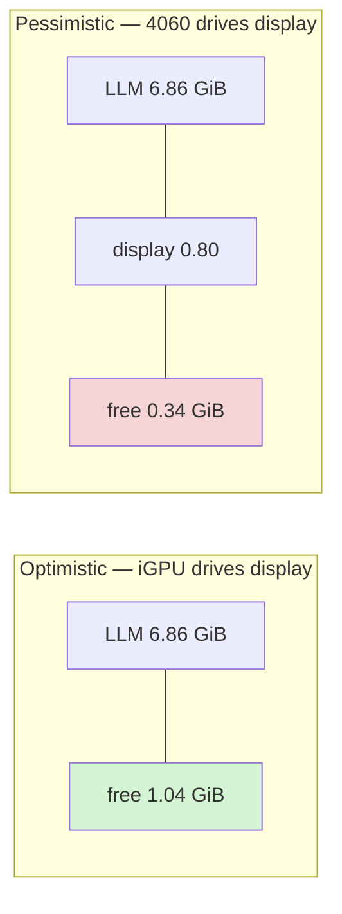

# Resource Budget

| | |
|---|---|
| **Status** | Draft — partly verified |
| **Last updated** | 2026-08-30 |
| **Governs** | NFR-R-01 … NFR-R-06 |

> **This is the most important document in the architecture tier.** The single
> number it establishes — roughly 1.1 GiB of VRAM headroom — is the reason for
> most non-obvious decisions in this design.

---

## 1. The constraint

| | | Confidence |
|---|---|---|
| GPU | RTX 4060 Laptop | **[VERIFIED]** |
| Total VRAM | 8,188 MiB = **7.996 GiB** | **[VERIFIED]** `nvidia-smi` |
| Usable target | ≤ 7.5 GiB (NFR-R-01) | Design choice |

> **Do not read VRAM from WMI.** `Win32_VideoController.AdapterRAM` reports
> **4 GB** for this GPU — the field is 32-bit and unreliable on modern cards. Any
> preflight check must use `nvidia-smi` or NVML, or it will refuse to run on a
> perfectly capable machine.
> [Hardware Baseline](../01-research/03-hardware-baseline.md).

---

## 2. LLM allocation

### 2.1 Weights **[VERIFIED]**

| | |
|---|---|
| File | `Qwen3.5-9B-UD-Q4_K_XL.gguf` |
| Size | 5,966,095,584 bytes = **5.556 GiB** |

Fully resident with `-ngl 99`. Partial offload is not an option — see §6.

### 2.2 KV cache **[ESTIMATED — arithmetic shown]**

This is where Qwen3.5's architecture pays off decisively.

Of 32 layers, only **8 are full-attention** (Gated Attention); the other 24 are
Gated DeltaNet with fixed-size recurrent state. **Only the 8 contribute to KV
cache.**

Per the model card: 16 query heads, **4 KV heads**, head dimension 256.

```
per token, per full-attn layer:
    2 (K and V) × 4 KV heads × 256 head_dim  =  2,048 values

across 8 full-attention layers:
    2,048 × 8                                = 16,384 values / token

at FP16 (2 bytes/value):
    16,384 × 2                               = 32,768 bytes = 32 KiB / token
```

| Context | FP16 | Q8_0 |
|---|---|---|
| 4,096 | 0.125 GiB | 0.063 GiB |
| 8,192 | 0.250 GiB | 0.125 GiB |
| **16,384** | **0.500 GiB** | 0.250 GiB |
| 32,768 | 1.000 GiB | 0.500 GiB |
| 65,536 | 2.000 GiB | 1.000 GiB |

**The comparison that matters.** A conventional dense 9B — 32 full-attention
layers, 8 KV heads, head dim 128 — would cost:

```
2 × 8 × 128 × 32 layers = 65,536 values/token = 128 KiB/token at FP16
    → 16K context = 2.0 GiB
```

**4× more.** On this card that difference is not an optimisation; it is the
difference between the project being possible and not.

> **[SOURCED] corroboration.** Independent analysis of the larger Qwen3.5-27B
> (64 layers, 16 full-attention) reports "~2 GB KV cache at 32K context",
> consistent with our per-layer arithmetic scaled to that model.

### 2.3 DeltaNet recurrent state **[ESTIMATED]**

The 24 linear-attention layers hold a fixed-size state — llama.cpp allocates it
as `cache_r_l*` / `cache_s_l*`. **It does not grow with context.**

Order-of-magnitude, per layer: 32 value heads × 128 head_dim × 128 QK_dim ≈ 512K
values ≈ 1 MiB at FP16, × 24 layers ≈ **~25–100 MiB**, plus allocator overhead.

Budgeted at **0.10 GiB**. Low confidence on the exact figure; high confidence
that it is small and constant. Measured in BM-04.

### 2.4 Runtime overhead **[SOURCED]**

llama.cpp's CUDA backend adds roughly **0.70–0.75 GiB** beyond model size —
compute buffers, cuBLAS workspace, CUDA context. Budgeted at **0.70 GiB**.

### 2.5 LLM subtotal

| Item | GiB |
|---|---|
| Weights | 5.556 |
| KV cache @ 16K FP16 | 0.500 |
| DeltaNet state | 0.100 |
| CUDA overhead | 0.700 |
| **Total** | **6.856** |

---

## 3. Full budget

| Item | GiB | Confidence |
|---|---|---|
| LLM total (§2.5) | 6.856 | **[ESTIMATED]** |
| Windows display/compositor | 0.10 – 0.80 | **[ASSUMED]** — BM-04 |
| **Consumed** | **6.96 – 7.66** | |
| **Free of 7.996 GiB** | **0.34 – 1.04** | |

### The spread is the problem



Whether we have **1.04 GiB or 0.34 GiB** depends entirely on which GPU drives
the display. This is a hybrid-graphics laptop with an Intel UHD iGPU present;
**[ASSUMED]** the iGPU handles the desktop, but this is unverified (BM-04).

**Under the pessimistic case, nothing else fits on the GPU at all.**

---

## 4. The decision this forces

We could try to fit STT and TTS into headroom that may be 0.34 GiB or may be
1.04 GiB. Instead:

> **All speech models run on the CPU. The GPU has exactly one tenant.**

This converts a risky unknown into a non-issue. The budget becomes:

| Item | GiB |
|---|---|
| LLM total | 6.856 |
| Display (worst case) | 0.800 |
| **Total** | **7.656** |
| **Margin** | **0.34** |

Tight but sufficient, and **it holds under the pessimistic assumption**. If BM-04
shows the optimistic case, the extra gigabyte becomes margin for a larger
context or a better quant — not a reason to relocate speech models.

The argument that makes this cheap rather than a sacrifice: **with `-ngl 99`,
llama.cpp leaves the CPU nearly idle.** All 32 layers execute on the GPU; the
CPU only marshals requests. During the LLM's ~5 s generation burst, 16 threads
sit unused. Putting Parakeet and Kokoro there consumes capacity we have already
paid for and are otherwise wasting.

Full rationale: [ADR-0004](adr/0004-cpu-placement-for-stt-and-tts.md).

---

## 5. What we are NOT putting on the GPU

| Candidate | VRAM | Verdict |
|---|---|---|
| **`mmproj-F16.gguf`** (vision) | **0.918 GiB** | **Never.** ~88% of best-case headroom, zero benefit for voice. |
| Whisper large-v3 | ~3 GiB | Impossible |
| faster-whisper small.en | ~0.5 GiB | Possible in optimistic case only — rejected |
| Orpheus TTS 3B | ~8 GiB | Impossible |
| Chatterbox TTS | ~1 GiB | Rejected — v1 has no voice cloning |
| Parakeet on GPU | ~0.6 GiB | Rejected — CPU is fast enough and free |

> **The `mmproj` line deserves emphasis.** The model is genuinely multimodal and
> the projector ships in the same repo. Loading it out of curiosity would consume
> more VRAM than STT and TTS combined, for a capability this product does not
> use. Omitting `--mmproj` is a one-flag decision worth ~0.9 GiB.

---

## 6. Why partial offload is forbidden

The obvious escape valve — offload 28 of 32 layers, keep 4 on CPU — does not
work.

| Offload | Behaviour |
|---|---|
| 32/32 | Full speed, ~25–35 tok/s |
| 28/32 | **Not 87% speed.** Every token crosses PCIe for the CPU-resident layers. |
| 16/32 | Single-digit tok/s |

The failure is not graceful degradation; it is a cliff. PCIe round-trips per
token dominate everything else. NFR-R-02 states this as a hard constraint, and
it is why §4's decision is to remove other tenants from the GPU rather than
shrink the LLM's share.

---

## 7. System RAM

| Item | GiB | Notes |
|---|---|---|
| Windows 11 | 3.5 | **[ASSUMED]** |
| Python runtime + asyncio orchestrator | 0.4 | |
| Parakeet TDT ONNX | 1.2 | 0.6B params, CPU-resident |
| Kokoro-82M ONNX | 0.3 | |
| Silero VAD + turn detector | 0.6 | Turn detector is a 0.5B model |
| Audio buffers | 0.1 | |
| llama-server host process | 0.5 | Beyond VRAM |
| Browser UI (optional) | 1.5 | |
| **Total** | **8.1** |
| **Of 15.7 available** | **52%** | Within NFR-R-03's 10 GiB cap |

Comfortable. The model is memory-mapped during load, which can transiently spike
page-cache usage but does not count as committed memory.

---

## 8. Disk

| Item | GiB |
|---|---|
| Qwen3.5-9B UD-Q4_K_XL | 5.56 |
| Parakeet TDT ONNX | ~0.65 |
| Kokoro-82M ONNX | ~0.31 |
| Silero VAD | ~0.002 |
| Turn detector | ~0.5 |
| Python environment | ~2.0 |
| llama.cpp binaries + CUDA | ~0.5 |
| Session data (500 sessions) | ~0.01 |
| **Total** | **~9.5** |

NFR-R-06 caps models at 8 GiB; models alone total ~7.0 GiB. Within budget.

---

## 9. Context size options

| Context | KV (FP16) | LLM total | Free (opt.) | Exchanges | Verdict |
|---|---|---|---|---|---|
| 8,192 | 0.25 | 6.61 | 1.29 | ~50 | Safe fallback |
| **16,384** | **0.50** | **6.86** | **1.04** | **~100** | **Chosen** |
| 32,768 | 1.00 | 7.36 | 0.54 | ~200 | Only if BM-04 is optimistic |
| 65,536 | 2.00 | 8.36 | — | — | Does not fit |

16K supports roughly 100 exchanges at ~150 tokens each — beyond a 40-minute
session, with compaction as a backstop
([Data Flow & State](04-data-flow-and-state.md)).

**KV quantization is deliberately not used.** Q8_0 KV would halve the cache and
free 0.25 GiB, but Unsloth's guidance notes gibberish output on Qwen3.5 with
quantized KV, recommending `--cache-type-k bf16 --cache-type-v bf16` as the fix.
Given hybrid recurrent state, we treat KV quantization as risky until proven
otherwise. It is a contingency lever, not a default.

---

## 10. Verification required

| ID | Measure | Resolves |
|---|---|---|
| **BM-04** | `nvidia-smi` with desktop idle; confirm which GPU drives display | §3 spread — the largest open uncertainty |
| **BM-04** | Actual VRAM after `llama-server` loads at 8K/16K/32K | §2 estimates |
| **BM-04** | VRAM sampled across a 60-min session | NFR-REL-05 leak detection |
| **BM-03** | Peak RAM under combined load | §7 |

**§2 and §3 are arithmetic, not measurement.** The KV derivation follows from the
published model card and is high confidence; the CUDA overhead and display
reserve are borrowed figures and are not.

---

## 11. If the budget does not hold

In order of preference:

| Lever | Frees | Cost |
|---|---|---|
| Context 16K → 8K | 0.25 GiB | ~50 exchanges instead of ~100 |
| Force display to iGPU in Windows settings | up to 0.7 GiB | User configuration step |
| Quant `UD-Q4_K_XL` → `UD-Q3_K_XL` | 0.85 GiB | Measurable quality loss |
| KV cache → Q8_0 | 0.25 GiB | **Risk of gibberish** — verify carefully |
| **Model 9B → Qwen3.5-4B** | **~3.0 GiB** | MMLU-Pro 82.5 → 79.1; also fixes latency |

**The 4B swap is the big lever and the one to reach for first if two constraints
bind at once.** It resolves both a VRAM shortfall and a throughput shortfall
simultaneously, at a cost — 3.4 points of MMLU-Pro — that matters far less for a
debate partner than for a knowledge tool. Argumentative structure is mostly a
reasoning-and-instruction-following skill, and the 4B retains most of it.
