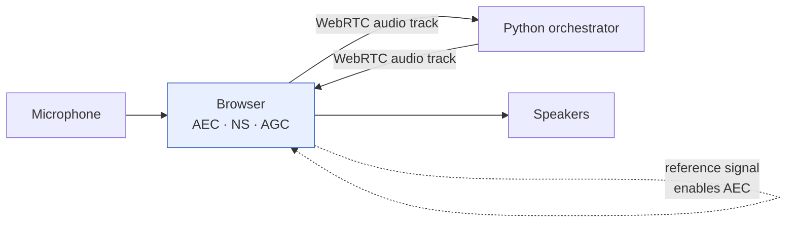

# ADR-0012: Browser/WebRTC audio transport with acoustic echo cancellation

| Status | Date | Confidence | Reversibility |
|---|---|---|---|
| **Accepted** | 2026-08-30 | Medium-high | Moderate |

**Supersedes** [ADR-0008](0008-headphones-first-audio-transport.md).
**Closes** [OQ-01](../../06-governance/05-open-questions.md).

## Context

[ADR-0008](0008-headphones-first-audio-transport.md) provisionally assumed
headphones, deferring acoustic echo cancellation on the grounds that headphones
eliminate the speaker→microphone path entirely.

**The user has confirmed they will use speakers.** That assumption is void.

The microphone stays live while the agent speaks — that is what makes barge-in
possible ([Data Flow §1](../04-data-flow-and-state.md)). With speakers, the
agent's own output reaches the microphone, VAD registers speech, barge-in fires,
and **the agent interrupts itself indefinitely.**

AEC is now mandatory, not deferred. It is also the hardest signal-processing
problem in the system, and hardest precisely during *double-talk* — the barge-in
moment — where the common failure is suppressing the user's speech along with
the echo.

## Decision

**Audio enters and leaves through a browser page over WebRTC. The browser
performs AEC.**

```javascript
navigator.mediaDevices.getUserMedia({
  audio: {
    echoCancellation: true,      // Google's WebRTC AEC3
    noiseSuppression: true,
    autoGainControl: true,
    channelCount: 1,
    sampleRate: 16000,
  }
})
```

### The non-obvious consequence

> **Agent audio must be played *by the browser*, not by Python.**
>
> AEC works by subtracting a *reference signal* — what is being played — from the
> microphone input. The browser can only do this for audio it is itself
> rendering. If Python plays TTS output through the system audio device, the
> browser has no reference signal and its echo canceller is inert. The agent
> would still hear itself.
>
> So synthesised audio must be streamed back to the browser over the WebRTC
> connection and played there. **The audio path is a loop through the browser in
> both directions.**

This changes the architecture materially: **the browser is no longer an optional
transcript viewer.** It is a required component carrying the audio path.



## Alternatives considered

### Native audio + a server-side AEC library — rejected

`webrtc-audio-processing` or `speexdsp` Python bindings would let us keep the
native `sounddevice` transport and cancel echo in Python.

Rejected on three grounds:

1. **Reference-signal alignment is the hard part.** Server-side AEC needs the
   played audio time-aligned with the captured audio to within a few
   milliseconds. The browser gets this for free because it owns both ends of the
   audio device; in Python we would be estimating device latency and correcting
   drift ourselves.
2. **Windows binding maturity.** These packages are Linux-first and are exactly
   the class of dependency that fails to build on Windows
   ([RISK-04](../../06-governance/01-risk-register.md)).
3. **The browser's AEC is better.** Chrome's AEC3 is among the most-tested echo
   cancellers in existence, refined against a decade of real-world video calls.

### Windows OS-level AEC — rejected as the primary mechanism, kept as an aid

Windows applies echo cancellation to devices enrolled as *Communications*
devices. It is real and it helps.

Not sufficient alone: it is not guaranteed to be active, its behaviour varies by
driver and device, and we cannot verify it programmatically. Treated as a
**recommended user configuration** in the install guide, not as the design.

### Half-duplex — mute the microphone during playback — rejected

Eliminates echo completely and trivially. **Also eliminates barge-in** (FR-12),
which is P0 and one of the three things that make this feel like a conversation
rather than a walkie-talkie.

### Push-to-talk only — rejected as primary

Same cost. Retained as an escape hatch (FR-43) for turn-detection failure.

### Ask the user to reconsider and wear headphones — rejected

They stated a requirement. Designing around it is the job.

## Consequences

### Positive
- Production-grade AEC at no implementation cost.
- Free noise suppression and automatic gain control — likely to *improve* WER,
  particularly against laptop fan noise
  ([RISK-07](../../06-governance/01-risk-register.md)).
- Free device enumeration and permission UI (NFR-U-05).
- Works with speakers, headphones, Bluetooth, external interfaces — the
  hardware constraint on the user disappears entirely.
- The transcript UI and the audio transport share one page and one connection.
- Matches how commercial voice agents are actually built.

### Negative
- **The browser becomes a required component.** A crashed or closed tab ends the
  session. Previously it was optional.
- **Added latency.** Opus encode/decode plus jitter buffering on a loopback
  connection. Budgeted at **40 ms** round trip — see
  [Latency Budget](../07-latency-budget.md). Tight but affordable.
- **Schedule impact.** The transport moves from a conditional Phase 4 item to a
  committed **Phase 1** item — barge-in in Phase 2 cannot be built or tested
  without working AEC. Roughly **+3 days**.
- WebRTC signalling, a local media server, and browser permission handling are
  now in scope.
- **Double-talk performance is unknown on this hardware.** Laptop speakers and a
  built-in microphone array are the *worst* case for AEC — tight acoustic
  coupling, and the array does its own processing which can confuse the
  canceller. New risk: [RISK-12](../../06-governance/01-risk-register.md).
- Debugging spans two runtimes.

### Neutral
- **Strengthens [ADR-0003](0003-pipecat-as-orchestration-framework.md).** That
  decision noted that if OQ-01 resolved to headphones-only, one of Pipecat's main
  justifications would evaporate and DIY orchestration would become competitive.
  It resolved the other way. Pipecat's WebRTC transport and audio handling are
  now doing real work, and the DIY alternative is correspondingly less
  attractive.

## Practical mitigations for the speaker case

Beyond the browser's AEC, all cheap and worth doing:

| Mitigation | Effect |
|---|---|
| Enrol the device as a Windows *Communications* device | Enables OS-level AEC as a second layer |
| Recommend moderate output volume | AEC degrades as echo amplitude rises |
| Prefer an external microphone away from the speakers | Reduces coupling; the biggest single physical win |
| Raise `vad.threshold` if self-triggering persists | Blunt, costs barge-in sensitivity |
| Require a short calibration on first run | Play a tone, measure echo return loss, warn if poor |

The calibration step is worth building: it converts "the agent keeps interrupting
itself" from a mystifying failure into a diagnosed one, at first-run time rather
than mid-argument.

## Revisit when

- **Double-talk performance proves inadequate** in BM-05 or real use → evaluate
  a dedicated AEC (Krisp, or `webrtc-audio-processing` tuned for this device),
  or fall back to push-to-talk as the default.
- The browser dependency becomes unacceptable — e.g. packaging as a desktop
  application. Electron or a WebView keeps the same AEC while removing the
  external browser.
- The user later adopts headphones anyway, at which point AEC becomes redundant
  but harmless. **Do not remove it** — it costs nothing and the user's hardware
  can change without notice.

## Verification

| ID | Measures |
|---|---|
| **BM-05** (new) | Echo return loss with speakers at typical volume; self-trigger rate over 5 min of agent speech with the user silent |
| **BM-05** | **Double-talk**: user speaks over the agent — is the user's speech preserved? |
| US-204 | Agent does not register barge-in from its own output |
| IT-02 | Barge-in still meets NFR-P-03 with the added transport latency |

> **The double-talk test is the one that matters.** An echo canceller that works
> when only one party speaks is easy and useless — the entire point is barge-in,
> which is by definition double-talk. A canceller that suppresses the user's
> interruption along with the echo produces an agent that cannot be interrupted,
> which is exactly the failure we are trying to avoid.
