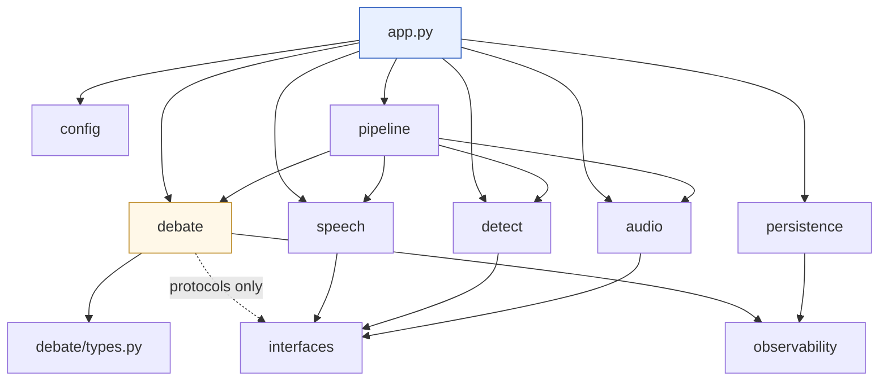

# Repository Structure

| | |
|---|---|
| **Status** | Draft |
| **Last updated** | 2026-08-30 |

---

## 1. Layout

```
contra-debate-agent/
├── README.md                    # what this is, how to run it
├── pyproject.toml               # deps, tool config, entry points
├── uv.lock                      # pinned lockfile — committed
├── .gitignore
├── .env.example
│
├── docs/                        # this documentation tree
│
├── src/contra/
│   ├── __main__.py              # entry point: python -m contra
│   ├── app.py                   # composition root — the ONLY wiring module
│   │
│   ├── audio/
│   │   ├── interfaces.py        # AudioInput, AudioOutput protocols
│   │   ├── local_device.py      # sounddevice implementation
│   │   ├── types.py             # AudioFrame, AudioChunk, PlaybackPosition
│   │   └── ring_buffer.py       # pre-buffer for barge-in onset capture
│   │
│   ├── detect/
│   │   ├── interfaces.py        # VadStage, TurnDetector protocols
│   │   ├── silero_vad.py
│   │   ├── smart_turn.py        # Pipecat Smart Turn v2
│   │   └── heuristic_turn.py    # punctuation fallback
│   │
│   ├── speech/
│   │   ├── interfaces.py        # SttStage, TtsStage protocols
│   │   ├── parakeet_stt.py      # onnx-asr
│   │   ├── whisper_stt.py       # faster-whisper fallback
│   │   └── kokoro_tts.py        # kokoro-onnx
│   │
│   ├── debate/                  # ← the core. No I/O library imports.
│   │   ├── session_manager.py   # state machine
│   │   ├── conversation.py      # ConversationState — FR-13 lives here
│   │   ├── prompt_builder.py
│   │   ├── llm_client.py
│   │   ├── segmenter.py         # SentenceSegmenter
│   │   └── types.py             # Message, Turn, SessionState
│   │
│   ├── pipeline/
│   │   └── assembly.py          # Pipecat wiring — the only framework-aware module
│   │
│   ├── persistence/
│   │   ├── repository.py
│   │   ├── schema.sql
│   │   └── migrations/
│   │       └── 001_initial.sql
│   │
│   ├── config/
│   │   ├── loader.py
│   │   ├── models.py            # typed config dataclasses
│   │   └── prompts.py           # PromptLoader
│   │
│   ├── observability/
│   │   ├── metrics.py
│   │   └── logging.py
│   │
│   └── ui/
│       ├── server.py            # FastAPI: WS + control HTTP
│       └── static/
│
├── config/
│   ├── default.yaml             # committed
│   └── user.yaml                # gitignored
│
├── prompts/
│   ├── ACTIVE.yaml
│   ├── debate/{v1,v2,v3}.md
│   ├── topic_extraction/v1.md
│   └── summarisation/v1.md
│
├── benchmarks/                  # Phase 0 — runs BEFORE src/ exists
│   ├── bm01_llm_throughput.py
│   ├── bm02_prefix_cache.py
│   ├── bm03_cpu_speech_rtf.py
│   ├── bm04_vram_profile.py
│   └── results/                 # committed — the evidence base
│
├── tests/
│   ├── unit/
│   ├── integration/
│   ├── fixtures/audio/          # recorded speech, incl. silence.wav
│   └── conftest.py
│
├── scripts/
│   ├── setup.ps1
│   ├── start.ps1                # supervisor: llama-server then orchestrator
│   └── fetch_models.py
│
└── data/                        # gitignored
    ├── contra.db
    └── transcripts/
```

---

## 2. The rules that matter

### 2.1 `debate/` imports no I/O libraries

The core must not import `onnx_asr`, `kokoro_onnx`, `sounddevice`, `pipecat`, or
`torch`. It depends only on the protocols in `*/interfaces.py`.

This is what makes NFR-M-01 real rather than aspirational, and it is
**enforceable by lint** ([Coding Standards](03-coding-standards.md)):

```toml
[tool.ruff.lint.flake8-tidy-imports.banned-api]
"onnx_asr".msg = "Import only in speech/. Core depends on interfaces."
"sounddevice".msg = "Import only in audio/."
"pipecat".msg = "Import only in pipeline/assembly.py."
```

Without mechanical enforcement this rule erodes within weeks — someone needs one
type from one library and the boundary quietly dissolves.

### 2.2 One composition root

`app.py` is the only module that constructs concrete implementations and wires
them together. Everything else receives dependencies through its constructor.

Consequence: swapping Parakeet for Whisper is a one-line change in `app.py`,
which is exactly the property [ADR-0005](../02-architecture/adr/0005-parakeet-tdt-for-stt.md)
relies on for its fallback plan.

### 2.3 Pipecat is confined to `pipeline/assembly.py`

Framework as *runtime*, not as *architecture*
([ADR-0003](../02-architecture/adr/0003-pipecat-as-orchestration-framework.md)).
If we leave Pipecat, the stages come with us and only this file is rewritten.
That is what keeps ADR-0003's reversibility at "Moderate".

### 2.4 `benchmarks/` precedes `src/`

Deliberately a sibling, not a subdirectory of tests. **The Phase 0 benchmarks run
before any application code exists** — they decide whether the design is viable
at all ([Roadmap](../07-planning/01-roadmap.md)).

`benchmarks/results/` is **committed**. Those measurements are the evidence base
that converts this design's [ESTIMATED] and [SOURCED] claims into [VERIFIED]
ones, and they should be reviewable in history.

### 2.5 Prompts are not code

`prompts/` sits at the repository root, beside `config/`, not inside `src/`.
They are versioned data ([ADR-0011](../02-architecture/adr/0011-yaml-configuration-and-versioned-prompts.md)),
and their placement should make that obvious.

---

## 3. Where does a new file go?

| If it… | Put it in |
|---|---|
| Talks to a specific model or library | `speech/`, `detect/`, or `audio/` |
| Implements debate logic | `debate/` |
| Wires components together | `app.py` or `pipeline/assembly.py` |
| Reads or writes the database | `persistence/` |
| Defines a contract between stages | the relevant `interfaces.py` |
| Measures something before we build it | `benchmarks/` |
| Is a prompt | `prompts/<role>/vN.md` |
| Is a tunable number | `config/default.yaml` |

**If a file seems to belong in two places, the boundary is wrong** — that is a
signal to reconsider the split rather than to pick one arbitrarily.

---

## 4. Naming

| Kind | Convention | Example |
|---|---|---|
| Modules | `snake_case` | `session_manager.py` |
| Classes | `PascalCase` | `ConversationState` |
| Protocols | `PascalCase`, no `I` prefix | `SttStage` |
| Implementations | `<Vendor><Role>` | `ParakeetStt`, `KokoroTts` |
| Config keys | `snake_case` | `max_response_tokens` |
| Env vars | `CONTRA_<SECTION>_<KEY>` | `CONTRA_LLM_PORT` |
| Prompt files | `v<N>.md` | `debate/v3.md` |
| Benchmarks | `bm<NN>_<subject>.py` | `bm01_llm_throughput.py` |

Implementations are named for their vendor because we expect several per
interface. `ParakeetStt` and `WhisperStt` sitting side by side makes the
substitution relationship obvious at a glance.

---

## 5. `.gitignore`

```gitignore
__pycache__/
.venv/
*.pyc

config/user.yaml          # personal overrides
.env

data/                     # sessions, transcripts — user's private debates
models/                   # large; fetched by scripts/fetch_models.py
*.gguf
*.onnx

tests/fixtures/audio/*.wav   # except committed fixtures below
!tests/fixtures/audio/silence.wav
!tests/fixtures/audio/README.md
```

Two entries deserve comment:

**`data/`** holds the user's actual debate transcripts — private by design
(NFR-S-01). It must never be committed, even accidentally, even in this
single-user project.

**`silence.wav` is force-included.** It is the fixture that verifies NFR-A-02 —
that STT produces no output on silence — which is the entire reason Parakeet was
chosen ([ADR-0005](../02-architecture/adr/0005-parakeet-tdt-for-stt.md)). A test
whose fixture is gitignored is a test that silently stops existing on a fresh
clone.

---

## 6. Entry points

```toml
[project.scripts]
contra = "contra.__main__:main"
```

```powershell
.\scripts\start.ps1        # supervised: llama-server + orchestrator (FR-51)
python -m contra           # orchestrator only, assumes llama-server running
python -m contra --ptt     # push-to-talk mode (FR-43)
python benchmarks/bm01_llm_throughput.py
```

---

## 7. Module dependency graph



**No cycles.** `debate/` is the innermost layer and depends on abstractions only.
`app.py` sits outermost and knows about everything — which is precisely the
inversion that makes the core testable with fakes and the implementations
swappable.
