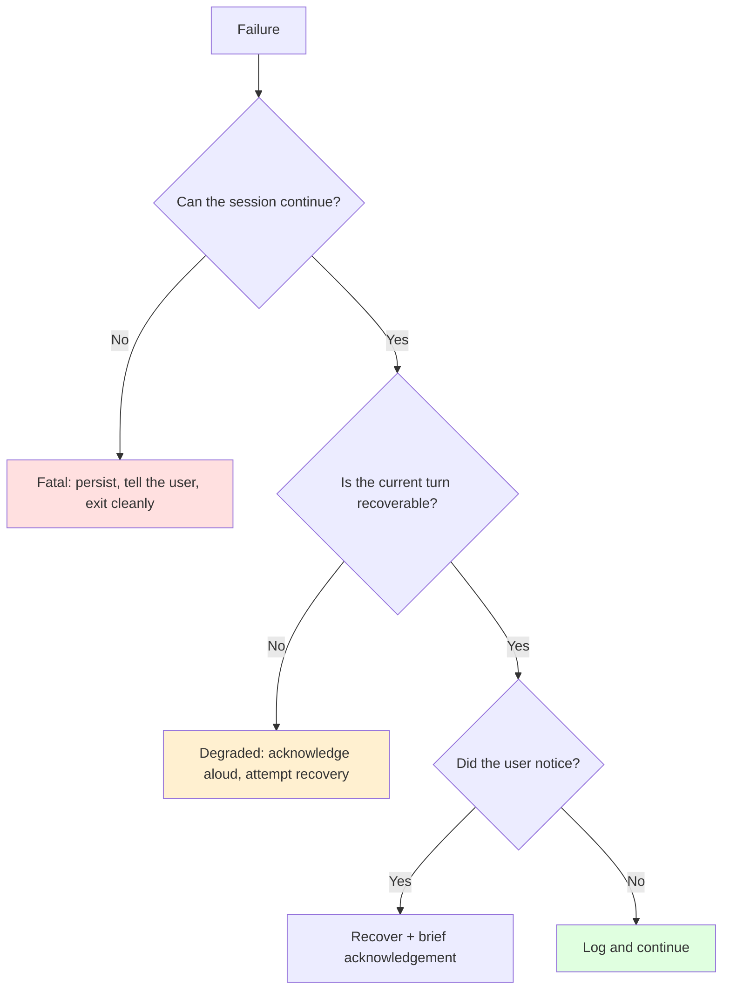
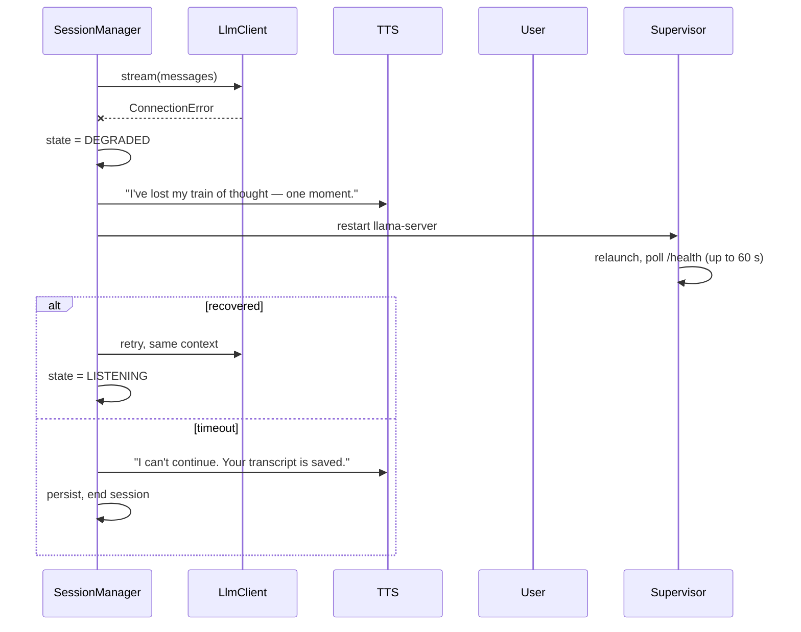

# Error Handling & Resilience

| | |
|---|---|
| **Status** | Draft |
| **Last updated** | 2026-08-30 |

---

## 1. Principle: match the response to the severity

A voice pipeline has failure modes at very different severities, and treating
them uniformly is wrong in both directions — crashing on a dropped syllable is
as bad as silently continuing with a dead model.



---

## 2. Failure catalogue

| # | Failure | Severity | Response |
|---|---|---|---|
| **F-01** | `llama-server` unreachable at startup | Fatal | Named error + remediation (FR-52) |
| **F-02** | `llama-server` dies mid-session | Degraded | Speak acknowledgement, restart, retry |
| **F-03** | LLM stream stalls (>5 s, no token) | Degraded | Cancel, apologise, re-prompt once |
| **F-04** | LLM returns empty | Turn-level | Retry once with temperature +0.2 |
| **F-05** | STT returns empty for a committed turn | Turn-level | Ask user to repeat |
| **F-06** | STT confidence below threshold | Turn-level | Proceed, but hedge ("if I heard right…") |
| **F-07** | TTS fails on one unit | Silent | Log, skip, continue |
| **F-08** | TTS fails repeatedly (3 in a row) | Degraded | Fall back to Piper; if that fails, fatal |
| **F-09** | Audio input device disappears | Fatal | Cannot continue |
| **F-10** | Audio output device disappears | Fatal | Cannot continue |
| **F-11** | Output buffer underrun | Silent | Log; raise buffer if repeated |
| **F-12** | Turn detector times out | Silent | Hard timeout commits the turn |
| **F-13** | Context overflow despite compaction | Degraded | Aggressive compaction; warn |
| **F-14** | Database write fails | Degraded | Continue session; warn transcript is at risk |
| **F-15** | VRAM exhaustion | Fatal | Cannot recover in-process |
| **F-16** | Config invalid | Fatal (startup) | Name the key and its range |

---

## 3. Startup failures — fail before the long wait

Preflight runs **before** the 20–40 s model load, so failures surface in
milliseconds rather than after a minute of waiting.

```python
def preflight() -> None:
    _check_gpu()          # nvidia-smi — NOT WMI, which reports 4 GB wrongly
    _check_model_file()   # exists AND size == 5_966_095_584
    _check_free_vram()    # >= 7.0 GiB
    _check_audio()        # at least one input and one output device
    _check_ports()        # 8080 and 8000 free
    _check_config()       # schema + loopback invariant
```

**Checking the model file *size*, not just existence, is worth the two lines.**
A truncated GGUF frequently loads and produces subtly degraded output rather
than failing — a genuinely miserable thing to debug weeks later.

Every failure produces an actionable message:

```
✗ Cannot reach the model server on 127.0.0.1:8080.

  Start it first:
      .\scripts\start.ps1

  Or run it manually:
      C:\llama.cpp\llama-server.exe -m C:\local-models\Qwen3.5-9B-UD-Q4_K_XL.gguf ^
          -ngl 99 -c 16384 -fa --host 127.0.0.1 --port 8080
```

Never a bare traceback as the primary output (NFR-U-03, US-502).

---

## 4. Mid-session LLM failure (F-02)



> **The spoken acknowledgement is not decoration.** In a voice-only interface a
> silent freeze is indistinguishable from a crash. Users respond by talking into
> the silence, which triggers barge-in on a pipeline already in trouble. Saying
> *something* breaks that loop.

Context survives a restart because `ConversationState` lives in the orchestrator
process, not in `llama-server`. The retry re-prefills — a few seconds, acceptable
in a recovery path.

---

## 5. Recovery policy

| Failure | Retries | Backoff | Then |
|---|---|---|---|
| LLM connection | 3 | 1s, 2s, 4s | Restart the server |
| LLM server restart | 2 | 5s | Fatal |
| LLM empty response | 1 | none | Skip turn, ask user to continue |
| TTS unit | 1 | none | Skip the unit |
| TTS engine (3 consecutive) | 1 | none | Fall back to Piper |
| DB write | 3 | 100ms | Warn, continue in memory |

**No retries on the audio path.** A retried audio frame is a stale audio frame;
by the time it succeeds the moment has passed. Drop and continue.

---

## 6. Degraded modes

The system can run reduced rather than stopping.

| Mode | Trigger | Lost | Retained |
|---|---|---|---|
| **No UI** | WebSocket dies | Live transcript | Full voice debate |
| **Fallback TTS** | Kokoro fails | Voice quality | Speech |
| **Fallback STT** | Parakeet fails | Accuracy | Transcription |
| **Heuristic turns** | Smart Turn fails | Natural pausing | Turn-taking |
| **Push-to-talk** | Turn detection unusable | Hands-free | Everything else |
| **No persistence** | DB fails | Transcript | Live session |

Each degradation is announced once, briefly, and logged. The user should know
they are in a reduced mode — silently degrading quality is how a product loses
trust without generating a bug report.

---

## 7. The barge-in path must not fail

Barge-in touches four subsystems within 300 ms
([Sequence Diagrams §3](../02-architecture/03-sequence-diagrams.md)). A failure
in any one must not block the others.

```python
async def handle_barge_in(self) -> None:
    position = self._audio_out.clear()          # MUST succeed — the visible part

    results = await asyncio.gather(
        self._tts.cancel(),
        self._llm.cancel(),
        return_exceptions=True,                 # a failure here must not block
    )
    for r in results:
        if isinstance(r, Exception):
            log.error("barge_in_cleanup_failed", exc_info=r)

    self._state.truncate_to_spoken(self._handle, position)
    self._session_state = SessionState.LISTENING
```

**`clear()` is ordered first and alone**, because it is the only step the user
perceives. If TTS cancellation throws, the user must still stop hearing the
agent. `return_exceptions=True` on the rest ensures one failing cleanup does not
leave the pipeline wedged in `SPEAKING`.

---

## 8. Resource exhaustion

### VRAM (F-15)

Not recoverable in-process — CUDA OOM leaves the context unusable.

**Prevention over recovery:**
- Preflight requires ≥ 7.0 GiB free
- VRAM sampled per turn (`turn_metrics.vram_used_mib`)
- Sustained growth logged as a warning (NFR-REL-05)

A slow VRAM climb across a session is exactly the failure that is invisible until
minute 45. Sampling per turn is what turns it from a mystery crash into a
trendline.

### Context overflow (F-13)

Compaction at 80% should prevent this
([Data Flow & State §4](../02-architecture/04-data-flow-and-state.md)). If it
still occurs: compact aggressively to 50%, preserving positions and concessions;
warn; continue.

---

## 9. Exception taxonomy

```python
class ContraError(Exception):
    """Base. Carries remediation."""
    def __init__(self, message: str, remediation: str = "") -> None:
        self.remediation = remediation
        super().__init__(message)

class ConfigError(ContraError): ...        # fatal, startup
class PreflightError(ContraError): ...     # fatal, startup
class LlmUnavailableError(ContraError): ...# degraded
class SpeechEngineError(ContraError): ...  # turn-level or degraded
class AudioDeviceError(ContraError): ...   # fatal
class PersistenceError(ContraError): ...   # degraded
```

`remediation` is on the base class because **every** user-facing error needs one
(NFR-U-03). Making it structural rather than conventional means an error without
one is visible at the type level.

---

## 10. What we deliberately do not do

| Not done | Why |
|---|---|
| Retry the whole turn on any failure | Wastes seconds; the user has moved on |
| Auto-restart on fatal errors | Masks real problems; a crash loop is worse |
| Swallow exceptions to "keep going" | Produces undiagnosable behaviour |
| Circuit breakers | One user, two services — over-engineered |
| Health checks on every stage | Overhead exceeding the value at this scale |

---

## 11. Testing

| Failure | How to inject |
|---|---|
| F-01, F-02 | Kill `llama-server` mid-session |
| F-03 | Proxy that accepts and never responds |
| F-05 | Feed silence as a committed turn |
| F-07, F-08 | Fake TTS raising on the Nth call |
| F-09, F-10 | Unplug a USB headset mid-session |
| F-13 | Force a tiny `context_tokens` |
| F-14 | Make the DB file read-only |
| F-16 | Malformed `user.yaml` |

Fault injection is part of the integration suite
([Test Strategy](../04-quality/01-test-strategy.md)). **The USB-unplug test is
worth doing manually at least once** — device disappearance mid-stream produces
platform-specific behaviour that is difficult to simulate faithfully and easy to
handle badly.
