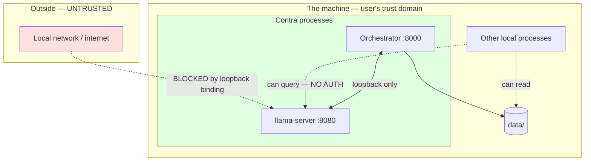

# Threat Model

| | |
|---|---|
| **Status** | Draft |
| **Last updated** | 2026-08-30 |
| **Method** | Asset-centric, with STRIDE used where it adds something |

---

## 1. Scoping

A formal enterprise threat model would be theatre for a single-user local
application. This document does the part that genuinely matters: **identify what
is worth protecting, and find the small number of ways it realistically
escapes.**

The conclusion, stated up front: there is **one threat that matters**, one that
matters somewhat, and a long tail that is correctly out of scope.

---

## 2. Assets

| Asset | Why it matters | Sensitivity |
|---|---|---|
| **Live microphone audio** | Voice, ambient sound, other people in the room | **Critical** |
| **Session transcripts** | The user's unfinished thinking on contested topics | **Critical** |
| **Session topics** | Short, but often the most revealing string present | **High** |
| LLM context window | Contains the live conversation | High |
| Model weights | Public, freely downloadable | None |
| Config, timings | Uninteresting | Low |

> The topic field is the asset most likely to be underestimated. "Should I leave
> my job", "is my father wrong about this" — a single line, more revealing than
> the debate around it.

---

## 3. Trust boundaries



**The only boundary that carries weight is machine ↔ network.** Everything inside
the machine is one trust domain, because a process running as this user can read
process memory and the database directly.

---

## 4. Threats

### T-01 — Network exposure of the inference endpoint ⚠ **PRIMARY**

| | |
|---|---|
| **STRIDE** | Information Disclosure, Elevation of Privilege |
| **Vector** | `llama-server` bound to `0.0.0.0` instead of loopback |
| **Likelihood** | Low (requires misconfiguration) |
| **Impact** | **Critical** |

**Scenario.** The user changes the bind address — to test from a phone, following
a tutorial, or by copying a config from a server deployment. They then join café,
hotel, or office Wi-Fi.

`llama-server` **has no authentication.** Anyone on that network can:

- query the model freely (compute theft — minor)
- **potentially observe conversation state** through the served context (severe)
- probe what the machine's owner has been arguing about

> This is the one genuine security threat in the system, and it arises from a
> single configuration value.

**Mitigations**
- **Loopback binding is a hard invariant, not a default** — it cannot be
  overridden by `user.yaml` or environment variable
  ([Config §4](../03-engineering/04-configuration-management.md))
- Startup preflight asserts it and refuses to run otherwise
- The error message explains *why*, so a user trying to work around it
  understands what they would be doing

**Residual risk.** A user editing source code can defeat this. Accepted — at that
point they have made a deliberate choice, and the code documents the consequence.

---

### T-02 — Silent data exfiltration by a dependency ⚠ **SECONDARY**

| | |
|---|---|
| **STRIDE** | Information Disclosure |
| **Vector** | An ML library phoning home |
| **Likelihood** | **Medium** |
| **Impact** | High |

**Scenario.** A dependency — or a transitive one — sends telemetry, checks for
model updates, or reports anonymised usage. This is *common* in ML tooling and
usually enabled by default. This risk dropped when Pipecat was removed
(ADR-0013) — the remaining dependencies are narrow local libraries — but
is the most likely source.

The user believes the tool is offline. It is not, in some small way, and they
have no signal.

**Mitigations**
- **IT-06: run a full session with the network adapter disabled.** A behavioural
  test that catches what code review misses.
- IT-06 is a **release gate** ([Definition of Done §4](../04-quality/05-definition-of-done.md))
- Explicit dependency audit for telemetry defaults
- Packet capture during a session before release

> This is more likely than T-01 and less severe. It is also the threat most
> resistant to being *reasoned* about — you find it by testing, not by reading.

---

### T-03 — Local process reads the database

| | |
|---|---|
| **Likelihood** | Low |
| **Impact** | High |
| **Status** | **Accepted** |

Any process running as this user can read `data/contra.db`.

**Not mitigated, deliberately.** Application-level encryption would require a key
stored on the same machine accessible to the same account — protection against
nothing, in exchange for preventing the user from reading their own transcripts
and creating a class of unrecoverable data loss.

**The correct control is full-disk encryption** (BitLocker), which protects this
properly. Documented in
[Security & Privacy §4](02-security-and-privacy.md).

---

### T-04 — Local process queries the LLM endpoint

| | |
|---|---|
| **Likelihood** | Low |
| **Impact** | Low–Medium |
| **Status** | **Accepted** |

No authentication on `127.0.0.1:8080`.

**Accepted** because a local process running as this user can already read the
database and the orchestrator's memory. Adding auth would protect nothing while
complicating every component. The meaningful control is the loopback binding
(T-01).

---

### T-05 — Microphone remains live unexpectedly

| | |
|---|---|
| **STRIDE** | Information Disclosure |
| **Likelihood** | Low |
| **Impact** | **High** |

**Scenario.** The user believes the session ended, or the application is minimised
and forgotten, while the microphone is still open. Conversations with people in
the room are captured.

Given that this is the application's most invasive capability, it deserves
treatment even at low likelihood.

**Mitigations**
- Audio is **never persisted** (NFR-S-04) — the bounded ring buffer caps exposure
  at ~30 seconds
- Audio is **never transmitted** (NFR-S-01)
- State indicator makes listening unambiguous (FR-41)
- Microphone released in `IDLE` and `ENDED`
- Process exits cleanly on session end

The combination of "never persisted" and "never transmitted" means even a live
microphone leaks nothing beyond the room. The remaining harm is a
transcript-worthy exchange being committed as a debate turn — bounded and
visible.

---

### T-06 — Malicious model file

| | |
|---|---|
| **Likelihood** | Very low |
| **Impact** | Medium |

A GGUF from an untrusted source could exploit a parser vulnerability, or a
tampered model could behave adversarially.

**Mitigations**
- Models from known repositories (`unsloth`, `Qwen`, `onnx-community`)
- **Exact file size verified** — `5,966,095,584` bytes. Also catches truncated
  downloads, which is the far more common problem.
- Hash verification would be better and is a reasonable addition.

---

### T-07 — Transcript leakage via user action

| | |
|---|---|
| **Likelihood** | **Medium** |
| **Impact** | High |
| **Status** | Documented |

The user backs up `data/` to cloud storage, commits it accidentally, or shares a
transcript.

**This is the most likely way data actually escapes**, and it is not a technical
failure.

**Mitigations**
- `data/` in `.gitignore`
- [Runbook §11](../05-operations/02-runbook.md) frames backups explicitly: *"back
  it up somewhere you would be comfortable keeping a private journal"*
- Transcripts are plain Markdown, so what is being copied is legible rather than
  opaque

---

## 5. Out of scope

| Threat | Why |
|---|---|
| Compromised operating system | Everything is readable. Nothing an application can do. |
| Physical access without disk encryption | Use BitLocker |
| Supply-chain attack on a dependency | Real, and unmanageable at this scale. Lockfile pinning is the extent of the control. |
| Side-channel attacks on inference | Absurd for a personal application |
| Denial of service | Single user; they can close it |
| Multi-user isolation | No multi-user |
| Audible speech overheard | You are talking out loud |

---

## 6. Summary

```
                    Impact →
              Low        Medium       High      Critical
    High  │           │            │  T-07    │
  L Med   │           │            │  T-02 ⚠  │
  i Low   │  T-04     │  T-06      │  T-05    │  T-01 ⚠
  k V.Low │           │            │  T-03    │
```

**Two threats warrant active engineering:**

- **T-01** — network exposure. Mitigated by a hard, non-overridable configuration
  invariant. This is the only *security* threat proper in the system.
- **T-02** — dependency telemetry. Mitigated by a behavioural test (IT-06) that
  is a release gate. More likely than T-01, and only findable by testing.

**T-07 — the user exporting their own data — is the most probable path by which
transcripts actually leave the machine**, and it is addressed by documentation
rather than code, because it is a choice rather than a vulnerability.

Everything else is accepted with reasons, and the reasons are recorded so that a
future reader can disagree with them knowingly.
