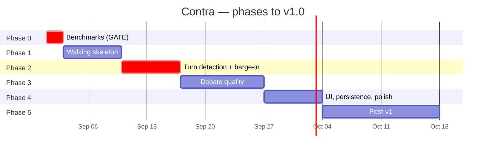

# Roadmap

| | |
|---|---|
| **Status** | Draft |
| **Last updated** | 2026-08-30 |

---

## Shape

Roughly **5 weeks of focused work** to v1.0. Part-time, realistically longer.

---

## Phase 0 — Measure before building ⚠ **GATE**

**2 days. No application code is written.**

| Benchmark | Answers |
|---|---|
| **BM-01** | Does the 9B hit ≥ 25 tok/s on *this* laptop GPU? |
| **BM-02** | Does prefix caching work on the hybrid architecture? |
| **BM-03** | Do CPU speech models meet RTF under GPU load? Does the GIL release? |
| **BM-04** | How much VRAM is actually free? |
| **BM-05** | **Does echo cancellation survive double-talk with speakers?** |

> **Everything downstream rests on numbers borrowed from other people's
> machines.** If BM-01 returns 15 tok/s, NFR-P-01 is unreachable and the right
> response is to switch to Qwen3.5-4B **now** — not to discover it three weeks
> into implementation and try to optimise around it.

**Retires five risks:** RISK-01, RISK-02, RISK-03, RISK-06, RISK-12.
**Answers three open questions:** OQ-03, OQ-08, OQ-09.

> **BM-05 gates Phase 2.** If double-talk fails on this hardware, barge-in cannot
> work with speakers and push-to-talk becomes the default — a product change, not
> a tuning exercise. Better known now than after Phase 2 is built around it.

**Exit:** results committed; every FAIL has a documented response; the latency
and resource budgets updated with measured values.

---

## Phase 1 — Walking skeleton

**~1 week.** The thinnest end-to-end path: speak → hear a reply.

| Build | Deliberately omit |
|---|---|
| **Browser page + WebRTC transport with AEC** | Semantic turn detection (fixed 800 ms timer) |
| Silero VAD | Barge-in |
| Parakeet STT | Transcript UI (audio only for now) |
| `llama-server` client with streaming | Persistence |
| Sentence segmenter | Debate persona (generic prompt) |
| Kokoro TTS | Error recovery |

> **The browser transport moved here from Phase 4** when
> [OQ-01](../06-governance/05-open-questions.md) resolved to speakers. It cannot
> be deferred: barge-in in Phase 2 is untestable without working echo
> cancellation, and building the skeleton on a native transport we would then
> replace would waste the integration work.
> **+3 days** ([ADR-0012](../02-architecture/adr/0012-browser-webrtc-transport-with-aec.md)).

**The one non-obvious priority:** build `ConversationState` with the FR-13
spoken-history structure **now**, even though barge-in does not exist yet.
Retrofitting it in Phase 2 means reworking the component barge-in depends on.

**Also probe early:** whether Pipecat's frame model can express FR-13 truncation
cleanly. This is the specific integration risk in
[ADR-0003](../02-architecture/adr/0003-pipecat-as-orchestration-framework.md),
and finding it now is cheap.

**Exit:** a full spoken exchange works. Latency measured, even if bad.

---

## Phase 2 — Turn detection and barge-in ⚠ **The hard part**

**~1 week.** The two features that separate a conversation from a walkie-talkie.

| Build |
|---|
| Semantic turn detection (Smart Turn v2) with the decision policy |
| Barge-in: stop playback, cancel TTS, **cancel LLM server-side** |
| FR-13 spoken-history truncation, with invariant I-3 asserted |
| Pre-buffer retaining speech onset across the transition |
| Push-to-talk escape hatch (FR-43) |
| Recorded fixture suite from **real argumentative speech** |

> **This phase carries the most risk of feeling wrong while testing green.**
> Turn detection can meet every numeric target and still cut you off at the
> memorable moment. Budget time for tuning against real recordings, not just for
> implementation.

The LLM cancellation detail matters and is easy to get wrong: abandoning the SSE
iterator is not enough — the HTTP request must be aborted so `llama-server` frees
the slot. Otherwise interrupting makes the *next* turn slower.

**Exit:** NFR-P-03 (barge-in ≤ 300 ms) met; false-cut rate ≤ 5%; invariant I-3
holds.

---

## Phase 3 — Debate quality

**~1.5 weeks.** The pipeline works; now make it worth using.

| Build |
|---|
| The v1 debate persona ([Prompt Spec](../03-engineering/05-prompt-engineering-spec.md)) |
| Topic extraction and confirmation (FR-02) |
| Intensity variants |
| Layer 2 probe suite |
| Context compaction |
| Speculative prefill — **only if BM-02 passed** |
| Latency optimisation to hit NFR-P-01 |

> **Expect the persona to need several versions.** RISK-08 (sycophancy) is the
> highest-scored risk in the register, and it is not fixed in one pass — every
> instruction-tuned model is trained toward agreeableness, and this asks it to
> resist that for twenty consecutive turns.
>
> The versioning discipline
> ([ADR-0011](../02-architecture/adr/0011-yaml-configuration-and-versioned-prompts.md))
> earns its keep here: without recorded versions and probe results, "v4 feels
> better than v3" is an impression, not a finding.

**Exit:** probes P-01 and P-04 pass; NFR-P-01 met; five real sessions rated.

---

## Phase 4 — Interface, persistence, polish

**~1 week.**

| Build |
|---|
| SQLite persistence, synchronous turn writes |
| Markdown transcript export |
| Live transcript UI with state indicator (FR-41) |
| Per-turn latency display (FR-42) |
| Error handling across the F-catalogue |
| Supervisor script and preflight checks |
| Installation guide verified on a clean machine |
| First-run audio calibration (echo return loss check) |

**Exit:** the full [Definition of Done §3](../04-quality/05-definition-of-done.md)
release checklist, including both gates.

---

## v1.0

Ships when every P0 requirement passes and both gates hold:

- **Gate 1 — Privacy:** IT-06 offline test passes
- **Gate 2 — Fabrication:** probe P-04 passes

---

## Phase 5 — Post-v1 candidates

Not committed. Recorded so they are not lost, and so v1 scope stays honest.

| Candidate | Value | Cost |
|---|---|---|
| **Post-session review** — claim extraction, fabrication audit | **High** — directly addresses RISK-09; latency-free because asynchronous | Medium |
| **Coach mode** — analyse the user's arguments after a session | High — the CHI research supports it | Medium |
| Structured debate format (timed rounds) | Serves the Practitioner persona (OQ-02) | Medium |
| Session resume (FR-05) | Convenience | Low |
| Argument map visualisation | Makes Journey D substantial | Medium |
| Client-side VAD for barge-in | Removes 40 ms from the barge-in path if BM-05 shows it is too tight | Low |
| Desktop packaging (Electron/WebView) | Removes the external-browser dependency while keeping AEC | Medium |
| Voice cloning (Chatterbox) | Interesting; **misuse surface** | Medium |
| RAG over user documents | Powerful; **breaks the offline guarantee** | High |
| Multilingual | Blocked by the speech layer, not the model | High |

> **Post-session review is the strongest candidate**, and worth explaining why.
> It is the only proposed feature that addresses
> [RISK-09](../06-governance/01-risk-register.md) — persuasive fabrication —
> because it re-examines the agent's factual claims *after* the conversation,
> when the user is no longer inside the rhetorical moment and latency costs
> nothing. A second LLM pass is unaffordable during a debate and free afterwards.
>
> It is also the feature that makes the cascaded architecture pay off, since it
> depends entirely on having intermediate text
> ([ADR-0001](../02-architecture/adr/0001-cascaded-pipeline-over-speech-to-speech.md)).

---

## Sequencing logic

**Why benchmarks first.** Four of the top six risks retire in two days of
measurement. Nothing else in the project has that return.

**Why turn detection and barge-in before debate quality.** They are structural.
Retrofitting barge-in into a working pipeline means reworking state management,
history, and cancellation across every component. Persona work, by contrast, is
almost entirely additive.

**Why persistence last.** The schema depends on knowing what is worth storing,
and that is clearest after the pipeline is real. Building it early means
migrating it.

**Why the UI last.** Voice is the interface (NFR-U-01). The UI is a diagnostic
and reading surface, valuable but not load-bearing.

---

## What could change this plan

| Trigger | Effect |
|---|---|
| BM-01 fails | Switch to Qwen3.5-4B. Little schedule impact; quality cost. |
| BM-02 fails | Latency budget re-derived without speculative prefill. Phase 3 lengthens. |
| BM-03 GIL-1 fails | **Serious.** Subprocess isolation for inference, or reconsider Python. Phase 1 lengthens materially. |
| ~~OQ-01 → speakers~~ | ✅ **Happened.** Browser transport moved into Phase 1. +3 days, already absorbed below. |
| **BM-05 double-talk fails** | Push-to-talk becomes the default; barge-in documented as requiring headphones. Product change, not a delay. |
| Pipecat cannot express FR-13 | Consider DIY orchestration. Phase 1 lengthens; ADR-0003 revisited. |
| Sycophancy resists prompting | Phase 3 extends. Worst case: fine-tuning, which is a separate project. |

The last row is the one with no bounded remedy — which is why RISK-08 scores 20
and why probes P-01 and P-02 gate every prompt version.
