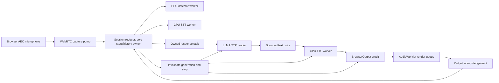

# Phase 2 — Turn Detection and Barge-in Implementation Plan

| | |
|---|---|
| **Status** | Complete planning draft; execution gated by M0/M1 evidence and ADR-0014 acceptance |
| **Last updated** | 2026-09-06 |
| **Scope** | All Phase 2 / M2 deliverables, including browser playback correctness and real-fixture validation |
| **Evidence basis** | Current working tree inspected on 2026-09-06; no tests or benchmarks were run to prepare this plan |
| **Related** | [Roadmap](../../07-planning/01-roadmap.md) · [Milestones](../../07-planning/02-milestones.md) · [Proposed ADR-0014](../../02-architecture/adr/0014-browser-acknowledged-playback.md) |

> **For agentic workers:** REQUIRED SUB-SKILL: Use superpowers:subagent-driven-development (recommended) or superpowers:executing-plans to implement this plan task-by-task. Steps use checkbox (`- [ ]`) syntax for tracking. Read each task together with its dependency contracts and the specification. Do not treat this plan as evidence that a hardware gate has passed.

**Goal:** Complete natural turn detection and interruption on the target Windows laptop: preserve speech onset, stop audible output, abort LLM generation, commit only acknowledged spoken history, and provide a complete push-to-talk bypass.

**Architecture:** Keep [ADR-0013](../../02-architecture/adr/0013-hand-written-asyncio-pipeline-over-pipecat.md)'s hand-written asyncio orchestration, with one state owner and independently running input, inference, and response workers. Smart Turn v3.2 receives immutable audio snapshots on CPU. Proposed ADR-0014 makes browser output acknowledgements authoritative for FR-13; its transport refinement has a separate acceptance gate.

**Tech Stack:** Python 3.11, asyncio, existing FastAPI/httpx/aiortc/PyAV, CPU ONNX Runtime, Parakeet, Kokoro, Silero, Smart Turn v3.2, vanilla browser JavaScript and AudioWorklet. Node's built-in test runner for pure JavaScript; local Chromium/Playwright only for browser integration tests. Pin dependencies at execution; install-time downloads must never become runtime downloads.

**Spec:** [PRD](../../00-product/02-product-requirements.md), [NFRs](../../00-product/05-non-functional-requirements.md), [User Stories](../../00-product/04-user-stories.md), [ADR-0007](../../02-architecture/adr/0007-two-layer-turn-detection.md), [ADR-0012](../../02-architecture/adr/0012-browser-webrtc-transport-with-aec.md), [Internal API](../../02-architecture/05-internal-api-spec.md), [State invariants](../../02-architecture/04-data-flow-and-state.md), [Test Strategy](../../04-quality/01-test-strategy.md), [Benchmark Plan](../../04-quality/03-benchmark-plan.md), [Definition of Done](../../04-quality/05-definition-of-done.md).

## Global Constraints

The following quoted constraints apply to every task. New implementation choices are explicitly identified below; they do not override the specification.

- “Python **3.11**, not the 3.13 installed” — [root instructions](../../../AGENTS.md); inspect the interpreter rather than assuming the historical installation description is current.
- “**No Pipecat.** Hand-written asyncio loop in `debate/session.py`” — root instructions / ADR-0013.
- “`debate/` imports **no** I/O library” — root instructions. Move the existing concrete httpx client outside the core.
- “One composition root (`app.py`)” — root instructions.
- “Never block the event loop” — root instructions; model work runs in owned workers using `asyncio.to_thread`.
- “No audio, transcript, or derived data leaves the machine. Ever.” — NFR-S-01.
- “All service ports bind to `127.0.0.1`, never `0.0.0.0`.” — NFR-S-03.
- “Raw audio is not persisted by default.” — NFR-S-04. Fixture recording is an explicit development operation.
- “Never log transcript content above `DEBUG`.” — root instructions.
- “Prompts are versioned files, not string literals” — root instructions / ADR-0011.
- “All tuning MUST live in configuration files, not code.” — FR-33.
- “No source file exceeds ~400 lines without a documented reason.” — NFR-M-05.
- “A partially-played chunk counts as **not played**.” — Internal API D.5.
- “Unit tests must run in **< 10 s with no models and no GPU**” — root instructions.
- “Do not load `mmproj-*.gguf`.” — root instructions. Speech and detection use 0 GiB VRAM per NFR-R-04.

## Contents

1. [Scope, baseline, and gates](#1-scope-baseline-and-gates)
2. [Contracts and file ownership](#2-contracts-and-file-ownership)
3. [Implementation tasks](#3-implementation-tasks)
4. [Acceptance and traceability](#4-acceptance-and-traceability)
5. [Self-review and handoff](#5-self-review-and-handoff)

## 1. Scope, baseline, and gates

### 1.1 Included and deliberately later

| Included in M2 | Later milestone |
|---|---|
| Smart Turn v3.2 audio inference; policy and deadline control | Debate persona, topic confirmation, intensity — M3 |
| Cancellable response lifecycle in THINKING and SPEAKING | Context compaction and speculative prefill — M3 |
| Browser stop, stale-audio fencing, acknowledged playback | SQLite and durable transcripts — M4 |
| FR-13 contiguous spoken prefix and I-3/I-4/I-7/I-8 tests | Full live transcript UI and diagnostics dashboard — M4 |
| 300 ms pre-buffer; bounded capture and inference queues | Complete F-catalogue recovery, supervisor, installer — M4 |
| PTT mode, down/up controls, disconnect cleanup | Voice-command session setup/end semantics — later lifecycle work |
| Necessary state/error UI and stage metrics for M2 verification | Piper/Whisper adapters unless a measured decision selects them |
| Real argumentative fixtures, tuning, IT-02, M2 evidence | v1 release certification; M2 is not a v1 release |

“Complete Phase 2” includes failure containment for its own workers and controls.
It does not mean silently claiming I-5 persistence or I-6 compaction, whose
implementations belong to M4 and M3 respectively.

### 1.2 Baseline findings

All rows are **[VERIFIED by source inspection on 2026-09-06]**, not runtime findings.

| Evidence | Consequence for this plan |
|---|---|
| [`Session.run`](../../../src/contra/debate/session.py) awaits `_handle_turn` inside capture and skips SPEAKING frames | Task 11 replaces blocking coordination; simply inserting a VAD callback is insufficient. |
| [`PlaybackQueue`](../../../src/contra/audio/webrtc_transport.py) has unbounded pending chunks and credits sender consumption | Tasks 7–9 replace that accounting and bound media credit. |
| [`ConversationState`](../../../src/contra/debate/conversation.py) calls dispatched text “generated”, commits before browser drain, and can append consecutive user roles | Task 10 separates records and constructs valid model history. |
| [`SileroVad`](../../../src/contra/detect/silero_vad.py) does not use `min_speech_ms` | Task 3 adds onset confirmation without resetting recurrent state on every pause. |
| [`KokoroTts`](../../../src/contra/speech/kokoro_tts.py) resets a shared cancellation boolean for each synthesis | Task 6 uses generation IDs and owned workers; an old thread cannot become current again. |
| [`LlmClient`](../../../src/contra/debate/llm_client.py) has no response object while connecting | Task 5 covers cancellation before response headers as well as during SSE. |
| [`app.py`](../../../src/contra/app.py) creates untracked session tasks on every offer | Task 13 adds exclusive session ownership and shutdown. |
| [`ConfigLoader`](../../../src/contra/config/loader.py) ignores unknown fields and splits environment names at the first underscore | Task 2 supports `turn_detection` and nested fields without silently ignoring tuning. |
| Git reported pre-existing edits in README, WebRTC, and VAD; untracked instruction files also exist | Preserve these edits; obtain a fresh baseline before execution. Never stage the whole repository. |

### 1.3 Documentation corrections required before implementation

| Conflict | Required resolution in Task 1 |
|---|---|
| M2/roadmap say Smart Turn v2; ADR-0007/0013 say v3.2 | Follow v3.2; update stale current-tense references. |
| ADR-0007 says model input is a partial transcript | Correct to audio using the primary source below; keep acoustic VAD plus semantic model policy. |
| ADR-0013 calls FR-13 verified by a sender loopback test | Preserve the historical test result, qualify its boundary, and link proposed ADR-0014. |
| State diagram uses first queued audio for SPEAKING | Refine transition to browser playback start; THINKING includes waiting for first playback. |
| Root/index say no code and no measurements | Update only from committed evidence; existing BM-01/BM-04 do not prove all of M0. |
| Config runtime subset excludes turn mode while US-402 requires a settings switch | Define a session-control mode operation, independent of general config PATCH. |
| 30 s ring buffer can be misread as a maximum user turn | Keep bounded detector/pre-roll windows and separately bound full utterance storage; do not discard long arguments silently. |

**[VERIFIED: upstream code]** Smart Turn v3.2 uses 16 kHz audio, last-eight-second
cropping/left padding, a Whisper-style log-mel frontend, and CPU ONNX inference.
See [Pipecat's adapter](https://raw.githubusercontent.com/pipecat-ai/pipecat/main/src/pipecat/audio/turn/smart_turn/local_smart_turn_v3.py).
The adapter is reference material, not a runtime dependency. Source inspection
does not establish the latency or accuracy of our selected artifact.

### 1.4 Entry gates and stopping rules

Task 1 is documentation/evidence work. Tasks 2–18 execute only after M0 and M1
have the required evidence. Planning is allowed now; unrun benchmarks are not
waived by a plan.

| Gate | Required evidence | Failure action |
|---|---|---|
| M0 | BM-01…BM-05 results, exact settings, decided responses to FAILs, updated budgets | Complete missing measurements using the benchmark specification; do not invent PASS records. |
| M1 | Real spoken exchange; AEC and transport measurements; current unit/type/lint baseline | Finish M1 before M2 application changes. [`M1-exit-criteria.md`](../../../benchmarks/results/M1-exit-criteria.md) is explicitly partial. |
| BM-03 | STT/TTS under GPU load, zero dropped frames, GIL behavior | If the thread design fails, update ADR-0009 and this plan for subprocess workers before executing dependent tasks. |
| BM-05 | 0 self-triggers/5 min; ≥18/20 preserved interruptions; double-talk WER ≤20% | 10–17/20: mitigation and rerun; <10/20: documented PTT-default product decision. PTT is not evidence that automatic M2 passed. |
| ADR-0014 | Accepted design plus rendering-graph BM-05 and conservative output-position evidence | Keep it Proposed if evidence is insufficient. Do not substitute sender counters or empty history. |

The original BM-05 may qualify the old RTP renderer; Task 9 must repeat it after
the proposed renderer change. All new timings are targets until measured.

## 2. Contracts and file ownership

### 2.1 Files

Paths below are repository-relative. “Modify” includes preserving current user edits.

| Action | Path | Responsibility / owning task |
|---|---|---|
| Modify | `config/default.yaml`, `src/contra/config/models.py`, `src/contra/config/loader.py` | Validated M2 tuning and precedence — 2 |
| Modify | `src/contra/detect/interfaces.py`, `src/contra/detect/silero_vad.py` | Acoustic observations and confirmed onset — 3 |
| Create | `src/contra/audio/ring_buffer.py` | Sample-indexed pre-roll and capture limits — 3 |
| Create | `src/contra/detect/turn_policy.py` | Pure silence/decision policy — 4 |
| Create | `src/contra/detect/smart_turn.py`, `src/contra/detect/whisper_features.py`, `src/contra/detect/heuristic_turn.py` | Model adapter, reviewed frontend, explicit fallback — 4, 12 |
| Create | `src/contra/runtime/inference_worker.py`, `src/contra/runtime/__init__.py` | One owned CPU worker per model — 6 |
| Create / move | `src/contra/llm/client.py`, `src/contra/llm/interfaces.py`, `src/contra/llm/__init__.py` | Concrete HTTP outside debate core — 5 |
| Modify | `src/contra/speech/interfaces.py`, `src/contra/speech/parakeet_stt.py`, `src/contra/speech/kokoro_tts.py` | Immutable request inputs and generation-safe adapters — 6 |
| Modify | `src/contra/audio/types.py`, `src/contra/audio/interfaces.py` | Generation/sample/receipt contracts — 7 |
| Create | `src/contra/audio/playback_ledger.py`, `src/contra/audio/media_protocol.py` | Acknowledged prefix and wire framing — 7 |
| Modify | `src/contra/audio/webrtc_transport.py` | Receive-only RTP plus output data/control channels — 9 |
| Create | `src/contra/audio/browser_output.py` | Credit, deadlines, stop, acknowledgements — 9 |
| Create | `src/contra/ui/static/playback-core.mjs`, `src/contra/ui/static/playback-worklet.js`, `src/contra/ui/static/audio-session.js` | Bounded renderer, output clock, transport lifecycle — 8 |
| Modify | `src/contra/debate/conversation.py`, `src/contra/debate/types.py` | Generated/dispatched/spoken records — 10 |
| Create | `src/contra/debate/events.py`, `src/contra/debate/turn_capture.py`, `src/contra/debate/response.py` | Typed events, capture ownership, streaming worker — 11 |
| Modify | `src/contra/debate/session.py` | Single state reducer and task supervision — 11 |
| Create | `src/contra/ui/control.py`, `src/contra/ui/events.py`, `src/contra/ui/static/ptt-controls.mjs` | Ordered controls and state stream — 13, 14 |
| Create | `src/contra/ui/static/capture-worklet.js`, `src/contra/audio/ptt_capture.py` | Sample-delimited PTT capture and completeness validation — 14 |
| Modify | `src/contra/ui/server.py`, `src/contra/app.py`, `src/contra/__main__.py`, `src/contra/ui/static/app.js`, `src/contra/ui/static/index.html` | Composition, CLI and accessible PTT UI — 13, 14 |
| Create | `src/contra/observability/metrics.py` | Bounded per-turn measurements — 15 |
| Modify | `scripts/fetch_models.py`, `pyproject.toml`, `.gitignore` | Install-time artifacts, test dependencies, fixture allowlist — 4, 16 |
| Create | `models.lock.json`, `THIRD_PARTY_NOTICES.md`, `uv.lock` | Reproducibility/provenance — 4 |
| Create | `prompts/skeleton/v1.md`, `prompts/ACTIVE.yaml`, `src/contra/config/prompts.py` | Extract existing skeleton prompt unchanged — 13 |
| Create | `tests/browser/`, `tests/helpers/`, named unit/integration files in tasks | Deterministic and browser verification |
| Create | `benchmarks/m2_evaluate.py`, `benchmarks/results/M2-exit-criteria.md`, `tests/fixtures/audio/phase2/manifest.json` | Evaluation and measured exit record — 16–18 |

The feature spans coupled subsystems. Execute the task groups below in order,
with separate review gates for detection, playback, and orchestration. Splitting
into unrelated subsystem plans would obscure the shared generation/receipt contract.

### 2.2 Ownership and concurrency



One `Session` owns state/history. Worker results carry `(session_id, generation,
utterance_id, revision)` as applicable. A resumed utterance increments revision;
a new response increments generation. A stale result can be logged by ID and
discarded, never committed or played. Stop/control events have priority over
normal completions. In one reducer cycle, process onset/stop before a same-cycle
detector completion. No untracked `create_task` and no unbounded queues.

### 2.3 Shared contract dictionary

These are target signatures, not claims that these APIs already exist. Protocol
bodies are declarations, not unfinished implementations.

```python
@dataclass(frozen=True)
class UtteranceSnapshot:
    utterance_id: int
    revision: int
    pcm16: bytes
    sample_rate: int
    first_sample: int
    end_sample: int

@dataclass(frozen=True)
class EndpointResult:
    utterance_id: int
    revision: int
    probability: float
    duration_ms: float

@dataclass(frozen=True)
class PlaybackReceipt:
    generation: int
    sample_end: int
    stopped: bool
```

`UtteranceSnapshot` and `EndpointResult` live in `detect/interfaces.py`.
`PlaybackReceipt` lives in `audio/types.py`. Python sample offsets are integers;
durations derive from sample count. Wire integer fields must be safe in JS
(`0 <= n <= 2**53 - 1`); reject invalid values. Source PCM is 24 kHz mono PCM16,
input PCM is 16 kHz mono PCM16. Browser rendering may use 44.1/48 kHz; source
sample counts never become output-device sample counts accidentally.

| Interface | Exact target operations |
|---|---|
| `TurnDetector` | `async evaluate(snapshot: UtteranceSnapshot) -> EndpointResult`; `async aclose() -> None` |
| `SttStage` | `async transcribe(snapshot: UtteranceSnapshot) -> Transcript`; `async aclose() -> None` |
| `TtsStage` | `synthesise(generation: int, text: str, span: tuple[int, int], sequence: int) -> AsyncIterator[AudioChunk]`; `cancel(generation: int) -> None`; `async aclose() -> None`; `sample_rate: int` |
| `LlmStage` | `stream(generation: int, messages: list[Message]) -> AsyncIterator[str]`; `async cancel(generation: int) -> None`; `async health() -> bool`; `async aclose() -> None` |
| `AudioOutput` | `begin(generation: int) -> None`; `async enqueue(generation: int, chunk: AudioChunk) -> None`; `finish(generation: int) -> None`; `async drained(generation: int) -> PlaybackPosition`; `clear(generation: int) -> PlaybackPosition`; `async stopped(generation: int) -> PlaybackPosition`; `is_playing: bool`; `async aclose() -> None` |
| `Session` | `async run() -> None`; `async end() -> None`; `async set_mode(mode: str) -> None`; `async ptt(down: bool, control_seq: int, capture_sample: int) -> None` |

`clear()` synchronously fences and dispatches stop, returns the last conservative
receipt, and never blocks capture on a network acknowledgement. `stopped()` has
a bounded wait; timeout keeps the conservative position and puts the session in
DEGRADED. `drained()` resolves only after EOF and the last output receipt. A
generation's receipt cannot change another generation's ledger.

## 3. Implementation tasks

Every code task follows RED → GREEN → full fast checks → focused commit. Each
checkbox is one action; split a large implementation block into the named
functions before coding. Test code below supplies concrete regression anchors;
the adjacent case tables are mandatory additional parametrized cases. Never
replace hardware acceptance with these unit tests.

### Task 1: Establish the execution baseline and reconcile source contracts

**Depends on:** nothing; documentation and read-only investigation allowed now.

**Files:** Modify `docs/02-architecture/adr/0007-two-layer-turn-detection.md`,
`docs/02-architecture/adr/0013-hand-written-asyncio-pipeline-over-pipecat.md`,
`docs/02-architecture/adr/README.md`, and the current-tense references listed in
§1.3. Record actual entry evidence in `benchmarks/results/M2-entry-gates.md`.
Read applicable instructions in `benchmarks/` before writing results there.

**Interfaces:** Consumes existing benchmark records; produces an explicit
M0/M1 pass/fail inventory and a reviewed ADR-0014 disposition.

- [ ] Inspect the actual starting tree and interpreter.

```powershell
git status --short
git diff -- src/contra/audio/webrtc_transport.py src/contra/detect/silero_vad.py README.md
Get-Content benchmarks/results/BM-01-llm-throughput.md
Get-Content benchmarks/results/BM-04-vram-profile.md
Get-Content benchmarks/results/M1-exit-criteria.md
py -3.11 --version
```

- [ ] Run and record the existing fast baseline, without changing failing tests
  to accept current defects.

```powershell
py -3.11 -m pytest tests/unit -q --durations=5
py -3.11 -m ruff check .
py -3.11 -m ruff format --check .
py -3.11 -m mypy src/contra
```

Expected: record actual exit codes and failures. A pre-existing failure is not
attributed to M2; it still needs a resolution before M2's final gate.

- [ ] Complete missing M0/M1 measurements by the existing benchmark method;
  record each result's date, command, model hash, backend, context, and verdict.
  Use the measured Vulkan/CUDA selection in BM-01 rather than replacing it with
  an older documentation command. Do not execute absent benchmark scripts as if
  they exist; missing harness work is prerequisite work under the benchmark plan.

- [ ] Correct ADR-0007's input contract to immutable 16 kHz audio and v3.2.
  Preserve its threshold policy and fallback rationale. Update BM-03 TD-1 to
  test audio snapshots, and clarify that OQ-06 concerns interim text/heuristic
  mode, not a prerequisite for Smart Turn.

- [ ] Review ADR-0014's exact proposal. Add its Proposed row to the ADR index;
  record acceptance only after its specified evidence. Do not relabel old
  loopback tests as acoustic proof.

- [ ] Propagate current contract corrections using the exact search scope:

```powershell
rg -n 'Smart Turn v2|partial transcript|ADR-0007|ADR-0012|ADR-0013|Pipecat|playback complete' docs README.md AGENTS.md CLAUDE.md
```

Update `02-component-design.md`, `03-sequence-diagrams.md`,
`04-data-flow-and-state.md`, `05-internal-api-spec.md`,
`03-engineering/01-repository-structure.md`, `04-configuration-management.md`,
`06-error-handling-and-resilience.md`, `04-quality/03-benchmark-plan.md`,
`06-governance/05-open-questions.md`, and `07-planning/{01-roadmap,02-milestones}.md`
where they prescribe these contracts. Retain superseded ADR bodies and historical
plans; add status notes instead of rewriting history.

- [ ] Commit only reviewed documentation/evidence paths with
  `docs(m2): reconcile phase two contracts and entry evidence`.

**Gate:** Do not advance to M2 application work until the entry conditions in
§1.4 are satisfied. ADR-0014 prototype verification is isolated prerequisite
work; failure revises the proposal, not FR-13.

### Task 2: Validate Phase 2 configuration and environment precedence

**Depends on:** 1.

**Files:** Modify `src/contra/config/models.py`, `src/contra/config/loader.py`,
`config/default.yaml`; test `tests/unit/test_config_loader.py` and new
`tests/unit/test_phase2_config.py`.

**Interfaces:** `load_config(config_dir: Path) -> Config` remains stable;
produces `Config.turn_detection`, `Config.runtime`, and added audio/STT fields.

- [ ] Add regression tests for the multiword section, precedence, and bad values.

```python
import pytest
from contra.config.loader import load_config
from contra.config.models import ConfigError

def test_turn_detection_environment_override(tmp_path, monkeypatch):
    monkeypatch.setenv("CONTRA_TURN_DETECTION_HARD_TIMEOUT_MS", "2100")
    assert load_config(tmp_path).turn_detection.hard_timeout_ms == 2100

@pytest.mark.parametrize("value", ["-1", "nan", "banana"])
def test_rejects_invalid_completion_threshold(tmp_path, monkeypatch, value):
    monkeypatch.setenv("CONTRA_TURN_DETECTION_COMPLETION_THRESHOLD", value)
    with pytest.raises(ConfigError):
        load_config(tmp_path)

def test_unknown_turn_key_is_not_ignored(tmp_path):
    (tmp_path / "user.yaml").write_text(
        "turn_detection:\n  hard_timout_ms: 2000\n", encoding="utf-8")
    with pytest.raises(ConfigError):
        load_config(tmp_path)
```

- [ ] Run `py -3.11 -m pytest tests/unit/test_phase2_config.py -q`;
  expect missing fields or tests exposing ignored values.

- [ ] Add the following defaults and frozen config fields. Existing fields
  remain; replace the old 800 ms VAD default.

```yaml
audio:
  sample_rate: 16000
  frame_ms: 20
  pre_buffer_ms: 300
  output_buffer_ms: 100
  max_utterance_seconds: 120
  playback_ack_timeout_ms: 500
  playback_guard_ms: 20
vad:
  threshold: 0.5
  min_speech_ms: 100
  silence_confirm_ms: 250
turn_detection:
  mode: semantic
  model_path: models/smart-turn-v3.2-cpu.onnx
  completion_threshold: 0.5
  max_wait_ms: 1500
  hard_timeout_ms: 2000
  inference_timeout_ms: 150
  num_threads: 1
stt:
  partial_interval_ms: 500
runtime:
  input_queue_frames: 25
  event_queue_size: 64
  text_queue_units: 2
  llm_cancel_timeout_ms: 100
  worker_shutdown_timeout_ms: 5000
```

250/1500/2000 ms, 300 ms pre-roll, 100 ms onset/output follow existing docs.
120 s capture cap, 500 ms acknowledgement timeout, 20 ms output guard and queue
counts are **[ASSUMED initial engineering settings]**; validate in Tasks 16–18.
Guard validity is an ADR-0014 acceptance condition, not a fixed latency fact.
At 16 kHz PCM16, 120 s is [ESTIMATED] `120 × 16000 × 2 = 3,840,000 bytes`
per utterance; exceeding the cap reports a repeat-in-shorter-parts error instead
of dropping the opening or committing mid-thought.

- [ ] Replace environment parsing with field-schema matching. Enumerate nested
  dataclass leaves, produce their full uppercase `CONTRA_` name, and look up
  exact names. This handles `TURN_DETECTION` and `LLM_SAMPLING_TEMPERATURE`.

```python
def env_name(parts: tuple[str, ...]) -> str:
    return "CONTRA_" + "_".join(part.upper() for part in parts)

def parse_bool(key: str, raw: object) -> bool:
    if isinstance(raw, bool):
        return raw
    value = str(raw).strip().lower()
    if value in {"true", "1", "yes", "on"}:
        return True
    if value in {"false", "0", "no", "off"}:
        return False
    raise ConfigError(key, raw, "a boolean")
```

Reject unknown YAML sections/keys, booleans passed as numeric fields, non-finite
floats, negative sizes, sample rates other than 16000, and non-20-ms input frames.
Validate `250 <= max_wait_ms < hard_timeout_ms`, probability in `[0,1]`,
positive worker/thread/timeouts, output buffer `1..100` ms for the M2 supported
profile, and `pre_buffer_ms >= min_speech_ms`. Parse the LLM URL with `urlsplit`;
require HTTP, host `127.0.0.1`, no credentials/query/fragment, and explicit valid
port. Require UI host exactly `127.0.0.1`. Retain explicit debug capture opt-in;
unknown `CONTRA_` runtime settings must not be silently treated as tuning.

- [ ] Run the config tests including defaults/user/env precedence, nested
  sampling, malformed booleans, remote URL, timeout ordering and typo failures.
- [ ] Commit explicit config/test paths with `feat(config): validate phase two tuning`.

### Task 3: Preserve onset and expose acoustic evidence without committing turns

**Depends on:** 2.

**Files:** Modify `detect/interfaces.py`, `detect/silero_vad.py`; create
`audio/ring_buffer.py`; test `tests/unit/test_vad_windowing.py`,
`tests/unit/test_vad_onset.py`, `tests/unit/test_ring_buffer.py`.

**Interfaces:** `VadObservation(speech: bool, confirmed_onset: bool,
last_voice_sample: int, end_sample: int)` and
`VadStage.process(frame: AudioFrame) -> VadObservation`.
`PcmRing(capacity_samples: int).append(pcm16: bytes) -> None`,
`tail(samples: int) -> bytes`, `clear() -> None`.

- [ ] Write the exact pre-roll regression.

```python
from contra.audio.ring_buffer import PcmRing

def test_ring_keeps_exact_last_samples():
    ring = PcmRing(capacity_samples=4)
    ring.append(b"\x01\x00\x02\x00\x03\x00")
    ring.append(b"\x04\x00\x05\x00")
    assert ring.tail(4) == b"\x02\x00\x03\x00\x04\x00\x05\x00"
    ring.clear()
    assert ring.tail(4) == b""
```

- [ ] Run `py -3.11 -m pytest tests/unit/test_ring_buffer.py -q`; expect missing module.
- [ ] Implement byte-aligned bounded pre-roll.

```python
class PcmRing:
    def __init__(self, capacity_samples: int) -> None:
        if capacity_samples <= 0:
            raise ValueError("capacity_samples must be positive")
        self._capacity = capacity_samples * 2
        self._pcm = bytearray()

    def append(self, pcm16: bytes) -> None:
        if len(pcm16) % 2:
            raise ValueError("PCM16 requires whole samples")
        self._pcm.extend(pcm16)
        del self._pcm[:max(0, len(self._pcm) - self._capacity)]

    def tail(self, samples: int) -> bytes:
        if samples < 0:
            raise ValueError("samples must be nonnegative")
        return bytes(self._pcm[-samples * 2:]) if samples else b""

    def clear(self) -> None:
        self._pcm.clear()
```

- [ ] Extract pure `OnsetTracker` from Silero inference. Feed each 512-sample
  window's probability and absolute sample end individually. Consecutive voiced
  duration accumulates toward `min_speech_ms`; below-threshold windows reset the
  candidate, not the recurrent model. Record last voiced sample even after
  confirmation. No-window input does not fabricate another voiced observation.

```python
# Update inside OnsetTracker.observe(probability, window_end, window_samples).
if probability >= self.threshold:
    self.voiced_samples += window_samples
    self.last_voice_sample = window_end
    onset = not self.confirmed and self.voiced_samples >= self.minimum_samples
    self.confirmed = self.confirmed or onset
else:
    self.voiced_samples = 0
    onset = False
    self.confirmed = False
```

`confirmed_onset` is a pulse, not a turn-commit event. Resetting `confirmed` on
silence permits resumed-speech pulses; the capture owner decides whether that
pulse continues the current utterance or interrupts an active response.
The 100 ms minimum is evaluated at 512-sample granularity; measure resulting
detection latency against NFR-P-04, not merely the configured value.

- [ ] Add tests: short click rejected; sustained onset exactly once; 320-sample
  transport frames accumulate without loss; 700 ms pause preserves the utterance;
  silence duration follows samples; pre-roll includes onset frame exactly once;
  resumed speech invalidates pending endpoint decisions immediately at acoustic
  activity, without waiting for another 100 ms confirmation.
- [ ] Run all VAD/ring tests and commit with `feat(audio): preserve confirmed speech onset`.

### Task 4: Implement Smart Turn audio inference and the pure decision policy

**Depends on:** 2–3; model worker integration completed in 6.

**Files:** Create `detect/turn_policy.py`, `detect/smart_turn.py`,
`detect/whisper_features.py`; modify `detect/interfaces.py`,
`scripts/fetch_models.py`, `pyproject.toml`; create `models.lock.json`,
`THIRD_PARTY_NOTICES.md`, `uv.lock`; tests
`tests/unit/test_turn_policy.py`, `tests/unit/test_smart_turn_adapter.py`,
`tests/integration/test_smart_turn.py`.

**Interfaces:** `TurnPolicy.decide(silence_ms: float, probability: float | None,
already_evaluated: bool, held_once: bool) -> str` returns `listen`, `evaluate`,
`hold`, or `commit`; `SmartTurn.evaluate(snapshot) -> EndpointResult`.

- [ ] Write exact boundary tests.

```python
import pytest
from contra.detect.turn_policy import TurnPolicy

@pytest.mark.parametrize("ms,p,done,held,expected", [
    (249, None, False, False, "listen"),
    (250, None, False, False, "evaluate"),
    (250, 0.9, True, False, "commit"),
    (250, 0.1, True, False, "hold"),
    (1499, None, False, True, "listen"),
    (1500, None, False, True, "evaluate"),
    (1500, 0.1, True, True, "hold"),
    (2000, None, False, True, "commit"),
])
def test_policy(ms, p, done, held, expected):
    assert TurnPolicy(250, 1500, 2000, 0.5).decide(ms, p, done, held) == expected
```

- [ ] Run the policy test; expect missing module.
- [ ] Implement the pure policy.

```python
from dataclasses import dataclass

@dataclass(frozen=True)
class TurnPolicy:
    silence_ms: int
    max_wait_ms: int
    hard_timeout_ms: int
    threshold: float

    def decide(self, silence_ms: float, probability: float | None,
               already_evaluated: bool, held_once: bool) -> str:
        if silence_ms >= self.hard_timeout_ms:
            return "commit"
        if silence_ms < self.silence_ms:
            return "listen"
        if probability is not None:
            return "commit" if probability > self.threshold else "hold"
        if already_evaluated:
            return "hold"
        if held_once and silence_ms < self.max_wait_ms:
            return "listen"
        return "evaluate"
```

The capture owner permits one inference at 250 ms and one recheck at 1500 ms
per uninterrupted silence episode; an incomplete recheck waits until 2000 ms.
All deadlines refer to **last voiced sample**, not inference completion. Ignore
results with mismatched revision. A deadline is driven by a clock/timer even if
the worker is stalled. Disconnected input is an error, not an infinite silence
that keeps producing phantom turns. The hard timeout applies only after speech
has been captured and never in PTT mode.

- [ ] Extend install-time fetching to retrieve the exact v3.2 CPU artifact and
  reference frontend from a pinned upstream revision. Record source URL,
  immutable revision, SHA-256, license, tensor names/shapes/dtypes, preprocessing
  parameters, and ONNX opset in `models.lock.json`. Verify hash before rename
  from a temporary download; preserve third-party license notices. Do not
  install/import Pipecat or torch. Runtime opens only local paths. A missing
  model yields a named startup error and `python scripts/fetch_models.py`
  remediation; PTT mode does not require loading Smart Turn.

- [ ] Use the reviewed NumPy-only Whisper frontend from the pinned upstream
  source, including its normalization, padding, mel filters and numerical
  constants. Keep its license in `THIRD_PARTY_NOTICES.md`. Test golden feature
  arrays/probabilities produced by that same revision; do not implement an
  approximate STFT by inspection. The adapter's numerical boundary is:

```python
def infer_pcm(session, compute_features, pcm16: bytes) -> float:
    import numpy as np
    if len(pcm16) % 2:
        raise ValueError("unaligned PCM16")
    audio = np.frombuffer(pcm16, dtype="<i2").astype(np.float32) / 32768.0
    audio = audio[-128000:]
    audio = np.pad(audio, (128000 - len(audio), 0))
    features = compute_features(audio, do_normalize=True)
    probability = float(session.run(None, {
        "input_features": np.expand_dims(features, 0).astype(np.float32)
    })[0].reshape(-1)[0])
    if not np.isfinite(probability) or not 0 <= probability <= 1:
        raise ValueError("invalid completion probability")
    return probability
```

Verify this input name against the **downloaded artifact**, not a similarly
named model. Configure `ORT_SEQUENTIAL`, one inter-op thread, configurable
intra-op threads, and `providers=["CPUExecutionProvider"]`. Validate metadata at
startup and fail on mismatch. Input sample rate must be 16000. The snapshot is
the current utterance only, including its observed trailing silence.

- [ ] Test empty input (no model invocation), <8 s left pad, >8 s tail crop,
  non-finite output, wrong graph schema, provider selection, local-only loading,
  revision echoed unchanged and preprocessing parity. Run real integration with
  clean/pausing fixtures once Task 16 supplies them; do not use that dependency
  to skip adapter unit tests now.
- [ ] Commit with `feat(detect): add audio semantic endpoint policy`.

### Task 5: Make LLM cancellation own the request from connect through SSE EOF

**Depends on:** 2.

**Files:** Move `src/contra/debate/llm_client.py` to `src/contra/llm/client.py`;
create `src/contra/llm/interfaces.py`, `src/contra/llm/__init__.py`; update imports
in `app.py`, `__main__.py`, `tests/unit/test_llm_client.py`; create
`tests/unit/test_llm_cancellation.py`, `tests/integration/test_llm_disconnect.py`.

**Interfaces:** `LlmStage` in §2.3; expose `active_generation: int | None` for
diagnostics. Preserve request sampling/body behavior and malformed-SSE handling.

Enforce the new boundary in `pyproject.toml`: ban `httpx` and `openai` imports
from the core, allow `httpx` only in `src/contra/llm/client.py` and HTTP-specific
tests. Keep `onnxruntime`, `aiortc`, `av`, `torch`, `onnx_asr`, `kokoro_onnx`,
`sounddevice`, and `pipecat` banned in `debate/`. Add an AST-based boundary test
for the core so a broad per-file TID251 exemption cannot silently disable all
of its restrictions. Update every old `contra.debate.llm_client` import with
`rg -n 'contra\.debate\.llm_client' src tests`; retain no concrete compatibility
shim inside `debate/`.

- [ ] Add a real asynchronous transport test that blocks before response headers.

```python
import asyncio
import contextlib
import httpx
from contra.config.models import LlmConfig
from contra.llm.client import LlmClient
from contra.debate.types import Message

class ConnectingTransport(httpx.AsyncBaseTransport):
    def __init__(self):
        self.started = asyncio.Event()
        self.cancelled = asyncio.Event()

    async def handle_async_request(self, request):
        self.started.set()
        try:
            await asyncio.Event().wait()
        finally:
            self.cancelled.set()

async def test_cancel_before_headers_aborts_request():
    transport = ConnectingTransport()
    async with httpx.AsyncClient(transport=transport) as http:
        client = LlmClient(LlmConfig(), http_client=http)
        async def consume():
            return [token async for token in client.stream(
                7, [Message(role="user", content="Argue the other side.")])]
        consumer = asyncio.create_task(consume())
        await transport.started.wait()
        await client.cancel(7)
        assert transport.cancelled.is_set()
        assert client.active_generation is None
        with contextlib.suppress(asyncio.CancelledError):
            await consumer
```

- [ ] Run `py -3.11 -m pytest tests/unit/test_llm_cancellation.py -q`; expect
  missing new client or failure to abort the connecting request.
- [ ] Retain `_payload`, but move HTTP reading into a dedicated `_read` task
  registered before its first await. `stream` yields from a bounded token queue
  and owns a `finally` that cancels/awaits the reader. The reader uses the HTTP
  stream context manager and also closes a captured response in `finally`.
  Set `trust_env=False` on owned clients to prevent ambient proxy routing.

```python
# The cancellation operation on LlmClient. _read_task and _response belong
# only to _generation; a new generation is rejected until this finishes.
async def cancel(self, generation: int) -> None:
    if generation != self._generation:
        return
    task = self._read_task
    if task is not None:
        task.cancel()
    response = self._response
    try:
        async with asyncio.timeout(self._cancel_timeout_s):
            if response is not None:
                await response.aclose()
            if task is not None:
                with contextlib.suppress(asyncio.CancelledError):
                    await task
    finally:
        if task is None or task.done():
            self._read_task = None
            self._response = None
            self._generation = None
```

Initialize `_cancel_timeout_s` from runtime config, `_generation=None`,
`_read_task=None`, `_response=None`; `active_generation` returns `_generation`.
Do not clear ownership if the reader remains alive: raise cancellation failure
and prevent another request. Do not enqueue a blocking EOF sentinel in cancelled
reader cleanup; completion/error is a separate future raced with queue reads.
One active HTTP generation per session. `cancel(old_generation)` cannot affect a
new one. Keep the original request ID until cleanup is complete.

- [ ] Add blocked SSE read, queue-full cancellation, HTTP error cleanup,
  caller-cancelled iterator, repeated cancel, and stale cancel tests. Verify the
  injected HTTP client's lifetime is not closed by a client that does not own it.
- [ ] Add a loopback TCP server integration test that observes EOF/reset on
  cancellation. A `MockTransport` with a fully buffered body cannot prove socket
  closure. In Task 17 also observe the real llama-server slot becoming idle
  within 200 ms; request closure itself must complete within 100 ms.
- [ ] Run both client unit files; commit with `fix(llm): abort owned streaming requests`.

### Task 6: Give CPU inference jobs bounded ownership and generation-safe cancellation

**Depends on:** 2, 4.

**Files:** Create `runtime/inference_worker.py`, `runtime/__init__.py`; modify
`speech/interfaces.py`, `speech/parakeet_stt.py`, `speech/kokoro_tts.py`,
`detect/smart_turn.py`; tests `tests/unit/test_inference_worker.py`,
`tests/unit/test_speech_cancellation.py`.

**Interfaces:** `InferenceWorker.submit(key: tuple[int, int], function: Callable,
args: tuple) -> asyncio.Future`, `cancel(key) -> None`, `async aclose() -> None`.
One active job and at most one queued job per worker. A final STT job replaces a
queued partial, never an active native call. No concurrent entry into a shared
model object.

**[VERIFIED: Python API semantics]** Cancelling an await of `to_thread` does
not provide a mechanism to stop arbitrary native inference already running.
[Python asyncio reference](https://docs.python.org/3.11/library/asyncio-task.html#asyncio.to_thread).
This design stops delivery immediately and tracks the native call until it
finishes; it does not claim to preempt ONNX computation.

- [ ] Write a cancellation test with threading events, not elapsed sleeps.

```python
import asyncio
import threading
from contra.runtime.inference_worker import InferenceWorker

async def test_cancelled_native_result_is_not_delivered():
    started, release = threading.Event(), threading.Event()
    def blocked():
        started.set()
        release.wait(timeout=2)
        return "obsolete"
    worker = InferenceWorker()
    result = worker.submit((1, 0), blocked, ())
    assert await asyncio.to_thread(started.wait, 1)
    worker.cancel((1, 0))
    release.set()
    await worker.aclose()
    assert result.cancelled()
```

- [ ] Run the worker test; expect missing module.
- [ ] Implement a long-lived worker task that owns each `to_thread` invocation.
  Cancelling a request cancels its result future, not the worker task. The
  worker awaits completion before taking the next job, then discards results
  whose future is cancelled. Queue replacement explicitly cancels the replaced
  future; queue overflow is a named busy result, never silent loss.

```python
# Body of the owned worker loop; Job holds key, function, args, and future.
while not self._closing or self._pending is not None:
    job = await self._take_next_job()
    if job is None:
        break
    if job.future.cancelled():
        continue
    try:
        value = await asyncio.to_thread(job.function, *job.args)
    except Exception as exc:
        if not job.future.done():
            job.future.set_exception(exc)
    else:
        if not job.future.done():
            job.future.set_result(value)
    finally:
        self._active = None
```

`Job` is a frozen dataclass with the four named fields. `_take_next_job()` waits
on an `asyncio.Event`, atomically moves `_pending` to `_active`, clears the event,
and returns `None` when closing with no pending job. `submit()` creates a loop
future, rejects closing, replaces/cancels pending only for an explicitly newer
revision of the same utterance, otherwise raises `WorkerBusy`. `cancel()` also
removes matching pending jobs. `aclose()` cancels pending work, signals closing,
and waits for the active native call up to the configured shutdown timeout.
Timeout reports shutdown failure; it does not pretend the thread was killed.
A worker that hangs in native code requires the measured subprocess redesign
gate in Task 1, not accumulating more threads.

- [ ] Replace Parakeet's mutable `feed/reset` buffer API with `transcribe(snapshot)`.
  Validate 16 kHz, convert immutable PCM in the owned worker, and return
  `Transcript` tagged by the caller's immutable request key. Final transcription
  uses the full utterance, not Smart Turn's eight-second crop. Preserve silence
  rejection; do not fabricate confidence 1.0 when the engine does not provide it.

- [ ] Replace Kokoro's shared `_cancelled` boolean with per-generation fencing.
  `cancel(generation)` marks it closed and cancels its result future; old
  completions never yield PCM. Use explicit CPU session configuration supported
  by the pinned Kokoro version and assert provider selection in integration.
  Do not create CUDA providers by default. Quantize PCM as in current code;
  validate actual rate equals `sample_rate`, length is even, and duration derives
  from samples. Keep one native synthesis unit at a time and the existing
  min-unit rule. Never split a sentence into artificial tiny TTS calls to fake
  streaming latency.

- [ ] Test one active native call, pending-partial replacement, next-generation
  delivery, cancellation during TTS, adapter failure recovery, and bounded shutdown.
- [ ] Run worker/speech unit tests and commit with `feat(speech): own cancellable inference jobs`.

### Task 7: Define acknowledged playback and a bounded wire protocol

**Depends on:** 1 and accepted ADR-0014 for production work; 2.

**Files:** Modify `audio/types.py`, `audio/interfaces.py`; create
`audio/playback_ledger.py`, `audio/media_protocol.py`; tests
`tests/unit/test_playback_ledger.py`, `tests/unit/test_media_protocol.py`.

**Interfaces:** `PlaybackLedger(generation: int)` has
`append(sequence: int, sample_count: int, span: tuple[int, int]) -> int`,
`acknowledge(receipt: PlaybackReceipt) -> None`, `position() -> PlaybackPosition`,
`close() -> PlaybackPosition`. `append` returns cumulative source sample end.

- [ ] Write the regression that sending a complete unit is not hearing it.

```python
from contra.audio.playback_ledger import PlaybackLedger
from contra.audio.types import PlaybackReceipt

def test_partial_unit_never_credits_its_whole_text():
    ledger = PlaybackLedger(7)
    ledger.append(0, 24000, (0, 16))
    ledger.append(1, 24000, (16, 33))
    assert ledger.position().last_complete_span_end == 0
    ledger.mark_sent(48000)
    ledger.acknowledge(PlaybackReceipt(7, 36000, False))
    assert ledger.position().last_complete_span_end == 16
    assert ledger.position().samples_played == 36000
    ledger.close()
    ledger.acknowledge(PlaybackReceipt(7, 48000, False))
    assert ledger.position().last_complete_span_end == 16
```

- [ ] Run ledger tests; expect missing module.
- [ ] Implement a bounded deque of unit boundaries. Validate contiguous spans
  and sequence numbers at append, accumulate source sample totals, and advance
  only whole-unit boundaries at acknowledgement. Receipt sample end must be
  monotonic, no larger than **sent** audio, and in the correct generation.
  Wrong-generation receipts are ignored; malformed current receipts cause a
  protocol error. Closed-ledger late receipts never advance the position.

```python
# PlaybackLedger.acknowledge, after validation and unless closed.
self._ack_sample = receipt.sample_end
while self._units and self._units[0].sample_end <= self._ack_sample:
    unit = self._units.popleft()
    self._chunks_played += 1
    self._last_span_end = unit.span[1]
```

`UnitBoundary(sequence, sample_end, span)` is frozen. Separate
`registered_sample_end` from `sent_sample_end`; `mark_sent(sample_end)` is called
only after a frame is sent. Tests may mark all registered samples sent before
acknowledging them. The final integration must never trust an ACK solely because
the TTS unit was registered. `close()` freezes position and frees unit metadata.

- [ ] Implement `encode_audio(generation, sequence, first_sample, pcm16)` and
  `decode_audio(packet) -> tuple[int, int, int, bytes]` with this exact layout:

```python
import struct

HEADER = struct.Struct("!4sBIIQI")
MAGIC = b"CTRA"
VERSION = 1

def encode_audio(generation: int, sequence: int, first_sample: int,
                 pcm16: bytes) -> bytes:
    count = len(pcm16) // 2
    if not 0 < count <= 480 or len(pcm16) % 2:
        raise ValueError("audio packet must hold 1..480 PCM16 samples")
    if not 0 <= generation < 2**32 or not 0 <= sequence < 2**32:
        raise ValueError("wire identifier out of range")
    if not 0 <= first_sample < 2**53:
        raise ValueError("sample offset out of range")
    return HEADER.pack(MAGIC, VERSION, generation, sequence, first_sample, count) + pcm16
```

`decode_audio` checks header length, magic/version, exact payload length,
count/range, and no trailing bytes before returning. PCM payload is little
endian regardless of header byte order. Audio frames are at most 20 ms; only
the final packet may be shorter. The text span does not travel over the wire;
it stays in the server ledger keyed by sample intervals.

Control channel JSON operations: `begin`, `ready`, `stop`, `stopped`, `eof`,
`ack`, `error`; all carry `version`, `session_id`, `generation`, `control_seq`.
`begin` includes source rate and output credit limit; `ready` must arrive before
sending generation audio. `eof` carries final sample count. `stop` is idempotent.
ACK carries `sample_end`, never arbitrary text offsets. Bound JSON to 4096 bytes;
reject unknown operations, unsafe integers and wrong session. Control and media
may arrive in different orders, so generation readiness—not channel ordering
across channels—governs acceptance.

- [ ] Test malformed/truncated payload, 32-bit generation bounds, stale ACK,
  ACK beyond sent audio, duplicate receipts, duplicate/gapped media sequence,
  contiguous text spans and repeated stop. Round-trip the same packet fixture
  in Python and JavaScript.
- [ ] Run ledger/protocol tests and commit with `feat(audio): track acknowledged playback generations`.

### Task 8: Build the browser renderer with output-clock acknowledgements

**Depends on:** 7 and ADR-0014 verification disposition.

**Files:** Create `ui/static/playback-core.mjs`, `ui/static/playback-worklet.js`,
`ui/static/audio-session.js`, `tests/browser/playback-core.test.mjs`,
`tests/browser/test_output_ack.py`.

**Interfaces:** `PlaybackCore.begin(generation)`,
`enqueue({generation, firstSample, samples})`, `render(output, contextFrame)`,
`stop(generation)`, `takeBoundaries()`.
`BrowserAudioSession` binds control messages to this core and emits receipts.

- [ ] Write browser-independent queue fencing tests.

```javascript
import test from "node:test";
import assert from "node:assert/strict";
import { PlaybackCore } from "../../src/contra/ui/static/playback-core.mjs";

test("closed generation never returns after late audio", () => {
  const core = new PlaybackCore({sourceRate: 24000, outputRate: 48000, capacity: 2400});
  core.begin(7);
  core.enqueue({generation: 7, firstSample: 0, samples: new Float32Array([1, 1])});
  core.stop(7);
  core.enqueue({generation: 7, firstSample: 2, samples: new Float32Array([1, 1])});
  const output = new Float32Array(128);
  core.render(output, 0);
  assert.ok(output.every(sample => sample === 0));
  assert.equal(core.takeBoundaries().length, 0);
});
```

- [ ] Run `node --test tests/browser/playback-core.test.mjs`; expect missing module.
- [ ] Implement a fixed-capacity source-sample ring and monotonic generation
  floor. Decode PCM into float samples in the main thread, transfer arrays to
  the worklet, and copy into preallocated storage. Never allocate/resample an
  entire TTS sentence inside `process()`. Source indices are absolute within
  generation; duplicates below received end are ignored, gaps are errors.

The renderer uses a continuous fractional source cursor for output resampling.
For output sample `j`, take adjacent available source samples `a,b` and fractional
position `f`, emit `a + (b-a)*f`, advance by `sourceRate/outputRate`. Preserve
cursor and adjacent sample across packets. If a needed sample is absent before
EOF, output zero and **do not advance source position**; at EOF clamp the final
neighbor to the final sample. Bound supported rates to tested browser rates and
test 24→48 kHz and 24→44.1 kHz durations/amplitude. Linear interpolation is a
specified implementation choice here, not a claim of equivalent codec quality;
measure listening quality in Task 17 and revise if audible artifacts appear.

```javascript
// playback-worklet.js imports PlaybackCore from the served local module.
class ContraPlayback extends AudioWorkletProcessor {
  constructor(options) {
    super();
    this.core = new PlaybackCore({
      sourceRate: options.processorOptions.sourceRate,
      outputRate: sampleRate,
      capacity: options.processorOptions.capacity,
    });
    this.port.onmessage = ({data}) => {
      if (data.type === "begin") this.core.begin(data.generation);
      if (data.type === "audio") this.core.enqueue(data);
      if (data.type === "eof") this.core.finish(data.generation, data.sampleEnd);
      if (data.type === "stop") {
        this.core.stop(data.generation);
        this.port.postMessage({type: "stopped", generation: data.generation});
      }
    };
  }
  process(inputs, outputs) {
    this.core.render(outputs[0][0], currentFrame);
    const boundaries = this.core.takeBoundaries();
    if (boundaries.length) this.port.postMessage({type: "rendered", boundaries});
    return true;
  }
}
registerProcessor("contra-playback", ContraPlayback);
```

Import `PlaybackCore` at module top. Add `finish(generation, sampleEnd)` to the
core: validates received extent, marks EOF, and permits final-neighbor clamp.
Each rendered boundary contains `{generation, sampleEnd, contextEndFrame}`
for a contiguous consumed source prefix. Progress messages are emitted once
per media packet boundary, not for each sample. Test queues never exceed capacity.

- [ ] Implement the main-thread acknowledgement filter using the output clock.

```javascript
function eligibleBoundary(boundary, context, guardSeconds) {
  if (context.state !== "running") return false;
  const timestamp = context.getOutputTimestamp();
  if (!Number.isFinite(timestamp.contextTime) || timestamp.contextTime <= 0) return false;
  return timestamp.contextTime >= boundary.contextEndFrame / context.sampleRate + guardSeconds;
}
```

Start/resume AudioContext from the user's start gesture. Connect the worklet
exactly once to `context.destination`; remove the old auto-playing outbound
audio element so output cannot play twice. Poll eligibility at configured
frame cadence; never use `currentTime` alone or extrapolate past the timestamp.
Only send monotonic eligible boundaries. Detect nonadvancing timestamps and
context suspension; stop and show remediation. Device change invalidates the
calibration guard and requires revalidation before automatic operation.
Track browser mute state and freeze ACK when muted; software cannot detect
every external amplifier or OS mute condition, so record this physical-limit
caveat and test the supported output controls.

- [ ] Implement stop on receipt: close generation in the main-thread gate,
  post worklet stop, freeze the last eligible source sample, and send `stopped`
  only after the worklet reports stop processed. A late rendered notification
  or queued packet must not reopen a stopped generation. Clear retained buffers
  on close, stop all local microphone tracks, remove listeners, close peer and
  AudioContext. Missing worklet/context support is a named unsupported-output
  error, never fallback to inaccurate sender accounting.
- [ ] Test rendering resample continuity, underrun, capacity, stop twice,
  context suspension, EOF drain, ACK delay, stale worklet messages, muted output,
  and new-generation isolation. Run pure Node tests plus the actual Chromium
  output-clock test; acoustic proof remains Task 17.
- [ ] Commit with `feat(audio): render and acknowledge browser playback`.

### Task 9: Integrate output credit, stop acknowledgements, and WebRTC lifetime

**Depends on:** 7–8.

**Files:** Modify `audio/webrtc_transport.py`; create `audio/browser_output.py`;
update `tests/unit/test_webrtc_output_track.py` to test the replacement contract;
create `tests/unit/test_browser_output.py`,
`tests/integration/test_browser_playback.py`; preserve inbound
`tests/integration/test_webrtc_loopback.py` coverage.

**Interfaces:** `BrowserOutput` implements §2.3 `AudioOutput`, including
`accept_receipt(receipt)` and `handle_control(message)` internally.
`WebRtcTransport` provides `AudioInput` and hosts the two channels.

The adapter's test/diagnostic methods are `mark_ready(generation: int) -> None`
and `position(generation: int) -> PlaybackPosition`; both validate the current
generation. First eligible positive sample acknowledgement publishes
`PlaybackStarted`, once per generation. `is_playing` describes an active browser
playback lifecycle (including a transient underrun), not just a nonempty server
queue. Deliver drain and the corresponding state update through the reducer
before releasing that lifecycle flag, so I-2 is checked at a coherent event boundary.

- [ ] Add the no-early-drain test with a fake channel.

```python
import asyncio
from contra.audio.browser_output import BrowserOutput
from contra.audio.types import AudioChunk, PlaybackReceipt

class Channel:
    def __init__(self): self.sent = []
    def send(self, value): self.sent.append(value)

async def test_drain_waits_for_browser_receipt():
    media, control = Channel(), Channel()
    out = BrowserOutput(media, control, sample_rate=24000, buffer_ms=100,
                        ack_timeout_ms=500)
    out.begin(7)
    out.mark_ready(7)
    await out.enqueue(7, AudioChunk(b"\0\0" * 480, (0, 6), 20, 0))
    out.finish(7)
    waiter = asyncio.create_task(out.drained(7))
    assert out.position(7).last_complete_span_end == 0
    out.accept_receipt(PlaybackReceipt(7, 480, False))
    assert (await waiter).last_complete_span_end == 6
    await out.aclose()
```

- [ ] Run output tests; expect missing adapter.
- [ ] Implement source-sample credit across all sent-but-unacknowledged audio:

```python
# Before each <=20 ms media frame; ready and credit are condition predicates.
async with self._credit_changed:
    await self._credit_changed.wait_for(
        lambda: self._closed_generation >= generation
        or (self._ready_generation == generation
            and self._sent_sample - self._ack_sample + frame_samples <= self._capacity)
    )
    if generation <= self._closed_generation:
        raise asyncio.CancelledError
    self._media.send(packet)
    self._sent_sample += frame_samples
    self._ledger.mark_sent(self._sent_sample)
```

Capacity is `sample_rate * buffer_ms // 1000`; one bounded TTS result may be held
upstream and is separately capped by response/unit length. Do not enqueue its
entire audio in the datachannel. Cap `bufferedAmount` to the same audio credit
plus headers; a nonadvancing ACK stops the generation, wakes waiters and reports
`PLAYBACK_ACK_TIMEOUT`. The watchdog has a progress deadline, not a timeout
reset by any unrelated message. Acknowledgements notify the condition.

- [ ] Implement `clear(generation)` with no await: set generation floor,
  discard unsent PCM, freeze ledger, send stop, wake blocked producers, return
  frozen position. `stopped` waits for browser control ACK with a bounded timeout;
  never credits samples received after the frozen boundary. `finish` sends EOF
  only once; `drained` resolves at final sample ACK or raises a named stop/failure.
  Do not call legacy `reset_turn` while media remains in transit.

- [ ] Set `RTCConfiguration(iceServers=[])` on Python as well as the browser.
  Reject remote peer origins/addresses in signalling and verify the chosen ICE
  candidate pair is local to this machine. No public STUN/TURN configuration.
  Datachannel names are exactly `contra-control` and `contra-audio`; reject
  unexpected labels, wrong session IDs and duplicate owners. Task 14 additionally
  reserves exactly one `contra-ptt` channel; it remains inactive in automatic mode.
  Keep microphone capture independent of media credit and TTS work.

- [ ] Replace infinite inbound `frames()` wait with explicit EOF/error signaling.
  On track end, close, peer failure or queue overflow, wake the input consumer.
  Use a separate EOF event so a full queue cannot prevent termination. Overflow
  increments metrics and emits a discontinuity error; invalidate the affected
  utterance rather than presenting missing speech as complete. Preserve current
  PyAV plane-padding trim and VAD diagnostics. Move per-frame diagnostics to
  DEBUG and explicit capture writes off the audio loop.
- [ ] Run inbound loopback, live browser drain/stop, queue-full stop, ACK loss,
  duplicate-offer and disconnect tests. Repeat BM-05 on this exact browser graph
  before accepting the renderer. No numeric claim is upgraded from a fake ACK.
- [ ] Commit with `feat(transport): bound playback and supervise browser lifetime`.

### Task 10: Store generated, dispatched, and spoken text without role corruption

**Depends on:** 7.

**Files:** Modify `debate/conversation.py`, `debate/types.py`;
test `tests/unit/test_conversation_state.py`.

**Interfaces:** Preserve `begin_agent_turn`, `record_dispatched`,
`truncate_to_spoken`, `messages`; add
`record_generated(handle: TurnHandle, token: str) -> None`,
`finish_agent_turn(handle: TurnHandle, position: PlaybackPosition) -> None`,
`discard_agent_turn(handle: TurnHandle) -> None`.
Remove `commit_agent_turn(handle)` without a position after migrating callers.

- [ ] Add two regressions: no audible output and an interrupted second sentence.

```python
from contra.audio.types import PlaybackPosition
from contra.debate.conversation import ConversationState

def test_thinking_interruption_does_not_create_two_user_roles():
    state = ConversationState()
    state.append_user_turn("Remote work is better.")
    handle = state.begin_agent_turn()
    state.truncate_to_spoken(handle, PlaybackPosition(0, 0, 0))
    state.append_user_turn("Because commuting wastes time.")
    assert [m.role for m in state.messages()] == ["user"]
    assert "commuting" in state.messages()[0].content

def test_unplayed_suffix_never_enters_model_history():
    state = ConversationState()
    state.append_user_turn("Explain.")
    handle = state.begin_agent_turn()
    state.record_generated(handle, "First sentence. Second sentence.")
    state.record_dispatched(handle, "First sentence. Second sentence.")
    state.truncate_to_spoken(handle, PlaybackPosition(1, 24000, 16))
    assert state.messages()[-1].content == "First sentence."
```

- [ ] Run conversation tests; expect missing method or adjacent-user failure.
- [ ] Introduce an `AgentTurnRecord` containing generation/handle,
  `text_generated`, `text_dispatched`, `text_spoken`, and `closed`. Generated
  tokens append separately; dispatched text is cumulative canonical text.
  `record_dispatched` requires the new cumulative value to extend the prior one.
  `finish_agent_turn` validates final playback covers all dispatched text;
  otherwise raises and uses interruption/failure finalization. Both finalizers
  use `_round_back_to_word` and forbid reopening closed handles.

```python
def append_user_turn(self, text: str) -> None:
    cleaned = text.strip()
    if not cleaned:
        return
    if self._messages and self._messages[-1].role == "user":
        previous = self._messages[-1].content
        self._messages[-1] = Message(role="user", content=previous + "\n" + cleaned)
    else:
        self._messages.append(Message(role="user", content=cleaned))
```

Retain separate internal utterance IDs in metrics, even when adjacent user text
is merged for I-4. Never fabricate an assistant “interrupted” sentence the user
did not hear. Zero spoken text closes the handle without adding an assistant
message. Bound diagnostic generated/dispatched records to the most recent
configured turns; keep actual model history until Phase 3 compaction, and stop
with an explicit context-limit error if the reserve is exceeded meanwhile.

- [ ] Make segment dispatch use one canonical cumulative string. For units
  `First sentence.` then `Second sentence.`, include the separating space in
  the second unit's absolute span: `(0,15)` then `(15,32)`. Do not append an
  unaccounted trailing space after every unit. TTS may trim leading whitespace
  for pronunciation; the ledger still credits the canonical span. Never derive
  char offsets from UTF-8 byte counts.
- [ ] Test 0%, 40%, 99%, 100% playback, Unicode, midword boundaries, punctuation,
  duplicate close, bad handles, generated-only suffixes, and all I-4 transitions.
  The asserted inequality is `len(spoken) <= position.last_complete_span_end`.
  Do not assert equality for a partially played synthesis unit.
- [ ] Commit with `fix(history): commit only acknowledged spoken prefixes`.

### Task 11: Replace the serial session loop with an owned event-driven lifecycle

**Depends on:** 3–10.

**Files:** Create `debate/events.py`, `debate/turn_capture.py`,
`debate/response.py`; modify `debate/session.py`; create
`tests/helpers/session_harness.py`, `tests/unit/test_session_barge_in.py`,
`tests/unit/test_session_races.py`; migrate `tests/unit/test_session_loop.py`.

**Interfaces:** §2.3 `Session`; `TurnCapture.accept(frame, observation)`,
`snapshot() -> UtteranceSnapshot`, `reset() -> None`;
`ResponseRunner.run(generation, handle, messages) -> None`.

- [ ] Introduce frozen events in `debate/events.py`: `AudioObserved(frame,
  observation)`, `EndpointReady(result)`, `TranscriptReady(snapshot, transcript)`,
  `PlaybackStarted(generation)`, `ResponseDrained(generation, position)`,
  `ResponseFailed(generation, code)`, `StopRequested(reason)`,
  `CleanupDone(generation, position, success)`, `ModeRequested(mode)`,
  `PttChanged(down, control_seq, capture_sample)`, `DeadlineExpired(utterance_id,
  revision, kind)`. Fields refer only to the types in §2.3 or Python primitives.

Also define `GeneratedToken(generation: int, handle: TurnHandle, token: str)`,
`DispatchAccepted(generation: int, handle: TurnHandle, cumulative: str,
accepted: asyncio.Future[None])`, and `ReducerBarrier(done: asyncio.Future[None])`.
The reducer updates history then resolves `accepted`; the TTS consumer waits for
that resolution before sending the corresponding audio. `pump()` uses the
barrier event and awaits `done`. Carry futures only on internal events, never
over the wire. Add DEGRADED to `SessionState`; no concrete model/HTTP imports
are permitted in these modules.

- [ ] Build a test harness with an injected clock and explicit events:
  `SessionHarness.create()` wires real Session/TurnCapture/ConversationState to
  fake input, detector, STT, LLM, TTS and output; `feed_speech(pcm)`,
  `advance_ms(n)`, `complete_detector(p)`, `complete_stt(text)`,
  `emit_tokens(text)`, `ack_samples(n)`, `barge_in(pcm)`, `pump()` expose those
  boundaries. `pump()` drains ready reducer work through an explicit barrier
  event, not arbitrary sleeps. Fakes never acknowledge audio automatically.
  Fake LLM blocks until released/cancelled; fake output records stop synchronously.

```python
from tests.helpers.session_harness import SessionHarness

async def test_interruption_while_thinking_keeps_microphone_live():
    async with SessionHarness.create() as h:
        await h.feed_speech(b"\x01\x00" * 4800)
        await h.advance_ms(250)
        await h.complete_detector(0.9)
        await h.complete_stt("Remote work is better.")
        assert h.llm.active
        await h.barge_in(b"\x02\x00" * 4800)
        await h.pump()
        assert not h.llm.active
        assert h.capture.sample_count >= 4800
        assert h.output.stop_calls == 1
        assert not any(m.role == "assistant" for m in h.history.messages())
```

- [ ] Run the race test; expect missing harness/new session contract.
- [ ] Implement `TurnCapture`: always append current input to a 300 ms pre-ring;
  when a confirmed onset starts an utterance, copy its exact retained sample
  interval once, then append only samples beyond the copied end. Continue
  appending speech **and silence** while the utterance is active. Increment
  revision on renewed acoustic activity; clear pending semantic deadlines/results.
  Keep whole utterance PCM up to configured max; Smart Turn receives a snapshot
  that it crops, STT receives the whole immutable snapshot. At capacity report
  `UTTERANCE_TOO_LONG` and ask for shorter parts; do not silently lose the start.

- [ ] Implement the session reducer with the following exhaustive transitions.

| Current state / event | Required action and next state |
|---|---|
| IDLE / start ready | Clear capture/output; LISTENING. |
| LISTENING / acoustic speech | Update capture/revision; no LLM request. |
| LISTENING / 250 ms silence | Launch detector snapshot; retain LISTENING. |
| LISTENING / matching complete or 2000 ms backstop | Freeze snapshot; THINKING; launch final STT. |
| THINKING / STT text | Append user text once; begin response generation. |
| THINKING / empty STT | No LLM/assistant turn; display repeat request; LISTENING. |
| THINKING or SPEAKING / confirmed onset | Fence response, preserve capture, send stop first, launch cleanup; DEGRADED/cleanup substate until no LLM is live. |
| THINKING / first browser playback event | SPEAKING; `AudioOutput.is_playing` true. |
| SPEAKING / temporary underrun | Keep output generation active; no normal completion until EOF acknowledged. |
| SPEAKING / matching final drain | Commit acknowledged history; LISTENING. |
| Cleanup / more input | Keep recording; never launch next response until cleanup succeeds. |
| Cleanup / success | Finalize spoken prefix once; LISTENING and process captured interruption. |
| Cleanup / failure or playback unavailable | DEGRADED; no next LLM request, named error. |
| Any / peer loss or explicit end | Stop output, cancel workers, finish acknowledged prefix, ENDED. |
| Any / stale result | Discard by key; no state/history change. |

Represent cleanup as an internal lifecycle flag with public DEGRADED label if
it outlasts the immediate transition; update the state spec in Task 1. This
preserves I-7: do not label the system LISTENING while the old LLM is live.
The microphone continues during cleanup, even though generation is fenced.

- [ ] Implement stop coordination as a nonblocking reducer action followed by
  an owned cleanup task. All result events carry the stopped generation.

```python
# Synchronous prefix of Session._begin_interrupt(generation).
position = self._audio_out.clear(generation)
self._closed_generation = max(self._closed_generation, generation)
self._tts.cancel(generation)
self._cancel_response_task(generation)
self._spawn_cleanup(generation, position)
```

`_cancel_response_task` cancels the one tracked ResponseRunner task; it does
not wait in capture. `_spawn_cleanup` awaits LLM cancel and output stopped
independently with `gather(return_exceptions=True)`, each with its own deadline,
then emits `CleanupDone`. Protect each synchronous call too: TTS cancellation
throwing must not prevent spawning LLM cleanup. The reducer closes history once
using the frozen conservative position; duplicate stop/drain events are no-ops.
If cleanup fails, stop remains effective and the state cannot start another
generation. Native inference jobs are tracked separately until completion.

- [ ] Implement `ResponseRunner` with concurrent LLM producer and TTS consumer,
  a bounded two-unit queue, and a TaskGroup. The producer sends tokens to
  `record_generated` via reducer events, segments into canonical span units,
  and records dispatched text only when the consumer accepts a unit. The
  consumer synthesizes one unit, yields PCM to `AudioOutput.enqueue`, and waits
  for credit without blocking capture. Completion sends EOF and awaits drain.
  The queue's end signal is cancellable; no blocking sentinel in a cancelled
  `finally`. Any child failure cancels and awaits its siblings.

```python
# ResponseRunner task structure; _produce and _consume implement the contracts above.
async with asyncio.TaskGroup() as group:
    group.create_task(self._produce(generation, messages, units))
    group.create_task(self._consume(generation, units))
self._output.finish(generation)
position = await self._output.drained(generation)
await self._events.put(ResponseDrained(generation, position))
```

For actual source, `units` is `asyncio.Queue[SpeakableUnit | None]` with configured
maxsize; `SpeakableUnit(sequence, text, span, cumulative)` is frozen in
`debate/types.py`. `_produce` emits `None` only on normal completion. A reducer
event/barrier ensures cumulative dispatch is recorded before an output ACK is
allowed to finalize that unit. Enforce configured response token/seconds caps;
if audio cap truncates a synthesis unit, its span remains uncredited.

- [ ] Test: resumed speech races complete detector; old STT finishes during new
  speech; interrupt before headers/first token/first audio; two interruptions;
  stop while queue full; cancel throwing; final drain racing onset; finite input
  EOF; overlong utterance; and old output ACK after new generation. Assert I-1,
  I-2, I-3, I-4, I-7, I-8 after every reducer barrier. Assert no orphan tasks or
  queued PCM at teardown. Tests must hold fake workers independently, not use
  a fake whose entire turn completes synchronously.
- [ ] Run all session/history tests; commit with `feat(session): coordinate cancellable conversation turns`.

### Task 12: Implement explicit heuristic fallback without contaminating semantic mode

**Depends on:** 4, 6, 11.

**Files:** Create `detect/heuristic_turn.py`; modify `debate/turn_capture.py`,
`debate/session.py`; test `tests/unit/test_heuristic_turn.py`,
`tests/unit/test_partial_transcription.py`.

**Interfaces:** `HeuristicTurn.complete(text: str, silence_ms: float) -> bool`;
existing STT `transcribe(snapshot)` supplies versioned partials.

- [ ] Write the fallback policy tests.

```python
from contra.detect.heuristic_turn import HeuristicTurn

def test_punctuation_needs_silence_and_incomplete_text_holds():
    policy = HeuristicTurn(600, 1500, 2000)
    assert not policy.complete("That is complete.", 599)
    assert policy.complete("That is complete.", 600)
    assert not policy.complete("and the problem is", 1200)
    assert policy.complete("and the problem is", 2000)
```

- [ ] Run heuristic tests; expect missing module.
- [ ] Implement the explicit heuristic policy and report it as degraded.

```python
from dataclasses import dataclass

@dataclass(frozen=True)
class HeuristicTurn:
    punctuation_ms: int
    hold_ms: int
    hard_timeout_ms: int

    def complete(self, text: str, silence_ms: float) -> bool:
        if silence_ms >= self.hard_timeout_ms:
            return True
        return silence_ms >= self.punctuation_ms and text.rstrip().endswith((".", "!", "?"))
```

Add `turn_detection.heuristic_punctuation_ms: 600` to Task 2 config/defaults.
At 1500 ms incomplete text schedules one refresh, not unconditional completion;
2000 ms remains the shared backstop. In heuristic mode, request partial STT at
most once per configured 500 ms with one active and one latest pending snapshot.
Final STT has priority. Results are usable only for their snapshot revision.
Semantic mode does not pay for periodic partial transcripts solely for Smart
Turn. OQ-06 stays open for M4's transcript display unless measured evidence
actually resolves its broader requirement.

- [ ] A transient semantic timeout follows F-12: preserve listening until the
  2000 ms backstop. After a configurable consecutive-failure threshold, display
  a named degraded notice and offer/select the documented heuristic fallback;
  log the effective mode. Configure threshold `turn_detection.failure_limit: 3`
  as an **[ASSUMED initial setting]**. Do not report heuristic fixture results
  as semantic mode passing FR-11. PTT remains separately selectable.
- [ ] Test no partial STT calls in semantic/PTT modes, no partial overlapping
  final STT on one native worker, stale result rejection, punctuation absent,
  model exception and timeout behavior. Update config tests for both new keys.
- [ ] Commit with `feat(detect): add explicit bounded heuristic fallback`.

### Task 13: Add exclusive session ownership, lifecycle controls, and state events

**Depends on:** 9–12.

**Files:** Modify `app.py`, `__main__.py`, `ui/server.py`;
create `ui/control.py`, `ui/events.py`, `config/prompts.py`,
`prompts/skeleton/v1.md`, `prompts/ACTIVE.yaml`; tests
`tests/unit/test_session_control.py`, `tests/unit/test_server_routes.py`,
`tests/unit/test_prompt_loader.py`.

**Interfaces:** `SessionController.start()`, `offer(sdp, type)`, `end()`,
`set_mode(mode)`, `ptt(down, control_seq, capture_sample)` are async;
one `SessionController` per application. `EventBus.publish(type, payload)`
assigns monotonic seq; `snapshot()` includes actual session state/mode.

- [ ] Add route tests with an injected fake controller: second live start/offer
  gets HTTP 409, end is idempotent, bad PTT state gets 409, invalid payload gets
  422, and server cleanup awaits the active session. Retain `/health`, static,
  and offer route tests with the new controller signature.

```python
import asyncio
import pytest
from contra.ui.control import SessionController, SessionBusy

async def test_only_one_session_owns_audio():
    class Session:
        def __init__(self): self.closed = asyncio.Event()
        async def run(self): await self.closed.wait()
        async def end(self): self.closed.set()
    controller = SessionController(session_factory=Session)
    await controller.start()
    with pytest.raises(SessionBusy):
        await controller.start()
    await controller.end()
    assert controller.active_session is None
```

- [ ] Run the controller test; expect missing module.
- [ ] Implement controller ownership under `asyncio.Lock`, retaining a session
  task and transport reference. Start reserves the slot before any await; failed
  negotiation unwinds it. End fences generation, stops output, cancels/awaits
  session and adapters, then releases the slot. A second browser is rejected
  rather than implicitly taking over the microphone/model state. On FastAPI
  lifespan shutdown, await controller end and worker close in `finally`.

```python
# Lifespan body in the composition root, after controller construction.
@asynccontextmanager
async def lifespan(app):
    try:
        yield
    finally:
        await controller.end()
        await detector.aclose()
        await stt.aclose()
        await tts.aclose()
        await llm.aclose()
```

Use independent cleanup collection so a detector-close exception cannot skip
TTS/LLM cleanup. Controller owns the transport lifetime; adapter workers may be
app-lived but must be quiescent before another session starts. `app.py` supplies
all concrete factories, clocks, workers and config; no route imports models.

- [ ] Implement these exact Phase 2 routes and semantics.

| Route | Body / result |
|---|---|
| `POST /api/session/start` | Begins one session; returns session ID and initial state. |
| `POST /api/webrtc/offer` | Adds session ID to current `{sdp,type}` contract; requires ownership. |
| `POST /api/session/end` | `{session_id}`; idempotent for the current/last ended session. |
| `POST /api/session/mode` | `{session_id,mode}` where mode is semantic/heuristic/ptt; runtime session control, not general config PATCH. |
| `POST /api/session/ptt` | `{session_id,down,control_seq,capture_sample}`; monotonic ordered control, Task 14. |
| `GET /api/config` | Read-only effective non-secret tuning used by browser; no server paths required by client. |
| `GET /health` | Process status; do not claim model ready if load failed. |
| `/ws` | State/error/metrics envelope from Internal API B, bound to current session. |

Mode changes are accepted only when no capture/response/cleanup is active;
otherwise 409 with “Finish the current turn before changing mode.” Update the
UI to reflect the server-confirmed mode, not an optimistic local checkbox.
CLI `--ptt` uses `dataclasses.replace` on validated config to select initial mode
before constructing models; it skips Smart Turn loading entirely.

- [ ] Add session-bound CSRF/origin defenses for state-changing local HTTP:
  validate Host and exact allowed Origin, no permissive CORS, and require a
  per-page random token from the local page bootstrap. WebSocket handshake must
  validate Origin/session ownership as well. This is local transport protection,
  not an external authentication system. Missing/stale token gives 403.

- [ ] Publish state changes after the reducer mutation. A slow UI gets a
  bounded 256-event replay ring or full snapshot on reconnect; it cannot stall
  capture. Media/control channels remain independent of this UI WebSocket.
  UI connection loss alone does not stop a healthy media connection, but loss
  of the required browser media peer ends the session per ADR-0012.

- [ ] Extract the existing `PHASE1_PROMPT` byte-for-byte to
  `prompts/skeleton/v1.md`; `ACTIVE.yaml` selects `skeleton: v1`. Load at startup
  through injected `PromptLoader.load(role: str) -> str`. Reject path traversal
  and missing versions. Test loaded text exactly equals the former constant.
  This is a storage migration with no persona change; any wording change instead
  follows ADR-0011 probes and three-session evaluation.
- [ ] Run controller/routes/prompt tests and commit with `feat(session): own lifecycle and expose controls`.

### Task 14: Implement push-to-talk with a trustworthy capture boundary

**Depends on:** 3, 6, 11, 13; ADR-0014's PTT capture refinement below.

**Files:** Create `ui/static/ptt-controls.mjs`,
`ui/static/capture-worklet.js`, `audio/ptt_capture.py`;
modify `ui/static/audio-session.js`, `ui/static/app.js`, `ui/static/index.html`,
`audio/webrtc_transport.py`, `ui/control.py`, `debate/session.py`;
tests `tests/browser/ptt-controls.test.mjs`, `tests/unit/test_ptt_capture.py`,
`tests/unit/test_ptt_session.py`, `tests/browser/test_ptt.py`.

**Interfaces:** `PttCapture.begin(control_seq: int, first_sample: int)`,
`feed(first_sample: int, pcm16: bytes)`,
`release(control_seq: int, end_sample: int) -> UtteranceSnapshot | None`;
`release` returns a snapshot only when all samples through `end_sample` have
arrived. `complete` future resolves then, not at HTTP request arrival.

**Protocol decision:** HTTP release can overtake microphone RTP packets. A fixed
sleep after release cannot prove the final syllable was retained. For PTT only,
the browser therefore supplies an indexed PCM capture stream on a third ordered
RTCDataChannel, `contra-ptt`, with explicit begin/end markers. Automatic mode
continues to use the original RTP input. This is part of the proposed ADR-0014
refinement and must be accepted/tested with it; never ingest both streams into
the same utterance.

The PTT stream comes from the same AEC-enabled `getUserMedia` track, routed
through a separate capture AudioContext requested at 16 kHz and an AudioWorklet.
Require the context's actual sample rate to equal 16000; unsupported capture
configuration is an explicit error. The browser handles source-rate conversion;
do not decimate 48 kHz microphone data without filtering. Connect the capture
worklet to a zero-gain destination so it is processed but never monitored aloud.
The playback graph remains the Task 8 graph. Verify both graphs together in BM-05.

- [ ] Write sample-boundary tests that deliberately deliver release before PCM.

```python
from contra.audio.ptt_capture import PttCapture

def test_release_waits_for_final_samples():
    capture = PttCapture(max_samples=16000)
    capture.begin(1, 0)
    capture.feed(0, b"\x01\x00" * 320)
    assert capture.release(2, 640) is None
    capture.feed(320, b"\x02\x00" * 320)
    result = capture.snapshot_if_complete()
    assert result is not None
    assert len(result.pcm16) == 1280
```

- [ ] Run PTT capture test; expect missing module.
- [ ] Implement `PttCapture` with contiguous sample validation, duplicate
  idempotence, monotonic control sequence, bounded duration and an explicit
  final boundary. `snapshot_if_complete()` returns the frozen complete PCM
  once, then `None`; missing/gapped capture reports a named error on the
  transport deadline and never transcribes a supposedly complete turn.

```python
# PttCapture.snapshot_if_complete; _released_end is None until release.
if self._released_end is None or self._received_end < self._released_end:
    return None
if self._delivered:
    return None
self._delivered = True
sample_count = self._released_end - self._first_sample
return UtteranceSnapshot(
    self._utterance_id, self._revision,
    bytes(self._pcm[:sample_count * 2]), 16000,
    self._first_sample, self._released_end,
)
```

Add `snapshot_if_complete()` to the PTT contract. `begin` allocates the next
utterance ID, increments revision and resets per-press state; `feed` validates
even byte counts and exact contiguity; `release` records the exclusive end.
Frames beyond the exclusive end are not transcribed. Keep the Task 3 pre-roll
only before begin; do not include unrelated earlier speech from another press.

- [ ] Implement capture worklet frame assembly with an absolute sample counter.
  On PTT-down, emit `begin` at the current sample boundary and start accumulating
  320-sample PCM16 frames. On release, flush the partial final frame and emit
  `end` with exclusive sample boundary. Worklet event order defines the boundary;
  main-thread arrival time does not. The third datachannel preserves media/end
  order; HTTP control is an idempotent notification of the same control sequence,
  not a competing commit trigger. Validate session ID/generation/sequence in both
  paths and deduplicate. On PTT-down during playback, stop locally immediately
  and send barge-in; keep capture running while server cleanup proceeds.

- [ ] Implement accessible PTT controls using one down/up state machine:

```javascript
export function makePtt(send) {
  let held = false;
  let sequence = 0;
  return {
    down() {
      if (held) return;
      held = true;
      send({down: true, controlSeq: ++sequence});
    },
    up() {
      if (!held) return;
      held = false;
      send({down: false, controlSeq: ++sequence});
    },
    get held() { return held; },
  };
}
```

Bind Space keydown/up (ignore repeats and editable fields), pointerdown/up
with pointer capture, pointercancel, lostpointercapture, window blur, and page
visibility loss to this single controller. Keyboard and pointer simultaneous
presses cannot produce duplicate turns. Use an actual button with `aria-pressed`,
visible “Hold to talk / Release to send”, and server-confirmed mode. `send`
posts control to the capture worklet; sample markers return before HTTP/data
messages are finalized. Blur/loss releases any held press; disconnected channels
abort capture with visible retry guidance rather than committing truncated audio.

- [ ] In PTT mode, bypass **all** VAD/semantic decisions for commitment. Silence
  and 2000 ms timeout never commit. Empty release produces no LLM request.
  A missing down/up or stale sequence is rejected or acknowledged idempotently;
  unheld microphone audio does not enter history. A held press exceeding the
  configured maximum aborts visibly; it does not auto-send.
- [ ] Test down→up, duplicate down/up, up without down, rapid presses,
  release-before-final-media, key repeat, blur, pointercancel, editable-field
  Space, switch while active, PTT interruption in THINKING/SPEAKING and missing
  Smart Turn file under `--ptt`. A fake detector that raises if called must never
  be invoked in PTT mode. Repeat real-device PTT double-talk capture tests.
- [ ] Commit with `feat(ptt): capture complete manually delimited turns`.

### Task 15: Add failure containment and bounded Phase 2 metrics

**Depends on:** 11–14.

**Files:** Create `observability/metrics.py`; modify `debate/session.py`,
`debate/response.py`, `ui/events.py`, `observability/logging.py`;
tests `tests/unit/test_phase2_failures.py`, `tests/unit/test_phase2_metrics.py`.

**Interfaces:** `TurnMetrics.mark(stage: str, at_ns: int)`,
`finish(outcome: str) -> dict[str, int | float | str | None]`;
injected monotonic clock; no transcript-bearing metrics fields.

- [ ] Add a test that checks critical-path timing rather than summing overlapping stages.

```python
from contra.observability.metrics import TurnMetrics

def test_overlapping_work_is_not_double_counted():
    metrics = TurnMetrics(session_id="test", turn_id=1)
    metrics.mark("speech_end", 0)
    metrics.mark("detect_start", 250_000_000)
    metrics.mark("stt_start", 250_000_000)
    metrics.mark("detect_end", 350_000_000)
    metrics.mark("stt_end", 450_000_000)
    metrics.mark("first_playback", 900_000_000)
    result = metrics.finish("completed")
    assert result["turn_detect_ms"] == 100
    assert result["stt_ms"] == 200
    assert result["total_ms"] == 900
```

- [ ] Run metrics tests; expect missing module.
- [ ] Implement durations from monotonic timestamps; absent stages are `None`
  rather than zero/negative stand-ins. Store per-stage durations and critical
  path total separately. Browser/server clocks have separate domains; correlate
  via clock exchange with measured uncertainty and label estimates. Acoustic
  NFR-P-03 measurements use a common capture clock in Task 17, not subtraction
  of unrelated browser/Python timestamps.

```python
def duration_ms(marks: dict[str, int], start: str, end: str) -> float | None:
    if start not in marks or end not in marks:
        return None
    duration = marks[end] - marks[start]
    if duration < 0:
        raise ValueError("non-monotonic stage timing")
    return duration / 1_000_000
```

Record `vad_detection_ms`, `turn_detect_ms`, `stt_ms`, `llm_ttft_ms`,
`tts_ttfb_ms`, `first_playback_ms`, `barge_in_stop_ms`, `llm_cancel_ms`,
`slot_release_ms`, queue high-water marks, dropped frames, stale results,
generated/dispatched/spoken char counts, active mode, fallback reason,
utterance/revision/generation IDs. Never infer a cache hit from short latency.
Keep at most 256 recent metric records in memory; aggregate counts/min/max
without retaining every frame. Full sample distributions are opt-in benchmark
output, not default raw session recordings.

- [ ] Implement and fault-inject the following M2 failure policy.

| Failure | Required behavior |
|---|---|
| F-12 detector timeout | Stale-safe 2000 ms backstop; reported fallback policy from Task 12. |
| Empty STT / F-05 | No phantom turn; repeat message in UI; voice recovery assets belong to later F-catalogue work. |
| TTS unit fails / F-07 | Log by IDs, skip and continue per failure catalogue; stop advancing the **contiguous** credited prefix at the gap. |
| LLM cancellation exceeds deadline | Output already stopped; DEGRADED; reject next request until ownership is released. |
| Playback ACK lost / browser suspended | Stop and freeze conservative history; show resume/restart guidance. |
| Audio discontinuity / F-09/F-10 | Abort affected capture or end media session; no silent partial transcript. |
| Bad config/model artifact / F-16 | Fail startup with offending key/path and remedy. |
| Any stale worker/event completion | Discard; never resurrect old speech/state/history. |

A skipped TTS unit creates a text hole: later played audio is **not** a contiguous
prefix. The ledger must have `mark_gap(span_start)` and cap credited span there
for the rest of that turn, even on normal EOF. Finalize that response as partial
with a metric, not a full normal `finish_agent_turn`. This keeps F-07's skip
behavior and I-3 without pretending later audio fills the missing prefix. If
accurate noncontiguous history is desired, that requires a future contract change.

- [ ] Test TTS gap followed by successful unit, independent cleanup failures,
  queue overflow, dead browser, detector stall, repeated empty STT, metrics
  retention bound, and transcript/token text absent from INFO logs.
- [ ] Commit with `feat(observability): expose phase two failures and timings`.

### Task 16: Record and validate the real argumentative fixture corpus

**Depends on:** 3–4, 12, 14. Recording can be prepared earlier without claiming
  accuracy, but evaluation uses the final tested audio/model path.

**Files:** Create `tests/fixtures/audio/phase2/manifest.json`,
`tests/fixtures/audio/phase2/README.md`, `tests/helpers/fixture_manifest.py`,
`tests/unit/test_fixture_manifest.py`, `benchmarks/m2_evaluate.py`;
modify `.gitignore`, `tests/fixtures/audio/README.md`.

**Interfaces:** `load_manifest(path: Path) -> list[Fixture]` validates PCM format,
hash and labels. `evaluate(manifest, config, split) -> EvaluationReport` runs
real policy/model/capture and reports denominators, counts and latency samples.

- [ ] Define this exact manifest schema and validator. Empty required categories
  are validation failures, not skipped tests.

```json
{
  "schema_version": 1,
  "fixtures": [],
  "required_categories": ["clean_turn", "pausing_turn", "interrupt", "noisy"],
  "minimum_per_category": 20,
  "sample_rate": 16000,
  "channels": 1,
  "sample_width_bytes": 2
}
```

The empty list above is the schema's initial invalid state, **not a finished
fixture corpus**. Every recorded entry must have `id`, relative `path`, `sha256`,
`category`, `speaker_id`, `session_group`, `split` (`tune` or `test`),
`reference_text`, `speech_start_sample`, `speech_end_sample`,
`must_hold_intervals` (pairs of sample offsets), and
`expected_commit_by_sample`. Interrupt entries additionally require
`agent_reference_path` and `interruption_onset_sample`. Store actual values
from annotation; do not invent example voice measurements.

- [ ] Write validator tests for missing category, too few entries, path escape,
  hash mismatch, wrong rate/channels, invalid intervals, duplicate IDs, and a
  recording group split across tuning/test. Use generated tiny PCM solely for
  validator unit tests, never detector accuracy evidence.
- [ ] Run `py -3.11 -m pytest tests/unit/test_fixture_manifest.py -q`;
  expect missing validator.
- [ ] Record at least 20 unscripted arguments per required category on harmless
  topics; aim for two speakers, document if only one is available. Record pauses
  while constructing an argument, not reading prepared sentences. Include
  700–1200 ms mid-sentence pauses, clean ends, breaths/coughs, fan noise,
  interruptions at early/middle/late playback, and initial “But…”/“No…” syllables.
  Capture the actual browser AEC path for interrupt fixtures. Keep a separate
  reference/output recording only under explicit benchmark recording opt-in.

- [ ] Annotate speech boundaries by listening and inspecting the waveform, then
  compute SHA-256. Keep all clips from one recording session in the same split.
  Use at least 20 **held-out** clean and pausing utterances if additional tuning
  clips would otherwise reduce those test denominators; minimum totals are not
  a reason to tune on test clips. Preserve `silence.wav` unchanged and verify
  its existing committed provenance. Add exact allowlisted WAV files to git;
  private `data/` sessions are never imported wholesale.

- [ ] Implement sample-clock replay and metric definitions:

```python
def rates(false_cuts: int, pausing_count: int,
          false_holds: int, clean_count: int) -> tuple[float, float]:
    if pausing_count < 20 or clean_count < 20:
        raise ValueError("at least 20 held-out utterances per endpoint category")
    return false_cuts / pausing_count, false_holds / clean_count
```

False cut: any commit inside an annotated must-hold interval, at most one failure
per utterance. False hold: no commit by annotated clean endpoint +600 ms,
matching US-202. Also report every commit timestamp, per-pause failures,
end-to-commit distribution, timeout frequency, WER via word-level edit distance,
and mode. Early commit outside label intervals requires manual label review;
do not silently count it as a correct clean end. A missing result is failure.
Assert silence emits zero words. Include detector/model/config/fixture hashes
and CPU/GPU-load configuration in output JSON and Markdown.

- [ ] Tune only on `tune`; freeze thresholds/model hash; evaluate `test` once per
  candidate version. If test results motivate retuning, record that exposure and
  collect a new held-out set. Do not optimize test-set labels to improve scores.
  Add an exact CLI with argparse:

```powershell
py -3.11 benchmarks/m2_evaluate.py --manifest tests/fixtures/audio/phase2/manifest.json --split test --config config --output benchmarks/results/M2-fixtures.json
```

Exit nonzero on missing fixtures, model failure, false cuts >5%, false holds
>10%, quiet WER >10%, or any words on silence. At 20 trials, [ESTIMATED]
`1/20 = 5%` permits at most one false cut and `2/20 = 10%` at most two holds;
report confidence intervals and limited population coverage rather than claiming
these small samples establish universal accuracy.
- [ ] Commit explicitly selected, privacy-reviewed fixtures, hashes, validator,
  evaluator and results with `test(audio): add real argumentative speech fixtures`.

### Task 17: Prove interruption at the browser and real LLM boundaries

**Depends on:** 5–16.

**Files:** Create `tests/integration/test_barge_in.py`,
`tests/integration/test_llm_slot_release.py`, `tests/browser/test_barge_in.py`,
`benchmarks/m2_barge_in.py`; write `benchmarks/results/M2-barge-in.json` and
`benchmarks/results/M2-browser-aec.md` from actual runs.

**Interfaces:** `m2_barge_in.py --trials 20 --output PATH` records trial IDs,
input onset, last audible agent sample, acknowledged prefix, detection latency,
socket cancel duration, slot-free duration and following-turn TTFT.

- [ ] Add a deterministic IT-02 test with four generated sentences, at least
  three dispatched units, and 40% acknowledged playback. Interrupt while native
  TTS remains blocked and the LLM still streams. Assert all of the following:
  stop sent before cleanup waits, stale TTS PCM never plays, next request waits
  for cancellation, history is the acknowledged whole-unit prefix, and captured
  interruption includes pre-roll exactly once. Keep the native worker blocked
  until after these assertions to expose accidental cleanup waits.

```python
async def test_it02_at_forty_percent_playback(harness):
    await harness.start_response("First sentence. Second sentence. Third sentence. Fourth sentence.")
    await harness.dispatch_units(3)
    await harness.ack_fraction(0.40)
    expected = harness.output.position.last_complete_span_end
    await harness.barge_in(b"\x03\x00" * 4800)
    await harness.pump()
    assert len(harness.last_spoken) <= expected
    assert harness.output.old_generation_fenced
    assert harness.llm.cancel_observed
    assert harness.capture.sample_count >= 4800
```

Extend the Task 11 harness with `start_response(text)`, `dispatch_units(count)`,
`ack_fraction(fraction)` as explicit fake event operations; `ack_fraction`
advances the ledger source-sample watermark, never infers char completion.
The fixture `harness` creates/closes `SessionHarness` in test setup/teardown.

- [ ] Run the deterministic integration test with fakes; a pass establishes
  ordering only. Then run it with actual Chromium worklet/datachannels and
  controlled PCM. Assert generation fencing across late queued messages, EOF,
  44.1/48 kHz output, background/foreground, pause/resume, and browser termination.
  Browser tests may use a deterministic fake microphone for software ordering,
  but those tests cannot qualify AEC or NFR-A-06.

- [ ] Test actual llama-server cancellation with the pinned build and the
  current model/backend/context. Open a long generation, interrupt before
  headers, during prefill and during token streaming across separate trials.
  Enable the supported local slot-status/debug evidence for that build, observe
  the active slot returning idle, and immediately issue the next request.
  Record server events and local monotonic timestamps. A health endpoint 200 is
  not evidence of an idle slot. If the build exposes no slot endpoint, parse its
  local task-release log with request IDs and record the evidence method.
  Never terminate the whole LLM server as a stand-in for request cancellation.

- [ ] Compare interrupted vs normally completed follow-up requests with matched
  prompt length/cache conditions over at least 20 pairs. Record p50/p95 and
  confidence/variation; distinguish shorter history or changed prefix caching
  from cancellation overhead. Required API A.4 gates: client abort ≤100 ms and
  slot free ≤200 ms. Investigate any queued next request; do not “fix” it with an
  extra delay between turns.

- [ ] Measure **acoustic** stop latency over ≥20 real interruptions with speakers.
  Use a single external/reference recording clock containing both user onset
  and agent output; annotate the last audible agent sample against known agent
  audio. Replayed fixture audio alone does not reproduce live room double-talk.
  Report every trial, median, p95, max and measurement uncertainty. Count
  ≤300 ms as target and >500 ms as ceiling failure; a 400 ms trial is not
  silently called a target pass because it is under the ceiling.

- [ ] Repeat BM-05 for the Task 8 playback graph and Task 14 PTT capture graph:
  normal/high volume, built-in mic, external-mic mitigation if needed, zero
  self-triggers in five minutes, ≥18/20 preserved interruptions, double-talk WER
  ≤20%, and transport round-trip ≤60 ms. Record exact Chrome/Windows/device
  versions, AEC/NS/AGC settings, source/output rates and calibrated guard.
  Use acoustic annotations to verify no credited whole unit was unheard; test
  muted/suspended output and stop at a unit boundary. A timestamp guard cannot
  be accepted solely because it makes history shorter.

- [ ] Run a 60-minute pipeline soak with periodic interruptions/PTT switches
  under GPU load. Sample RAM and `nvidia-smi` VRAM, input drop count, live task
  count and queue/ledger high-water marks. Explicitly separate bounded working
  buffers from expected history growth; hit the pre-compaction context guard
  deliberately rather than claiming unbounded conversation. Require NFR-R-01/03/04,
  no unbounded worker/audio growth, zero input drops, and no accumulation of
  closed-generation ledgers. This is M2 soak coverage, not the full M4 durability test.

- [ ] Run the implemented M2 surface offline with adapter disabled and check
  attempted external destinations. All model/frontend files are local; no STUN,
  TURN, CDN, browser test downloader, telemetry or proxy at runtime. Keep test
  browser installation separate from this run. IT-06 remains a release gate
  repeated for the eventual full product.
- [ ] Commit tests and genuine result files with `test(m2): verify interruption end to end`.

### Task 18: Close M2 with a requirement-by-requirement evidence review

**Depends on:** 1–17; no waived mechanical or acoustic M2 criteria.

**Files:** Create `benchmarks/results/M2-exit-criteria.md`; modify
`docs/07-planning/02-milestones.md`, `docs/07-planning/01-roadmap.md`,
`docs/02-architecture/07-latency-budget.md`, `08-resource-budget.md`,
`docs/06-governance/01-risk-register.md`, `05-open-questions.md`,
`docs/05-operations/02-runbook.md`, `03-troubleshooting.md`, `README.md`.

**Interfaces:** Produces measured M2 evidence, supported configuration, updated
risks, and explicit remaining M3/M4 work. No fabricated PASS cells.

- [ ] Run the fast gate after all implementation commits.

```powershell
py -3.11 -m ruff check .
py -3.11 -m ruff format --check .
py -3.11 -m mypy src/contra
py -3.11 -m pytest tests/unit -q --durations=10
node --test tests/browser/playback-core.test.mjs tests/browser/ptt-controls.test.mjs
```

- [ ] Run real model/browser suites from Tasks 16–17; install `pytest-cov` as a
  dev dependency and check ≥90% debate coverage alongside invariant tests.
  Coverage percentage never replaces the FR-13 or acoustic tests.

```powershell
py -3.11 -m pytest tests/integration tests/browser -q
py -3.11 -m pytest tests/unit --cov=contra.debate --cov-report=term-missing --cov-fail-under=90
```

Run the <10 s unit timing gate without coverage instrumentation. Model-required
tests may skip in ordinary developer runs, but any such skip means the M2
acceptance run is incomplete. M2 evidence records the exact invoked tests and
all skips. Do not claim v1 privacy, persistence, or fabrication gates are complete.

- [ ] Populate this result table from generated evidence, using `PASS`, `FAIL`,
  or `NOT RUN` and relative evidence links for every row:

| Criterion | Threshold |
|---|---|
| NFR-P-03 acoustic barge-in stop | ≤300 ms target; report all samples and ceiling violations |
| NFR-P-04 onset detection | ≤200 ms |
| NFR-P-10 detector under GPU load | ≤150 ms |
| NFR-P-14 total in-flight playback credit | ≤100 ms |
| NFR-P-15 WebRTC RTT | ≤60 ms |
| NFR-A-03 held-out false cuts | ≤5% |
| NFR-A-04 held-out false holds | ≤10% |
| NFR-A-02 silence | 0 words |
| NFR-A-05 self-trigger | 0 in 5 min |
| NFR-A-06 double-talk preservation | ≥18/20 |
| API A.4 HTTP cancel / slot release | ≤100 / ≤200 ms |
| FR-13 / I-3 | No credited text ahead of acknowledged audible prefix |
| US-402 PTT bypass | Only complete release commits; no semantic detector calls |
| I-1/I-2/I-4/I-7/I-8 | All applicable lifecycle tests pass |
| NFR-R-04 | All speech/detection providers CPU-only |
| Fast suite | <10 s, models/GPU not loaded |
| Resource/worker stability | Bounded capture/media/jobs/metrics under soak |

Also record unresolved limitations, trial count, fixture split, model/config/
frontend hashes, exact interpreter/library/browser versions, backend/context,
headphones-vs-speakers, and the uncertainty of output-device acknowledgements.

- [ ] Update RISK-05 from fixture/real-session evidence; RISK-12/OQ-09 from the
  new graph's double-talk evidence; RISK-06/OQ-08 from concurrent worker/drop
  evidence. Do not close OQ-03 because M2 ran; it requires BM-02. Do not close
  OQ-06 solely because Smart Turn does not need text. Any answered question moves
  to Closed with date, answer, evidence, carrying ADR, summary-table update and
  all references corrected. Re-score rather than delete risks.
- [ ] Update runbook with `--ptt`, settings mode, supported browser, normal stop,
  and restart guidance for lost output or incomplete capture. Preserve all
  pre-existing user edits. Upgrade only measured claims in budgets and records.
- [ ] Validate every new/changed Markdown relative link and inspect diff for
  stale Pipecat/Sender-is-played claims; keep old ADR history intact.
- [ ] Commit explicit completed paths with `docs(m2): record verified milestone outcomes`.
  Tick M2 only if every M2 criterion passes. A complete implementation with failed
  acoustics is “implemented, M2 not accepted”, never an unqualified completion.

## 4. Acceptance and traceability

### 4.1 Phase 2 scope coverage

| Requirement / story / milestone task | Implementation | Evidence |
|---|---|---|
| FR-11, US-202 semantic endpointing | 3–4, 11–12 | Boundary/race tests; held-out clean and pausing corpus |
| ADR-0007 v3.2 model choice | 1, 4 | Corrected source contract; artifact/frontend parity; CPU latency |
| FR-12, US-203 interruption | 5–11 | IT-02, acoustic stop, real server slot release |
| FR-13, I-3 spoken history | 7–11, 15 | Browser ACK ledger, partial/gapped-unit tests, acoustic comparison |
| FR-14 streaming synthesis | 6, 9, 11 | First playback before full LLM response; independent capture |
| FR-16/17, US-204 speakers/double-talk | 8–9, 14, 17 | BM-05 repeated on actual final graph |
| M2 pre-buffer / onset preservation | 3, 11, 14 | Exact PCM interval tests; initial-syllable fixture recognition |
| FR-43, US-402 complete PTT bypass | 13–14 | Missing detector model, no detector calls, release-boundary/browser tests |
| FR-33, NFR-M-03 tunables | 2, 12 | Defaults/user/env schema and invalid config tests |
| FR-41, NFR-P-05 necessary state visibility | 13–14 | Server-owned state and actual browser update timing |
| FR-53 M2 diagnosis | 15 | Correlated bounded metrics; correct overlapping-stage arithmetic |
| NFR-S-01/02/03/04, FR-50 | 2, 4–9, 13, 16–17 | Local model loading, no STUN/proxy/CDN, explicit fixture capture, offline run |
| NFR-M-01/04/05 | 2–15 | Protocol fakes, file boundaries, strict types and focused modules |
| M2 fixture recording and tuning | 16 | ≥20/category, separate held-out corpus, hashes and annotations |
| M2 all exit criteria | 17–18 | Threshold table with linked measured evidence |

### 4.2 Required race matrix

| Race / failure boundary | Expected result |
|---|---|
| New speech vs old detector completion | New revision wins; no stale commit. |
| Hard timeout vs resumed speech | Speech invalidates timeout; commit at most once. |
| PTT up vs last audio packet | Wait for explicit sample boundary; no clipped release. |
| Barge-in vs connect/headers | Owned request aborts; next generation cannot overlap. |
| Barge-in vs blocked TTS native call | Output stops now; native completion is discarded later. |
| Stop vs full media/text/event queue | Stop has reserved priority and wakes producers. |
| Stop vs final drain | One finalization; no duplicate assistant turn. |
| Old ACK/PCM vs new generation | Old generation cannot advance/reopen anything. |
| Browser pause/mute vs sender drain | No false credit and no normal commit. |
| TTS skipped unit vs later unit heard | Contiguous prefix stays capped at gap. |
| Input EOF vs awaiting next frame | Consumer wakes and supervised cleanup finishes. |
| Two offers / tabs | One owner; second receives 409. |
| Mode switch during active capture | 409; current mode remains authoritative. |
| Native worker hangs | Bounded error, no extra abandoned inference threads. |

### 4.3 Cross-document propagation map

| Change | Authoritative record | Required dependent documents |
|---|---|---|
| Smart Turn audio input/v3.2 | ADR-0007 correction | Component design, sequences, BM-03 TD-1, roadmap/M2, config, OQ-06 wording |
| Browser acknowledged playback | Proposed ADR-0014, ADR-0012 refinement if accepted | API D, state invariants, sequences, latency/resource budget, ADR-0013 evidence qualification |
| PTT sample markers and mode control | ADR-0014 and API C | US-402 implementation notes, config runtime distinction, component design, runbook |
| Capturing during cleanup | State machine | API errors/state envelope, resilience §7, observability |
| TTS failure leaves a prefix gap | API D and F-07 interpretation | Conversation tests, resilience, metrics |
| Measured M2 results | M2 evidence record | Milestone checkboxes, budgets, risk/OQ summaries, runbook |

Do not broaden FR-13 to permit invented words, or relax NFR-P-03 to make a failing
test green. If a requirement itself changes, update its US acceptance criteria
and test references by ID through the root instruction workflow.

## 5. Self-review and handoff

### 5.1 Plan review

- [x] All six Phase 2 roadmap build items and all eight M2 exit criteria have
  implementation tasks and evidence gates.
- [x] Existing code, user edits and partial M1 evidence are accounted for;
  the old Phase 1 plan is not used as authoritative current architecture.
- [x] Smart Turn audio input is distinguished from transcript-based heuristics.
- [x] Sender consumption, rendering, output-clock estimate and acoustic
  measurement are distinguished; no synthetic benchmark is labeled audible proof.
- [x] Full response/capture concurrency, before-header cancellation and native
  thread completion ownership are explicit.
- [x] Every cross-component contract has a named owner; generation, revision,
  sample offsets and canonical char spans have consistent meanings.
- [x] PTT release ordering and backend bypass include browser behavior, not just
  a server flag; missing models and disconnection have explicit behavior.
- [x] No invented performance result, model hash, recording, or accepted ADR.
- [x] Review includes false cuts, false holds, silence, actual room AEC,
  slot release, resource stability and offline behavior.
- [x] Scope does not import Phase 3 persona/RAG or Phase 4 persistence under
  the label of production readiness.

### 5.2 Limits and execution handoff

This is a complete planning draft, **not an execution-ready claim that the
prerequisites passed**. The production transport proposal is deliberately
reviewable in ADR-0014; if its acoustic/output evidence fails, revise the ADR and
dependent tasks before continuing. Exact artifact hashes and fixture recordings
must come from execution; supplying invented values would make the plan less
complete, not more.

An implementation worker starts at Task 1, reads the linked specs, and runs
each task's regression tests before changes. Commit focused deliverables after
review. Do not begin by executing Task 11 against the existing synchronous
adapters, and do not mark M2 complete because a fake-only suite passes.

Execution options after entry-gate review: **subagent-driven development** with
one task and review gate per worker, or **inline executing-plans** with the same
task order and checkpoints. The user requested a plan in this turn; implementing
the application is a separate execution step.
